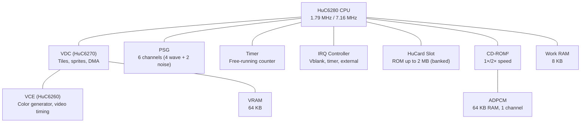

[← Core Catalog](README.md) · [↑ Knowledge Base](../README.md)

# PC Engine / TurboGrafx-16 / SuperGrafx

> A credit-card-sized console with arcade-quality graphics. The HuC6280 CPU (enhanced 6502) paired with a powerful VDC made the PC Engine punch far above its size class. The MiSTer core covers HuCard, CD-ROM², Super CD-ROM², Arcade Card, and SuperGrafx.

Sources: [`TurboGrafx16_MiSTer`](https://github.com/MiSTer-devel/TurboGrafx16_MiSTer) · Original FPGAPCE by Gregory Estrade · CD support by srg320

---

## Architecture Overview

---

## Hardware Specifications

| Component | Detail |
|---|---|
| **CPU** | HuC6280 — enhanced WDC 65C02, 1.79/7.16 MHz dual-speed |
| **RAM** | 8 KB work RAM |
| **VDC** | HuC6270 — tile/sprite engine with DMA |
| **VCE** | HuC6260 — 512-color palette generator, video timing |
| **VRAM** | 64 KB — 2 BAT tables + tile/sprite data |
| **PSG** | 6 channels: 4 programmable waveform + 2 noise |
| **Timer** | 16-bit free-running counter |
| **HuCard** | ROM up to 2 MB (bank-switched, SF2/Populous mappers) |
| **CD-ROM²** | 1× (150 KB/s) or Super 2× (300 KB/s) |
| **ADPCM** | 64 KB buffer, 1 channel, 16 kHz max |
| **Backup** | 2 KB internal + Memory Base 128 external |
| **Display** | 256×239 (visible 256×216 typical), 512-color palette |

---

## VDC — Video Display Controller

The HuC6270 VDC provides a powerful tile/sprite engine:

| Feature | Detail |
|---|---|
| **BG layers** | 1 tile layer (32×32 or 64×64 tiles) |
| **Sprites** | Up to 64 per frame, 16 per scanline |
| **Sprite sizes** | 16×16, 32×64 pixels (width × height) |
| **DMA** | VRAM-to-VRAM and VRAM-to-SAT DMA transfers |
| **SAT** | Sprite Attribute Table — 256 bytes in VRAM |
| **Resolution** | Up to 512×262 (visible varies by mode) |
| **Color depth** | 16 colors per BG tile / 16 colors per sprite |

### SuperGrafx Mode

SuperGrafx adds a **second VDC** (VDC-A + VDC-B), enabling:
- Two independent BG layers with two sprite planes
- Priority mixing between VDC layers
- Only 5 games use this mode (Daimakaimura, Aldynes, etc.)

---

## CD-ROM² System

| Feature | Detail |
|---|---|
| **CD-ROM²** | Base unit, 1× speed, 64 KB ADPCM |
| **Super CD-ROM²** | 256 KB RAM expansion built in |
| **Arcade Card** | 2 MB RAM expansion — required for late arcade ports |
| **BIOS** | `cd_bios.rom` in `TGFX16-CD/` — Japanese Super CD v3.00 recommended |
| **Formats** | BIN/CUE, CHD |
| **CD+G** | CloneCD format (IMG + SUB files) |

> [!NOTE]
> US BIOS must be an original 262,144-byte dump. Pre-swapped BIOS files (with readable copyright string) will cause some CD games to fail.

---

## MiSTer Core Features

Source: [`TurboGrafx16_MiSTer` README](https://github.com/MiSTer-devel/TurboGrafx16_MiSTer)

| Feature | Detail |
|---|---|
| **CPU** | Rewritten for cycle accuracy |
| **SuperGrafx** | Full 2-VDC mode (`.SGX` extension) |
| **Arcade Card** | 2 MB RAM expansion |
| **CD-ROM** | Full CD-ROM² / Super CD-ROM² support |
| **Memory** | DDR3 (default) or SDRAM (recommended for accuracy) |
| **Turbotap** | Multi-player (5 joysticks) |
| **6-button pad** | Supported (20+ games) |
| **Mouse** | Supported (16+ games) |
| **Pachinko** | Via paddle/analog Y axis |
| **XE-1AP analog** | After Burner II, Forgotten Worlds, Operation Wolf, Outrun |
| **Memory Base 128** | External save unit (23+ games) |
| **Cheat engine** | Standard cheats for HuCard; zip for CD games |
| **Palettes** | Original (VDP reverse-engineered by furrtek/ArtemioUrbina) |
| **Audio filters** | By Kitrinx |
| **Mappers** | Street Fighter II, Populous |
| **Soft reset** | Run + Select (in-game, preserves OSD settings) |

---

## Cross-References

| Topic | Article |
|---|---|
| SDRAM module | [Addon Boards](../02_hardware_platforms/addon_boards.md) |
| Cheat engine | [Cheats](../14_extensions/cheats.md) |
| SNAC controller wiring | [SNAC & LLAPI](../10_input_devices/snac_llapi.md) |
| Audio pipeline | [Audio Pipeline](../09_video_audio/audio_pipeline_deep_dive.md) |
| Genesis (Sega 16-bit) | [Genesis](genesis.md) |
