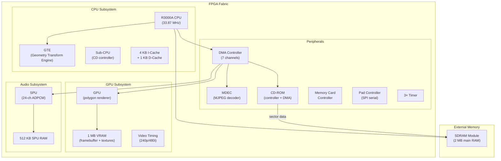

[← FPGA Cores Catalog](README.md) · [↑ Knowledge Base](../README.md)

# PSX: Sony PlayStation

The PSX core for MiSTer is a from-scratch FPGA implementation of the Sony PlayStation by Robert Peip (FPGAzumSpass). It recreates the MIPS R3000A-based CPU, the custom Geometry Transform Engine (GTE), the GPU with polygon rendering, the MDEC video decoder, and the full CD-ROM subsystem. It is one of the most ambitious MiSTer cores and requires SDRAM.

Sources:
* [`MiSTer-devel/PSX_MiSTer`](https://github.com/MiSTer-devel/PSX_MiSTer) — core repository
* Developer: Robert Peip (FPGAzumSpass) — [Patreon](https://www.patreon.com/FPGAzumSpass)

---

## 1. Feature Summary

| Feature | Implementation |
|---|---|
| **CPU** | MIPS R3000A (LSI LR333x10 core, 33.8688 MHz) |
| **GTE** | Geometry Transform Engine (coprocessor 2) |
| **GPU** | Custom 2D/3D renderer (360×240 to 640×480) |
| **SPU** | 24-channel ADPCM audio |
| **MDEC** | Motion JPEG decoder (FMV playback) |
| **RAM** | 2 MB main RAM + 1 MB VRAM (SDRAM-backed) |
| **CD-ROM** | CUE+BIN and CHD format, multi-disc support |
| **BIOS** | Region-specific (US/JP/EU auto-selected) |
| **Memory cards** | 2 slots, `.mcd` format, per-game auto-creation |
| **Save states** | Yes |
| **Input** | DualShock, Digital, Analog, Mouse, NeGcon, Wheel, Guncon, Justifier |
| **SNAC** | Native controller + memory card support |
| **Widescreen** | Widescreen hack modes |
| **24-bit rendering** | Full 24-bit color output option |
| **Dithering** | Toggle on/off |
| **Texture filtering** | Optional filtering |
| **Turbo** | CPU/GTE speed increase (Low/Medium/High) |

> [!CAUTION]
> **SDRAM required.** The PSX core will not function without an SDRAM module installed. If you see a black screen with "ED" overlay, check SDRAM and BIOS.

---

## 2. Core Architecture

---

## 3. CPU — MIPS R3000A

The PlayStation uses a custom LSI LR333x10 core implementing the MIPS R3000A ISA:

| Feature | Specification |
|---|---|
| **Architecture** | 32-bit MIPS RISC |
| **Clock** | 33.8688 MHz (NTSC), 33.8688 MHz (PAL) |
| **Pipeline** | 5-stage |
| **I-Cache** | 4 KB direct-mapped |
| **D-Cache** | 1 KB direct-mapped |
| **Bus width** | 32-bit address, 32-bit data |
| **Coprocessors** | CP0 (system control), CP2 (GTE) |

The CPU does **not** have a hardware FPU — all floating-point geometry is handled by the GTE coprocessor using fixed-point arithmetic.

---

## 4. GTE — Geometry Transform Engine

The GTE (Coprocessor 2) is a hardware vector math unit:

| Operation | Performance |
|---|---|
| 3×3 matrix × 3D vector | ~14 cycles |
| 3D perspective transform | ~24 cycles |
| Depth cue color interpolation | ~8 cycles |
| Normal vector lighting | ~22 cycles |
| Average 3D vertex transform | ~30 cycles |

The GTE operates on fixed-point values (16.16 and 12.4 formats). It directly feeds transformed vertices to the GPU's polygon rendering pipeline.

---

## 5. GPU — Graphics Processing Unit

### 5.1 Rendering Capabilities

| Feature | Specification |
|---|---|
| **Frame buffer** | 1 MB VRAM (dual-ported) |
| **Resolution** | 256×240 to 640×480 (interlaced) |
| **Polygon rate** | ~180K flat-shaded, ~360K gouraud triangles/sec |
| **Textures** | 4-bit, 8-bit, 16-bit color depths |
| **Color depth** | 15-bit RGB (32,768 colors) |
| **Sprite rendering** | 8-bit, 16-bit, direct color |

### 5.2 Drawing Primitives

| Type | Variants |
|---|---|
| **Polygons** | Triangle, Quad — flat, gouraud, textured |
| **Lines** | Polyline, single line — flat, gouraud |
| **Rectangles** | 1×1, 8×8, 16×16, variable size — textured, solid |
| **Sprites** | Free-size, 16-color, 256-color, direct color |

### 5.3 Video Output

The core supports multiple output modes:

| Mode | Description |
|---|---|
| **Normal** | Standard 15-bit rendering via HDMI + analog |
| **24-bit** | Full 24-bit color (reduces banding in FMVs) |
| **Dithering on/off** | PSX hardware dither for 15→24 bit approximation |
| **Deinterlacing** | Bob or weave for 480i content |
| **Widescreen** | Horizontal stretch hack for 16:9 display |
| **Debug framebuffer** | Full 1024×512 VRAM view (development only) |

> [!WARNING]
> 24-bit dithering is for **analog output only** (Direct Video / I/O board). Using it with HDMI produces artifacts.

---

## 6. SPU — Sound Processing Unit

| Feature | Specification |
|---|---|
| **Channels** | 24 ADPCM voices |
| **Sample rate** | 44.1 kHz |
| **RAM** | 512 KB SRAM (sample storage) |
| **Effects** | Reverb, pitch modulation, noise, envelope |
| **Output** | Stereo, 16-bit |

The SPU is controlled via register writes from the CPU. Sound data (ADPCM-compressed) is loaded into SPU RAM, then triggered by writing to voice control registers.

---

## 7. CD-ROM & Memory Cards

### CD-ROM

| Feature | Implementation |
|---|---|
| **Formats** | CUE+BIN, CHD |
| **Multi-disc** | Automatic lid open/close for disc swaps |
| **Fast boot** | Skip BIOS intro |
| **CD speed** | 1×, 2×, faster seek options |
| **Libcrypt** | .sbi file support for protected games |

### Memory Cards

Two memory card slots, each providing 128 KB (15 blocks × 8 KB + header):

- Per-game folders auto-create `.sav` memory card files
- Manual `.mcd` loading supported
- SNAC mode passes real memory card access through

---

## 8. Input Devices

| Pad Type | ID | Description |
|---|---|---|
| **DualShock** | — | Digital/analog switchable (L3+R3 or button) |
| **Digital** | 0x41 | Original 10-button digital pad |
| **Analog** | 0x73 | Twin-stick (analog joystick) |
| **Mouse** | 0x12 | Two-button mouse |
| **NeGcon** | 0x23 | Racing controller (twist → left analog) |
| **GunCon** | 0x62 | Light gun |
| **Justifier** | — | Konami light gun |
| **Off** | — | Port disconnected |

SNAC can be enabled per-port for original PlayStation controller and memory card access.

---

## 9. Unsafe Options

The core provides several options that improve gameplay but may cause issues:

| Option | Effect | Risk |
|---|---|---|
| **480i→480p** | Renders 480i games at progressive scan | Only works for some full-3D games |
| **Turbo** | CPU/GTE speed +10/20/50% | Disables cheats; some games break |
| **PAL 60Hz** | PAL games at 60 Hz | Games run fast, 256-line crop |
| **CD Fast Seek** | Instant CD seeks | Some games crash (expect delay) |
| **CD Speed** | Faster CD drive | Some games crash |
| **8 MB RAM** | Dev console memory size | Only for homebrew |

---

## 10. Implementation Status

| Subsystem | Completeness | Notes |
|---|---|---|
| **CPU** | ~90% | Exception handling for invalid areas missing |
| **GPU** | ~90% | Mask bits for cpu2vram, vram2vram race condition |
| **GTE** | ~90% | CPU↔GTE transfer pipeline delay |
| **SPU** | ~95% | Stable for most games |
| **MDEC** | ~90% | Timing slightly fast |
| **CD-ROM** | ~90% | Accurate seek times not yet implemented |
| **IRQ** | ~90% | SIO IRQ missing |

---

## 11. Cross-References

| Topic | Article |
|---|---|
| N64 core | [N64](n64.md) |
| SNES core | [SNES](snes.md) |
| Save state architecture | [Save State Architecture](../13_save_states/save_state_architecture.md) |
| SNAC direct controller wiring | [SNAC & LLAPI](../10_input_devices/snac_llapi.md) |
| Audio pipeline | [Audio Pipeline](../09_video_audio/audio_pipeline.md) |
| UIO command reference | [UIO Commands](../17_references/uio_command_reference.md) |
| Core template walkthrough | [Template Walkthrough](../07_fpga_cores_architecture/template_walkthrough.md) |
