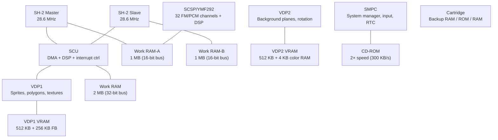

[← Core Catalog](README.md) · [↑ Knowledge Base](../README.md)

# Sega Saturn

> Sega's dual-CPU powerhouse. The Saturn's complex architecture — dual SH-2, VDP1+VDP2, SCU DSP — made it notoriously difficult to program but capable of impressive 2D and early 3D. The MiSTer core by srg320 is currently WIP/beta.

Sources: [`Saturn_MiSTer`](https://github.com/MiSTer-devel/Saturn_MiSTer) · [Copetti — Saturn Architecture](https://www.copetti.org/writings/consoles/sega-saturn/) · [SegaRetro — Specs](https://segaretro.org/Sega_Saturn/Technical_specifications)

---

## Architecture Overview

---

## Hardware Specifications

| Component | Detail |
|---|---|
| **CPU** | 2× Hitachi SH-2 (SH7604) @ 28.6 MHz, 32-bit RISC |
| **Cache** | 4 KB per SH-2 (8 KB total) |
| **Work RAM** | 2 MB (32-bit) + 1 MB (16-bit, RAM-A) + 1 MB (16-bit, RAM-B) |
| **SCU DSP** | Geometry processor — 1 KB program + 1 KB data RAM |
| **VDP1** | Sprite/polygon processor — 512 KB VRAM + 256 KB framebuffers |
| **VDP2** | Background/rotation engine — 512 KB VRAM + 4 KB CRAM |
| **Sound** | SCSP (YMF292) — 32 channels FM/PCM, integrated DSP, 512 KB sound RAM |
| **CD-ROM** | 2× speed, 300 KB/s, MPEG Video CD support |
| **Cartridge** | Backup RAM (32 KB internal + 4 MB cart), ROM, 1–4 MB RAM cart |
| **Input** | 2 controller ports (SMPC managed), 12 digital buttons + analog |
| **Video output** | Composite, S-Video, RGB — 320×224 to 704×512 |

---

## VDP1 — Sprite & Polygon Engine

| Feature | Detail |
|---|---|
| **Primitives** | Distorted sprites, polygons, polylines, lines |
| **Rendering** | Quads (not triangles), half-transparency, Gouraud shading |
| **Resolution** | Up to 704×512 (interlaced) |
| **Textures** | 4/8/16-bit color, from VDP1 VRAM |
| **Framebuffers** | Dual 256 KB — ping-pong for non-blocking draw |
| **Commands** | Command list in VRAM — VDP1 processes autonomously |

---

## VDP2 — Background Plane Engine

| Feature | Detail |
|---|---|
| **Planes** | Up to 4 scrolling NBG layers + 1 rotation (RBG) layer |
| **Rotation** | Up to 4096×4096 pixel planes with affine transform matrix |
| **Color modes** | 4/8/16/32 bits per pixel per layer |
| **Color RAM** | 4 KB — 1,024 entries of 16-bit color |
| **Special effects** | Shadow, half-transparent, color calculation, window masking |
| **Line screen** | Per-scanline color offset for CRT-style effects |

---

## MiSTer Core Features

Source: [`Saturn_MiSTer`](https://github.com/MiSTer-devel/Saturn_MiSTer)

### Hardware Requirements

| Requirement | Detail |
|---|---|
| **Primary SDRAM** | 128 MB module (required) |
| **Secondary SDRAM** | Any size (32–128 MB), recommended for better compatibility |

> [!WARNING]
> This core is currently WIP/Beta. Compatibility and features are under active development.

### Status

- WIP/Beta — active development by srg320
- Dual SDRAM configuration recommended for best results
- Check the GitHub issues list for current compatibility status

---

## Cross-References

| Topic | Article |
|---|---|
| SDRAM module requirements | [Addon Boards](../02_hardware_platforms/addon_boards.md) |
| Genesis predecessor | [Genesis](genesis.md) |
| SNAC controller wiring | [SNAC & LLAPI](../10_input_devices/snac_llapi.md) |
| Video scaler | [HDMI Scaler](../09_video_audio/ascal_deep_dive.md) |
| Analog video output | [Analog Video](../09_video_audio/analog_direct_video_architecture.md) |
