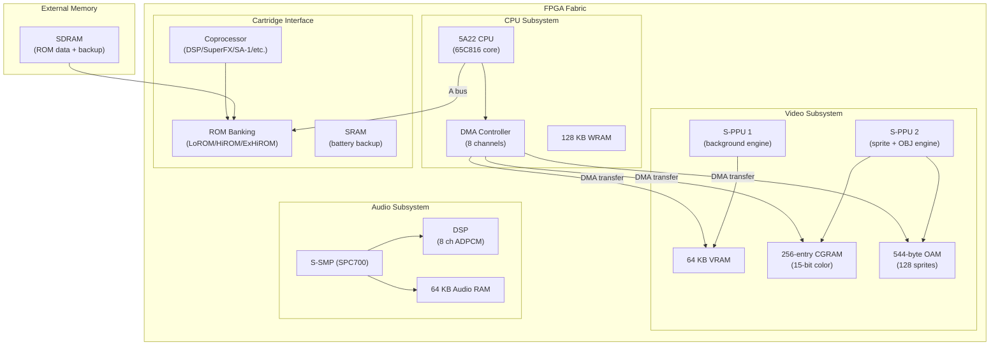

[← FPGA Cores Catalog](README.md) · [↑ Knowledge Base](../README.md)

# SNES: Super Nintendo Entertainment System / Super Famicom

The SNES core for MiSTer is a cycle-accurate FPGA implementation written by srg320. It covers the full SNES chipset — the Ricoh 5A22 CPU (based on the 65C816), the S-PPU dual picture processing units, the S-SMP audio coprocessor, and a comprehensive set of enhancement coprocessor chips that defined the SNES library.

Sources:
* [`gyurco/SNES_FPGA`](https://github.com/gyurco/SNES_FPGA) — core repository
* [`MiSTer-devel/SNES_MiSTer`](https://github.com/MiSTer-devel/SNES_MiSTer) — MiSTer integration

---

## 1. Feature Summary

| Feature | Implementation |
|---|---|
| **CPU** | Ricoh 5A22 (WDC 65C816-derived, 3.58 / 2.68 / 1.79 MHz) |
| **PPU** | Dual S-PPU (256×224 / 256×239, 256 colors from 32,768) |
| **Audio** | S-SMP (SPC700) + DSP, 8 channels, 32 kHz, 64 KB SRAM |
| **Memory** | 128 KB WRAM, 64 KB VRAM per PPU, 64 KB audio RAM |
| **Cartridge modes** | LoROM, HiROM, ExHiROM |
| **Coprocessors** | DSP-1/2/3/4, Super FX (GSU-1/2), SA-1, S-DD1, CX4, SPC7110, ST010, OBC1, S-RTC |
| **MSU-1** | CD-quality streaming audio and data (modern chip) |
| **BSX** | BS-X Satellaview BIOS support |
| **Sufami Turbo** | Bandai Sufami Turbo cartridge support |
| **Save states** | Yes |
| **Cheats** | Built-in cheat engine |
| **Input** | Standard pad, mouse, light gun (Wiimote/mouse/analog) |
| **Turbo modes** | Super FX turbo, CPU turbo |

---

## 2. Core Architecture



---

## 3. CPU — Ricoh 5A22

The 5A22 is based on the WDC 65C816 (16-bit extension of the 6502):

| Feature | Specification |
|---|---|
| **Data bus** | 8-bit (16-bit internal) |
| **Address space** | 24-bit (16 MB) |
| **Clock speeds** | 3.58 MHz (FastROM), 2.68 MHz (SlowROM), 1.79 MHz (controller serial) |
| **DMA** | 8 channels, 4 modes (registrar→WRAM, etc.) |
| **Multiplier** | Hardware 8×8→16 bit multiply |
| **IRQ sources** | NMI, IRQ, COP, BRK, ABORT |

### Memory Map

```
$00–$3F, $80–$BF  Banks 0/1 — HW registers + LoROM cart
$40–$6F, $C0–$CF  Banks 2–5 — HiROM cart
$7E–$7F           WRAM (128 KB)
$C0–$FF           HiROM cart ( banks $C0–$FF)
```

---

## 4. S-PPU — Dual Picture Processing Units

The SNES uses two separate PPU chips working together:

### 4.1 Background Layers

| Layer | Modes | Max Size | Features |
|---|---|---|---|
| **BG1** | All modes | 64×64 tiles | Highest priority background |
| **BG2** | Modes 1–7 | 64×64 tiles | Offset-per-tile in mode 2, 4, 6 |
| **BG3** | Modes 0–2 | 64×64 tiles | Mode 0: 4-color, others: varies |
| **BG4** | Mode 0 only | 64×64 tiles | Extra background in mode 0 |

### 4.2 Video Modes

| Mode | BG Layers | Colors/BG | Notes |
|---|---|---|---|
| 0 | 4 layers × 4 colors | 16 total | Simplest mode |
| 1 | 3 layers (16 + 16 + 4 colors) | 36 total | Most common mode |
| 2 | 2 layers × 16 colors + offset-per-tile | 32 total | *Yoshi's Island* terrain |
| 3 | 2 layers (128 + 16 colors) | 144 total | Diagonal scrolling |
| 4 | 2 layers (128 + 4 colors) + offset-per-tile | 132 total | Rare |
| 5 | 2 layers (16 + 4 colors) | 20 total | 512-width (interlaced) |
| 6 | 1 layer (16 colors) + offset-per-tile | 16 total | 512-width + OAM |
| 7 | 1 layer, 256 colors, affine transform | 256 total | Mode 7 rotation/scaling |

### 4.3 Sprites (OBJ)

| Property | Value |
|---|---|
| Max per frame | 128 |
| Max per scanline | 32 (80 pixels total width) |
| Sizes | 8×8, 16×16, 32×32, 64×64 (small × large selectable) |
| Colors | 8 palettes × 15 colors + transparent |

---

## 5. S-SMP — Audio Processing

The SNES audio subsystem is a self-contained coprocessor:

| Component | Specification |
|---|---|
| **CPU** | SPC700 (8-bit, ~1.024 MHz) |
| **DSP** | 8-channel ADPCM mixer |
| **RAM** | 64 KB SRAM (shared program + sample data) |
| **Sample rate** | 32 kHz |
| **Bit depth** | 16-bit stereo output |
| **Effects** | Echo, noise generator, pitch modulation, BRR compression |

The SPC700 runs independently from the main CPU. Audio programs (sample data + player code) are uploaded to the 64 KB audio RAM via four I/O ports at boot, then the S-SMP operates autonomously.

---

## 6. Coprocessor Support

The SNES is famous for its enhancement chips embedded in cartridges:

| Coprocessor | Function | Notable Games |
|---|---|---|
| **DSP-1** | Fixed-point math (rotation, projection) | *Pilotwings*, *Super Mario Kart* |
| **DSP-2** | Data decompression + matrix ops | *Dungeon Master* |
| **DSP-3** | Map decompression | *SD Gundam GX* |
| **DSP-4** | Road rendering | *Top Gear 3000* |
| **Super FX (GSU-1)** | 3D polygon rendering | *Star Fox*, *Vortex* |
| **Super FX 2 (GSU-2)** | Enhanced 3D, higher clock | *Super Mario World 2: Yoshi's Island*, *Doom* |
| **SA-1** | Secondary 65C816 CPU, 10.74 MHz | *Super Mario RPG*, *Kirby Super Star*, *Kirby's Dream Land 3* |
| **S-DD1** | Graphics decompression | *Star Ocean*, *Street Fighter Alpha 2* |
| **CX4** | 3D line/triangle rendering | *Mega Man X2*, *Mega Man X3* |
| **SPC7110** | Data decompression + RTC | *Tengai Makyou Denki* (JP only) |
| **ST010** | AI coprocessor | *F1 Race of Champions II* |
| **OBC1** | Object controller | *Metal Combat* |
| **S-RTC** | Real-time clock | *Daikaijuu Monogatari II* |
| **MSU-1** | CD-quality streaming (modern) | *Stone of Unity* and other homebrew |

### Super FX Turbo

The Super FX chip runs at a fixed clock in original hardware (~10.74 MHz for GSU-1, ~21.48 MHz for GSU-2). The MiSTer core offers a **Super FX Turbo** option that increases the rendering clock, smoothing out frame rates in polygon-heavy titles.

---

## 7. Cartridge Banking Modes

| Mode | ROM Layout | Max Size | Notes |
|---|---|---|---|
| **LoROM** | Banks mapped at $8000–$FFFF | 4 MB | Most common, slower access |
| **HiROM** | Banks mapped at $C000–$FFFF (mirrored) | 4 MB | Faster access, used by FastROM games |
| **ExHiROM** | Extended mapping | 8 MB | Used by large games like *Tales of Phantasia* |

---

## 8. Cross-References

| Topic | Article |
|---|---|
| NES core | [NES](nes.md) |
| Genesis core | [Genesis](genesis.md) |
| Save state architecture | [Save State Architecture](../13_save_states/save_state_architecture.md) |
| Cheat engine | [Cheat Engine](../14_extensions/cheats.md) |
| SNAC direct controller wiring | [SNAC & LLAPI](../10_input_devices/snac_llapi.md) |
| Core template walkthrough | [Template Walkthrough](../07_fpga_cores_architecture/template_walkthrough.md) |
