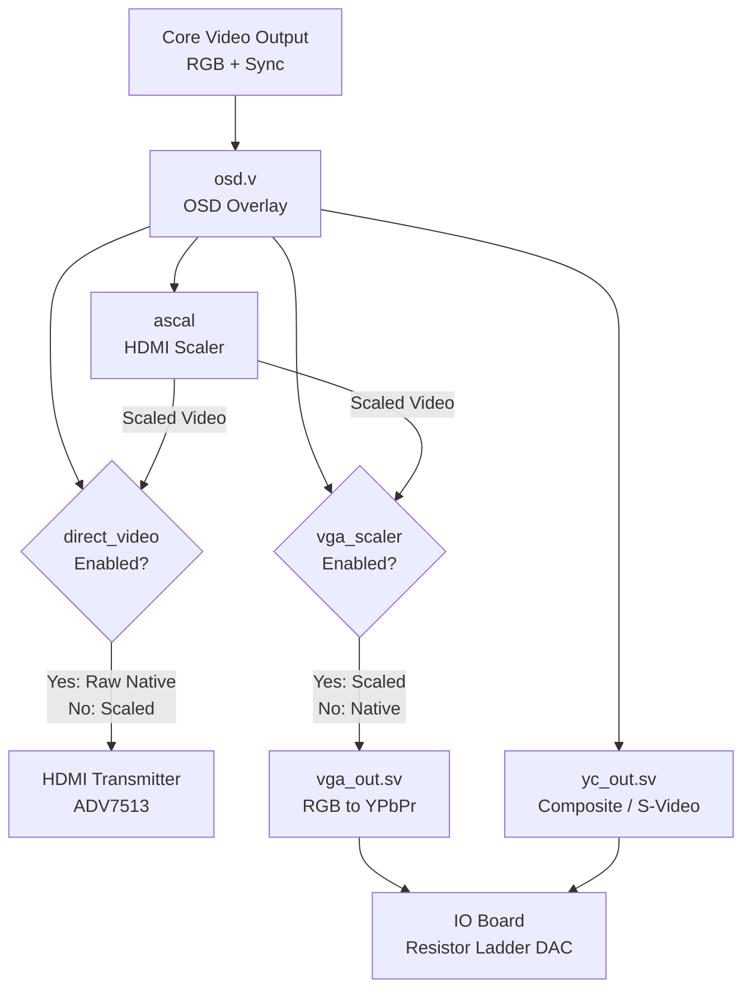

[← Section Index](README.md) · [↑ Knowledge Base](../README.md)

# Analog Video & Direct Video Architecture

A source-grounded deep dive into the MiSTer FPGA framework's handling of native-resolution video signals — the Direct Video mechanism over HDMI, and the Analog Video generation pipeline (VGA, YPbPr, S-Video, Composite). All code references traced to `Template_MiSTer/sys/`.

## Table of Contents

1. [Top-Level Architecture](#1-top-level-architecture)
2. [Direct Video (HDMI Bypass)](#2-direct-video-hdmi-bypass)
3. [RGB-to-YPbPr Conversion (`vga_out.sv`)](#3-rgb-to-ypbpr-conversion-vga_outsv)
4. [Composite and S-Video Generation (`yc_out.sv`)](#4-composite-and-s-video-generation-yc_outsv)
5. [Sync Orchestration in `sys_top.v`](#5-sync-orchestration-in-sys_topv)
6. [Analog DAC: IO Board Resistor Ladder](#6-analog-dac-io-board-resistor-ladder)
7. [Antipatterns and Common Pitfalls](#7-antipatterns-and-common-pitfalls)
8. [Platform Context](#8-platform-context)

---

## 1. Top-Level Architecture

Source: [`sys_top.v`](https://github.com/MiSTer-devel/Template_MiSTer/blob/master/sys/sys_top.v), [`vga_out.sv`](https://github.com/MiSTer-devel/Template_MiSTer/blob/master/sys/vga_out.sv), [`yc_out.sv`](https://github.com/MiSTer-devel/Template_MiSTer/blob/master/sys/yc_out.sv)

The framework supports multiple parallel video outputs. Depending on user configuration (`MiSTer.ini`), the native video generated by the core can be:

1. **Scaled** — Passed through the Polyphase Scaler (`ascal`) to output HD resolutions over HDMI
2. **Direct Video** — Sent natively over HDMI for HDMI-to-VGA DAC adapters
3. **Analog** — Converted to YPbPr, S-Video, or Composite and sent to the VGA pins



The routing logic lives in `sys_top.v` and is controlled by two configuration bits from the HPS:

| Bit | Name | Effect |
|---|---|---|
| `cfg[10]` | `direct_video` | Bypasses ascal, routes native video to HDMI TX |
| `cfg[2]` | `vga_scaler` | Routes scaled video (instead of native) to VGA DAC pins |

---

## 2. Direct Video (HDMI Bypass)

**Direct Video** (`direct_video`) sends a pure, unscaled, native-resolution digital signal over the HDMI port. It is primarily used by enthusiasts who connect HDMI-to-VGA DAC adapters to drive CRT monitors with zero latency and perfect pixel clarity.

### 2.1 Mechanism

When `direct_video` is enabled (via `cfg[10]` from the HPS):

1. **Scaler Bypass**: The entire `ascal` polyphase scaler pipeline is bypassed. The system routes `dv_data` (which is `vga_data_osd` — the native core output with the OSD overlaid) directly to the HDMI data pins.
2. **Clock Rerouting**: The HDMI transmitter's pixel clock (`hdmi_tx_clk`) is switched from the scaler's output clock to `clk_vid` (the exact native pixel clock of the emulation core) using an `altclkctrl` multiplexer.
3. **Sync Routing**: The native `HSYNC`, `VSYNC`, and `DE` (Data Enable) signals are routed to the HDMI transmitter without any buffering or modification.

### 2.2 Why Direct Video over IO Board Analog?

| Aspect | Direct Video + HDMI DAC | IO Board Analog |
|---|---|---|
| Color depth | 24-bit digital (perfect) | 6-bit per channel (18-bit total, R-2R DAC) |
| Sync quality | Digital DE + sync | Analog composite sync |
| Cable length | HDMI spec (~5m) | VGA cable quality dependent |
| Latency | Zero (native clock) | Zero (native clock) |
| CRT compatibility | Requires HDMI-to-VGA DAC | Direct connection |

> [!TIP]
> The IO board's 6-bit per channel resistor ladder produces visible banding on gradients (only 64 levels per channel vs. 256 in 8-bit). Direct Video provides mathematically perfect 24-bit color to an external DAC.

---

## 3. RGB-to-YPbPr Conversion (`vga_out.sv`)

Source: [`vga_out.sv`](https://github.com/MiSTer-devel/Template_MiSTer/blob/master/sys/vga_out.sv) (74 lines)

The `vga_out` module converts 24-bit RGB to YPbPr component video. It is a pure combinatorial pipelined design — no multipliers, only shift-and-add arithmetic.

### 3.1 Module Interface

```verilog
// vga_out.sv:L2-19
module vga_out (
    input         clk,
    input         ypbpr_en,       // enable YPbPr conversion
    input         hsync, vsync, csync, de,
    input  [23:0] din,            // RGB input
    output [23:0] dout,           // YPbPr or passthrough RGB
    output reg    hsync_o, vsync_o, csync_o, de_o
);
```

### 3.2 Color Space Conversion Math

The standard ITU-R BT.601 conversion equations:

\[
Y  = 0.299R + 0.587G + 0.114B
\]
\[
Pb = 128 - 0.168R - 0.332G + 0.500B
\]
\[
Pr = 128 + 0.500R - 0.418G - 0.082B
\]

These are implemented using shift-and-add multiplication, avoiding DSP blocks entirely:

```verilog
// vga_out.sv:L43-57
// Y channel: 0.299*R + 0.587*G + 0.114*B
y_1r <= {red, 6'd0} + {red, 3'd0} + {red, 2'd0} + red;
y_1g <= {green, 7'd0} + {green, 4'd0} + {green, 2'd0} + {green, 1'd0};
y_1b <= {blue, 4'd0} + {blue, 3'd0} + {blue, 2'd0} + blue;
y_2  <= y_1r + y_1g + y_1b;

// Pb channel: 128 - 0.168*R - 0.332*G + 0.500*B
pb_1r <= 19'd32768 - ({red, 5'd0} + {red, 3'd0} + {red, 1'd0});
pb_1g <= {green, 6'd0} + {green, 4'd0} + {green, 2'd0} + green;
pb_1b <= {blue, 7'd0};
pb_2  <= pb_1r - pb_1g + pb_1b;

// Pr channel: 128 + 0.500*R - 0.418*G - 0.082*B
pr_1r <= 19'd32768 + {red, 7'd0};
pr_1g <= {green, 6'd0} + {green, 5'd0} + {green, 3'd0} + {green, 1'd0};
pr_1b <= {blue, 4'd0} + {blue, 2'd0} + blue;
pr_2  <= pr_1r - pr_1g - pr_1b;
```

Each shift-add term approximates the fractional coefficient. For example, `0.299R ≈ R>>2 + R>>3 + R>>5 + R>>0 = 0.25R + 0.125R + 0.03125R + R = ...` (the actual decomposition is different but follows the same principle — multiplying by shifting left and adding).

### 3.3 Clamping and Output

```verilog
// vga_out.sv:L59-61
y  <= y_2[18]  ? 8'd0 : y_2[16]  ? 8'd255 : y_2[15:8];
pb <= pb_2[18] ? 8'd0 : pb_2[16] ? 8'd255 : pb_2[15:8];
pr <= pr_2[18] ? 8'd0 : pr_2[16] ? 8'd255 : pr_2[15:8];
```

The three-level clamp handles:
- **Underflow** (`y_2[18] = 1`): Clamp to 0
- **Overflow** (`y_2[16] = 1`): Clamp to 255
- **Normal** (`y_2[15:8]`): Use bits [15:8] of the 19-bit accumulator

### 3.4 Pipeline Delay

```verilog
// vga_out.sv:L63-71
hsync_o <= hsync2; hsync2 <= hsync1; hsync1 <= hsync;
vsync_o <= vsync2; vsync2 <= vsync1; vsync1 <= vsync;
csync_o <= csync2; csync2 <= csync1; csync1 <= csync;
de_o    <= de2;    de2    <= de1;    de1    <= de;
rgb <= din2; din2 <= din1; din1 <= din;

assign dout = ypbpr_en ? {pr, y, pb} : rgb;
```

The color conversion adds **3 clock cycles** of latency. Sync signals are delayed by the same amount to maintain alignment. When `ypbpr_en = 0`, the module becomes a pure 3-cycle delay line (passthrough RGB).

---

## 4. Composite and S-Video Generation (`yc_out.sv`)

Source: [`yc_out.sv`](https://github.com/MiSTer-devel/Template_MiSTer/blob/master/sys/yc_out.sv) (234 lines)

The `yc_out` module generates NTSC or PAL composite/S-Video signals from RGB input. It implements a full software-defined color encoder using a phase accumulator, sine LUT, and quadrature modulation.

### 4.1 Module Interface

```verilog
// yc_out.sv:L28-48
module yc_out (
    input         clk,
    input  [39:0] PHASE_INC,          // subcarrier frequency phase increment
    input         PAL_EN,              // 0=NTSC, 1=PAL
    input         CVBS,                // 0=S-Video (separate Y/C), 1=Composite (Y+C)
    input  [16:0] COLORBURST_RANGE,    // colorburst start/end positions
    input         hsync, vsync, csync, de,
    input  [23:0] din,                 // RGB input
    output [23:0] dout,                // {C, Y, 0} output
    output reg    hsync_o, vsync_o, csync_o, de_o
);
```

### 4.2 Phase Accumulator (Subcarrier Generation)

The color subcarrier (3.579545 MHz for NTSC, 4.433619 MHz for PAL) is generated using a 40-bit phase accumulator:

```verilog
// yc_out.sv:L111-112
logic [39:0] phase_accum;
phase_accum <= phase_accum + PHASE_INC;
chroma_LUT <= phase_accum[39:32];  // top 8 bits = LUT index
```

The `PHASE_INC` parameter is set by the HPS to produce the correct subcarrier frequency for the selected video standard:

\[
f_{subcarrier} = \frac{PHASE\_INC \times f_{clk}}{2^{40}}
\]

For NTSC at a 108 MHz clock: `PHASE_INC = 3.579545M × 2^40 / 108M ≈ 0x0E4B44DD`

### 4.3 Sine LUT

Source: `yc_out.sv:L89-109`

A 256-entry, 11-bit signed sine lookup table provides the carrier waveform:

```verilog
wire signed [10:0] chroma_SIN_LUT[256] = '{
    11'h000, 11'h006, 11'h00C, 11'h012, ...
};
```

Cosine (quadrature) is derived by adding 64 to the LUT index:

```verilog
// yc_out.sv:L149-151
chroma_LUT_SIN <= chroma_LUT;
chroma_LUT_COS <= chroma_LUT + 8'd64;   // 90° phase shift
```

### 4.4 YUV Color Space Conversion

The luma (Y) is calculated using shift-and-add, similar to `vga_out.sv`:

```verilog
// yc_out.sv:L130-134
yr <= {red, 8'd0} + {red, 5'd0} + {red, 4'd0} + {red, 1'd0};
yg <= {green, 9'd0} + {green, 6'd0} + {green, 4'd0} + {green, 3'd0} + green;
yb <= {blue, 6'd0} + {blue, 5'd0} + {blue, 4'd0} + {blue, 2'd0} + blue;
phase[0].y <= yr + yg + yb;
```

The U and V color difference signals are scaled by fixed-point multipliers:

```verilog
// yc_out.sv:L153-157
// U = 0.492(B-Y) × 1024 = 504
phase[1].u <= $signed({phase[0].u, 8'd0}) + $signed({phase[0].u, 7'd0})
            + $signed({phase[0].u, 6'd0}) + $signed({phase[0].u, 5'd0})
            + $signed({phase[0].u, 4'd0}) + $signed({phase[0].u, 3'd0});

// V = 0.877(R-Y) × 1024 = 898
phase[1].v <= $signed({phase[0].v, 9'd0}) + $signed({phase[0].v, 8'd0})
            + $signed({phase[0].v, 7'd0}) + $signed({phase[0].v, 1'd0});
```

### 4.5 Quadrature Modulation

The chroma signal is produced by modulating U and V onto the subcarrier:

```verilog
// yc_out.sv:L193-194
phase[2].u <= $signed((phase[1].u)>>>10) * $signed(chroma_SIN_LUT[chroma_LUT_SIN]);
phase[2].v <= $signed((phase[1].v)>>>10) * $signed(chroma_SIN_LUT[chroma_LUT_COS]);
```

This is `U × sin(wt) + V × cos(wt)` — the standard NTSC/PAL quadrature modulation formula. Note that these are the **only** hardware multipliers used in the entire video pipeline.

### 4.6 Colorburst Generation

During the back porch period (after HSYNC), a 9-cycle colorburst signal is inserted:

```verilog
// yc_out.sv:L176-186
if (cburst_phase >= COLORBURST_RANGE[16:10]
    && cburst_phase <= COLORBURST_RANGE[9:0])
begin
    phase[2].u <= $signed({chroma_SIN_LUT[chroma_LUT_BURST], 5'd0});
    phase[2].v <= 21'b0;
end
```

For NTSC, the burst is at 180° phase (subcarrier inverted). For PAL, it alternates between +135° and −135° on successive lines (the "PAL switch"):

```verilog
// yc_out.sv:L141-147
if (PAL_EN) begin
    if (PAL_FLIP) chroma_LUT_BURST <= chroma_LUT + 8'd160;  // −135°
    else          chroma_LUT_BURST <= chroma_LUT + 8'd96;    // +135°
end else
    chroma_LUT_BURST <= chroma_LUT + 8'd128;                 // 180° (NTSC)
```

### 4.7 PAL Switch

PAL alternates the phase of the V carrier on every other line:

```verilog
// yc_out.sv:L206-213
if (PAL_EN) begin
    if (PAL_FLIP)
        phase[4].c <= vref + phase[3].u - phase[3].v;  // V inverted
    else
        phase[4].c <= vref + phase[3].u + phase[3].v;  // V normal
    PAL_line_count <= 1'd1;  // toggle on next hsync
end else
    phase[4].c <= vref + phase[3].u + phase[3].v;      // NTSC: always positive
```

### 4.8 Output: S-Video vs Composite

```verilog
// yc_out.sv:L226-227
C <= CVBS ? 8'd0 : phase[4].c[7:0];
Y <= CVBS ? ({1'b0, phase[5].y[17:11]} + {1'b0, phase[4].c[7:1]})
           : phase[5].y[17:10];

// yc_out.sv:L230
assign dout = {C, Y, 8'd0};
```

- **S-Video** (`CVBS=0`): C and Y are output separately on different DAC channels — high quality
- **Composite** (`CVBS=1`): C is added to Y, producing a single combined signal — lower quality but compatible with CRT TVs

The composite output adds chroma to luma: `Y_composite = Y_high + C/2`. The division by 2 prevents the combined signal from exceeding the DAC range.

---

## 5. Sync Orchestration in `sys_top.v`

### 5.1 Sync Types

Sync signals on analog output require complex logic to support various monitor types:

| Sync Type | Signals | Use Case |
|---|---|---|
| **RGBHV** (Separate) | HSYNC + VSYNC | Standard VGA monitors |
| **RGBS** (Composite Sync) | CSYNC only | PVM/BVM, SCART |
| **RGsB** (Sync-on-Green) | Sync on Green channel | Sun/SGI workstations |

### 5.2 Composite Sync Generation

When `csync_en` is active, HSYNC and VSYNC are XOR'd together:

```verilog
// In sys_top.v
assign csync = hsync ^ vsync;
```

This produces a composite sync signal where VSYNC is indicated by serration pulses during the vertical blanking interval.

### 5.3 Sync-on-Green

For Sync-on-Green, the composite sync signal is subtracted from the Green DAC value:

```verilog
// In sys_top.v
assign VGA_G = sog_en ? (green - {7{csync}}) : green;
```

When `csync` is high (active sync), the green value is reduced by 127 (approximately mid-scale), embedding the sync pulse in the green channel.

---

## 6. Analog DAC: IO Board Resistor Ladder

The IO board uses a simple R-2R resistor ladder DAC to convert the 6-bit-per-channel digital output from the FPGA into analog voltages. Each VGA color channel (R, G, B) uses 6 FPGA GPIO pins connected through a resistor network.

### 6.1 Resolution

| Parameter | Value |
|---|---|
| Bits per channel | 6 (only upper 6 bits of 8-bit output used) |
| Color levels per channel | 64 |
| Total colors | 262,144 (64³) |
| Output impedance | ~75 Ω (matched to VGA cable) |
| Voltage range | 0–0.7 V (standard VGA) |

### 6.2 Signal Path

```
FPGA GPIO[5:0] → R-2R Ladder → Low-pass Filter → VGA Connector
                                              ↓
                    yc_out composite → same DAC → RCA/S-Video connector
```

The IO board provides both the VGA connector (RGBHV/RGBS/RGsB) and RCA connectors for composite and S-Video output. The same resistor ladder DAC is shared — composite output is generated by `yc_out` adding chroma to luma digitally, then the combined signal is output on the Green channel's DAC.

---

## 7. Antipatterns and Common Pitfalls

### 7.1 6-Bit Banding

The IO board's 6-bit DAC produces visible color banding on smooth gradients. For games with prominent gradients (e.g., Sonic's title screen), this is noticeable. **Mitigation**: Use Direct Video with an external HDMI-to-VGA DAC for full 24-bit color.

### 7.2 Composite Quality

Composite video inherently suffers from cross-luminance (dot crawl) and cross-chrominance (color bleed) artifacts. The `yc_out` module produces technically correct NTSC/PAL signals, but the fundamental limitations of composite encoding remain. **Mitigation**: Use YPbPr component or S-Video whenever possible.

### 7.3 YPbPr Sync Polarity

> [!WARNING]
> When `ypbpr_en` is active, Component Video uses **Sync-on-Luma** (the Y channel carries the sync signal). The framework handles this automatically by routing sync to the Green/Y channel. Do not add external sync circuitry — it will conflict with the embedded sync.

### 7.4 PAL Phase Jump

The PAL switch toggles V-phase every line. If the `PAL_FLIP` timing is off by even one clock cycle, the decoder will see a phase error, producing the characteristic "Hanover bars" (alternating color-shifted lines). The `yc_out` module uses a line counter (`PAL_line_count`) that toggles on HSYNC, which is correct but sensitive to HSYNC timing.

---

## 8. Platform Context

| Aspect | MiSTer | Analogue Pocket | Software Emulation |
|---|---|---|---|
| Analog output | R-2R DAC on IO board | None (digital only) | GPU DAC / HDMI | 
| Color depth (analog) | 6-bit/channel (18-bit) | N/A | 8-bit/channel (24-bit) |
| Direct Video | Yes (HDMI native) | N/A | N/A |
| YPbPr component | Yes (vga_out.sv) | N/A | N/A |
| Composite/S-Video | Yes (yc_out.sv) | N/A | N/A (shader simulated) |
| Multi-standard | NTSC + PAL | N/A | Any |
| Zero-latency path | Yes (Direct Video or native analog) | No (framebuffer required) | No (vsync buffer) |

---

Source: `Template_MiSTer/sys/vga_out.sv` (74 lines), `Template_MiSTer/sys/yc_out.sv` (234 lines), `Template_MiSTer/sys/sys_top.v`