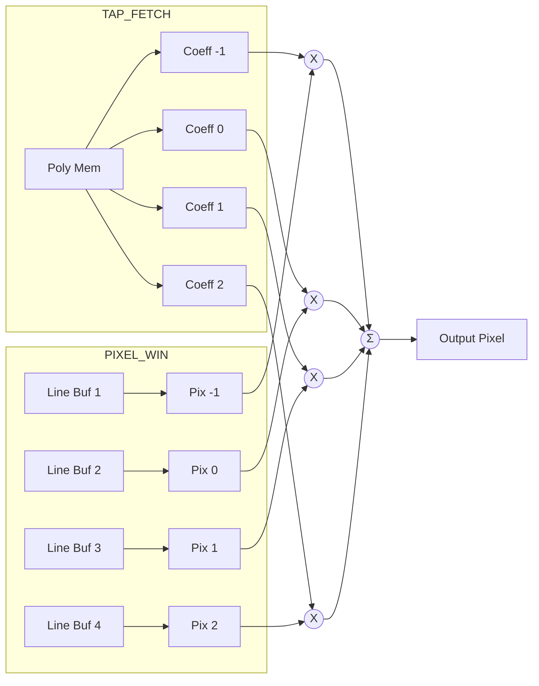

# MiSTer `ascal` Polyphase Scaler Architecture

The `ascal` module is the high-performance video scaling engine at the heart of the MiSTer FPGA framework. Whether referenced via its original implementation (`ascal.vhd`) or its modern port (`ascal.sv`), the underlying hardware architecture and DSP pipeline remain logically identical. 

This document serves as the definitive reference for the scaler's multi-clock domain strategy, Avalon memory interfacing, and fractional filtering pipelines.

---

## 1. Multi-Clock Domain Strategy

The scaler is designed to decouple the timing of the arcade/console core from the timing of the modern display (e.g., HDMI at 60Hz). To achieve this, data flows across five distinct clock domains:

| Clock | Purpose | Typical Frequency |
| :--- | :--- | :--- |
| **`i_clk`** | **Input Clock**. Synchronous to the source core's pixel data. Handles ingestion and initial downscaling. | Varies (e.g., 5-50 MHz) |
| **`avl_clk`** | **Avalon/Memory Clock**. Synchronous to the DDR3 controller. Manages memory requests via the F2H AXI bridge. | 166.6 MHz (Cyclone V) |
| **`o_clk`** | **Output Clock**. Synchronous to the display pixel clock. Drives the final interpolation and HDMI sync generation. | Varies (e.g., 148.5 MHz for 1080p) |
| **`poly_clk`** | **Coefficient Clock**. Dedicated clock for updating filter coefficients from the HPS. | 100 MHz |
| **`pal_clk`** | **Palette Clock**. Dedicated clock for palette RAM updates (used in 8bpp color modes). | Varies |

---

## 2. The Scaling Pipeline Dataflow

The scaling process is divided into three major stages, buffered by memory arrays and FIFOs to prevent timing hazards.

### 2.1 Stage 1: Input Processing (`Cadrage`)
Operating in the `i_clk` domain, the `Cadrage` process analyzes the raw incoming video.
*   **Resolution Detection**: It counts `i_pde` (Pixel Data Enable) pulses to determine the active width and height of the source frame.
*   **Interlace Handling**: It detects whether the input is progressive or interlaced by monitoring the relationship between vertical sync and line counts.
*   **Downscaling**: If the input resolution is larger than the target (rare, but possible), a bilinear downsampler pre-processes the pixels to save memory bandwidth.
*   **Framebuffer Packing**: Pixels are packed into wide data words (64-bit or 128-bit) and written to the DDR3 framebuffer via clock-crossing FIFOs.

### 2.2 Stage 2: Memory Interfacing (`Scalaire`)
Operating in the `avl_clk` domain, the `Scalaire` state machine manages the DDR3 framebuffers via an Avalon Master interface.
*   **Double / Triple Buffering**: The scaler maintains multiple framebuffers in memory. It toggles read/write banks (`wr_bank`, `rd_bank`) at frame boundaries to prevent screen tearing.
*   **Avalon Burst Reads**: To maximize DDR3 throughput and prevent starvation, the Avalon master calculates dynamic addresses based on the current output line and issues **Burst Reads** to fill internal FIFOs.

### 2.3 Stage 3: The Scaling Engine (`HSCAL` & `VSCAL`)
Operating in the high-speed `o_clk` domain, this stage performs the actual 2D interpolation. It is split into Horizontal and Vertical passes.

#### Horizontal Scaling (`HSCAL`)
Horizontal scaling occurs "on-the-fly" as data is popped from the Avalon FIFOs.
*   **Pipelined Phase Accumulation**: A **3-cycle Non-Restoring Divider** is used to calculate the sub-pixel phase. It performs a multi-cycle division of `o_hacc * 256` by `o_hsize`. The fractional result (`o_hfrac`) provides the exact index to fetch Polyphase coefficients.
*   **H-FIR Filter**: A 4-tap FIR filter processes 4 adjacent input pixels.
*   **Line Buffers**: The horizontally scaled result is written into a set of **4 Line Buffers** (implemented in M10K block RAM). This provides a temporal cache of 4 complete scanlines.

#### Vertical Scaling (`VSCAL`)
Vertical scaling happens as the final step before outputting pixels to the display.
*   **V-FIR Filter**: It reads the 4 line buffers simultaneously to perform a vertical 4-tap convolution, producing the final interpolated pixel.
*   **Output Sweep (`OSWEEP`)**: Generates the standard VGA/HDMI timing signals (`hsync`, `vsync`, `de`) based on the target resolution parameters.
*   **Color Space Conversion**: Handles 16/24/32-bit pixel formats and optional RGB/BGR swapping prior to final output.

---

## 3. The Convolution Engine

The mathematical core of `HSCAL` and `VSCAL` is the FIR Convolution Engine.

### 3.1 Interpolation Modes
The scaler supports several algorithms, selectable via the `mode[2:0]` register:
*   **000 (Nearest)**: Simple point sampling (no DSP required).
*   **001 (Bilinear) / 010 (Sharp Bilinear)**: 2-tap interpolation.
*   **011 (Bicubic) / 1xx (Polyphase)**: Full 4-tap convolution using the logic shown above.

---

## 4. Hardware Implementation Nuances

### 4.1 Low-Lag Syntonizer Interface (`o_lltune`)
The scaler exposes an `o_lltune` diagnostic bus to the MiSTer `sys` framework. 
*   **Purpose**: It provides a real-time bitmask of input vs. output syncs (e.g., `i_vss`, `i_pde`, `o_vss`).
*   **Application**: External modules monitor this bus for "sync-slippage." By comparing the core's native timing to the output timing, the system can micro-adjust the `o_clk` pixel clock or frame boundaries to maintain ultra-low latency without tearing.

### 4.2 Language Specifics: VHDL vs. SystemVerilog
While logically identical, the HDL implementations handle data routing differently:
*   **VHDL (`ascal.vhd`)**: Heavily utilizes 2D arrays and records for pixel buffering and fractional math. It relies heavily on verbose sequential `PROCESS` blocks.
*   **SystemVerilog (`ascal.sv`)**: Modernizes the dataflow using `struct packed` types for cleaner signal mapping and avoids complex multi-dimensional arrays, making it significantly easier to integrate into AXI/Avalon VIP testbenches.

### 4.3 Resource Utilization (Cyclone V Estimates)
A standard instantiation of the polyphase scaler on the DE10-Nano consumes:
*   **ALMs**: ~2,500 - 4,000 (dependent on Bicubic/Palette configuration).
*   **DSPs**: 8 - 12 (used for the high-speed 10-bit signed multiplications).
*   **M10K Blocks**: 20 - 40 (primarily for the 4x line buffers and dual-port Polyphase coefficient RAMs).

*Note: Timing closure on `o_clk` is critical. The logic utilizes heavy pipelining to ensure 1080p (148.5MHz) and 1440p timing is met reliably.*

---

## 5. Related Documentation

For detailed implementation logic, state machines, and mathematical foundations, please refer to the following expanded documents:

- [ASCAL Deep Dive & FSM Reference](ascal_deep_dive.md) — Comprehensive logic, clock domains, and architectural block/Mermaid diagrams.
- [Polyphase Scaling Theory](polyphase_scaling_theory.md) — Mathematical foundations and filter coefficient definitions.
- [Video/Audio Pipelines](../06_fpga_subsystem/video_audio_pipelines.md) — How the scaler fits into the broader MiSTer video subsystem.
