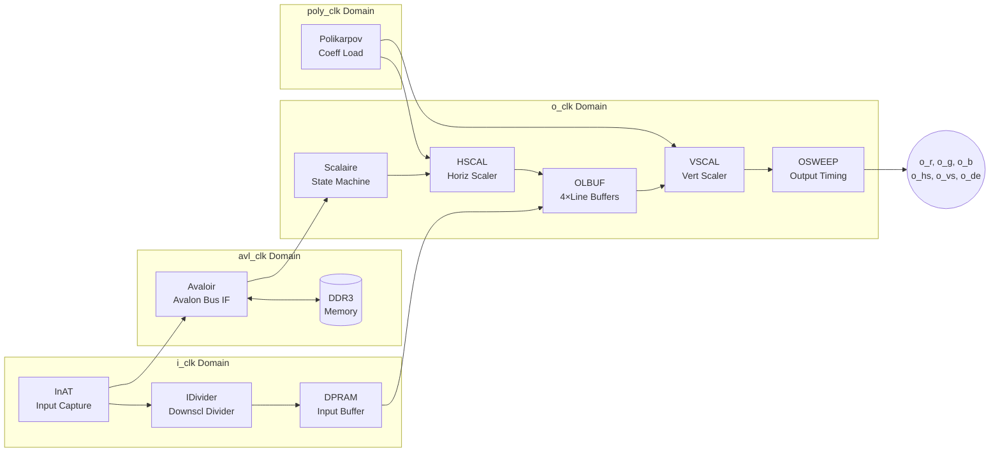
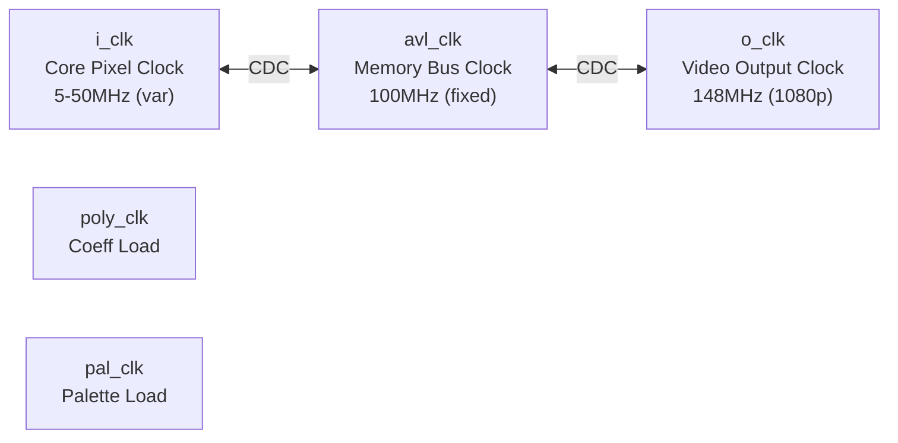
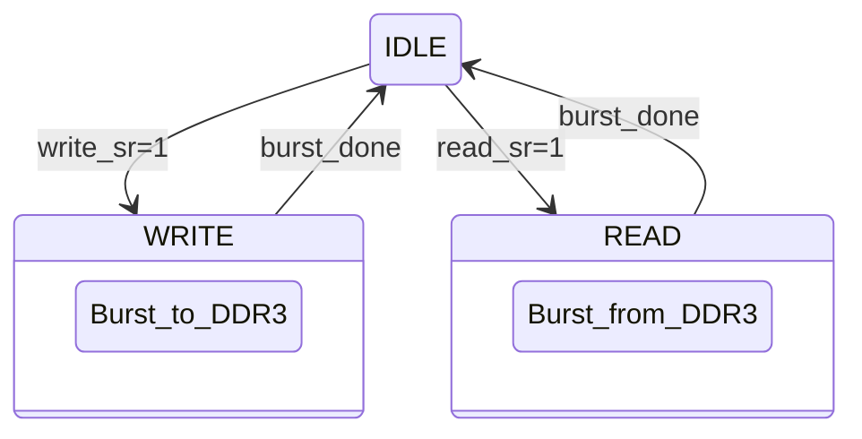
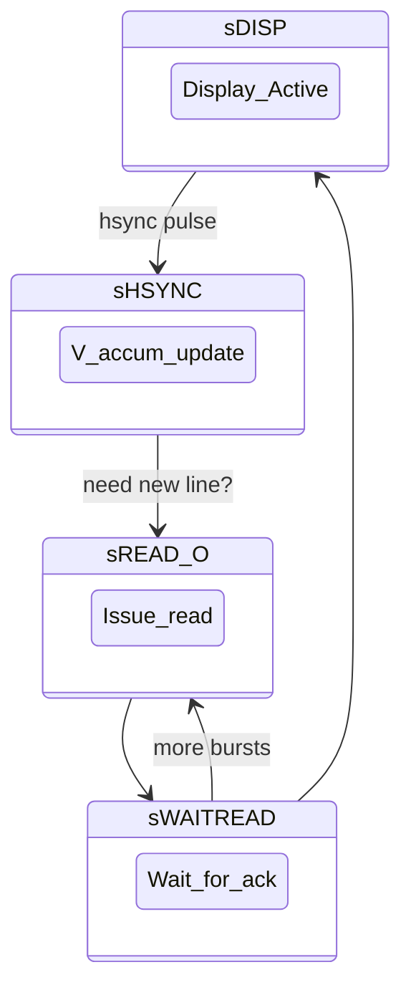
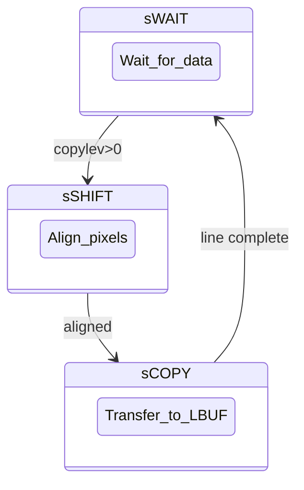
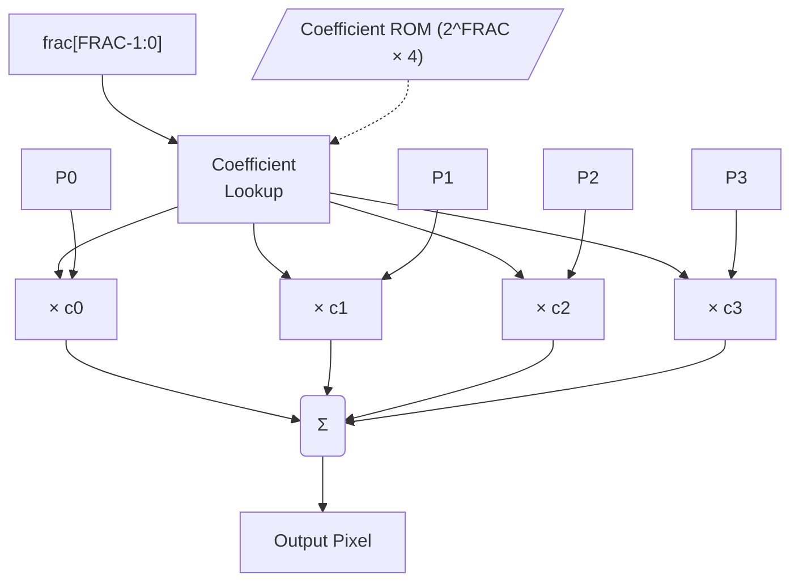
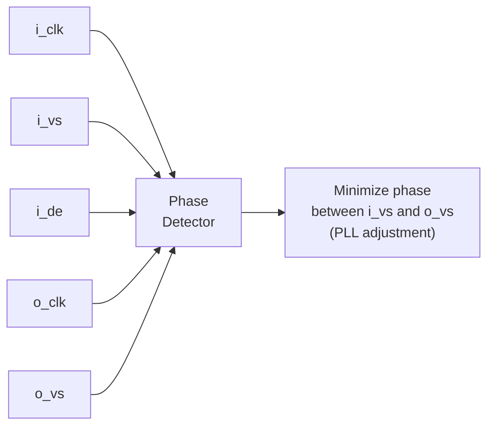

[← Section Index](README.md) · [↑ Knowledge Base](../README.md)

# ASCAL Deep Dive: Avalon Scaler Architecture & Implementation

> **Document Status**: Deep  
> **Source**: `Template_MiSTer/sys/ascal.vhd` (3057 lines)  
> **Author**: TEMLIB 2018-2020, Analysis by MiSTer KB  

This document provides a complete technical analysis of the MiSTer Avalon Scaler (`ascal`), the FPGA-based video scaling engine that transforms input video from emulated cores into properly scaled output for modern displays.

---

## Table of Contents

1. [Executive Summary](#1-executive-summary)
2. [System Architecture](#2-system-architecture)
3. [Clock Domains & CDC](#3-clock-domains--cdc)
4. [Data Flow Pipeline](#4-data-flow-pipeline)
5. [Input Stage (i_clk Domain)](#5-input-stage-i_clk-domain)
6. [Avalon Bus Interface (avl_clk Domain)](#6-avalon-bus-interface-avl_clk-domain)
7. [Output Stage (o_clk Domain)](#7-output-stage-o_clk-domain)
8. [Interpolation Algorithms](#8-interpolation-algorithms)
9. [Triple Buffering](#9-triple-buffering)
10. [Polyphase Filter Implementation](#10-polyphase-filter-implementation)
11. [Downscaling Path](#11-downscaling-path)
12. [Framebuffer Mode](#12-framebuffer-mode)
13. [Low-Lag Mode](#13-low-lag-mode)
14. [Parameter Reference](#14-parameter-reference)
15. [Signal Reference](#15-signal-reference)

---

## 1. Executive Summary

### What ASCAL Does

ASCAL is a **real-time video scaler** that:

- Accepts arbitrary input video timing from FPGA cores (15kHz–31kHz, progressive/interlaced)
- Stores frames in DDR3 via Avalon bus interface
- Reads back and scales to fixed output timing (typically 1080p/4K)
- Supports multiple interpolation methods: Nearest, Bilinear, Sharp Bilinear, Bicubic, Polyphase
- Handles interlaced content with optional bob deinterlacing
- Provides optional triple buffering for tear-free output

### Why It Exists

Retro gaming systems output non-standard video timings that modern displays cannot accept directly:

| System | Typical Output | Problem |
|--------|---------------|---------|
| NES | 256×240 @ 60.1Hz | Non-standard resolution and refresh |
| Genesis | 320×224 @ 59.92Hz | Unusual refresh rate |
| Arcade | 384×224 @ 57.5Hz | Variable timing per game |
| Amiga | 320×256 @ 50Hz PAL | Interlaced, PAL timing |

ASCAL bridges this gap by buffering frames in DDR3 and outputting at standard HDMI timings while preserving the original aspect ratio and applying high-quality scaling.

### Key Specifications

| Parameter | Value |
|-----------|-------|
| Maximum input resolution | 2048 × 2048 |
| Maximum output resolution | 4096 × 4096 (OHRES dependent) |
| Bus width | 64 or 128 bits |
| Burst size | 256 bytes (configurable) |
| Color depth | 24-bit RGB (8:8:8) |
| Clock domains | 5 independent |
| Interpolation modes | 5 (Nearest, Bilinear, Sharp Bilinear, Bicubic, Polyphase) |
| Polyphase taps | 4 |
| Fractional precision | 4–8 bits (FRAC parameter) |

---

## 2. System Architecture

### Block Diagram

```
┌────────────────────────────────────────────────────────────────────────────────┐
│                              ASCAL TOP LEVEL                                   │
├────────────────────────────────────────────────────────────────────────────────┤
│                                                                                │
│  ┌──────────────┐    ┌──────────────┐    ┌──────────────┐    ┌──────────────┐  │
│  │   i_clk      │    │   avl_clk    │    │   o_clk      │    │  poly_clk    │  │
│  │   Domain     │    │   Domain     │    │   Domain     │    │  Domain      │  │
│  ├──────────────┤    ├──────────────┤    ├──────────────┤    ├──────────────┤  │
│  │              │    │              │    │              │    │              │  │
│  │  ┌────────┐  │    │  ┌────────┐  │    │  ┌────────┐  │    │  ┌────────┐  │  │
│  │  │ InAT   │  │    │  │Avaloir │  │    │  │Scalaire│  │    │  │Polikar-│  │  │
│  │  │        │──┼────┼─▶│        │──┼────┼─▶│        │  │    │  │pov     │  │  │
│  │  │ Input  │  │    │  │ Avalon │  │    │  │ State  │  │    │  │        │  │  │
│  │  │ Capture│  │    │  │ Bus IF │  │    │  │ Machine│  │    │  │ Coeff  │  │  │
│  │  └────────┘  │    │  └────────┘  │    │  └────────┘  │    │  │ Load   │  │  │
│  │      │       │    │      ▲       │    │      │       │    │  └────────┘  │  │
│  │      ▼       │    │      │       │    │      ▼       │    │      │       │  │
│  │  ┌────────┐  │    │      │       │    │  ┌────────┐  │    │      │       │  │
│  │  │IDivider│  │    │     DDR3     │    │  │ HSCAL  │  │    │      ▼       │  │
│  │  │        │  │    │    Memory    │    │  │        │◀─┼────┼──────────────┤  │
│  │  │Downscl │  │    │              │    │  │  Horiz │  │    │              │  │
│  │  │Divider │  │    │              │    │  │ Scaler │  │    │              │  │
│  │  └────────┘  │    │              │    │  └────────┘  │    │              │  │
│  │      │       │    │              │    │      │       │    │              │  │
│  │      ▼       │    │              │    │      ▼       │    │              │  │
│  │  ┌────────┐  │    │              │    │  ┌────────┐  │    │              │  │
│  │  │DPRAM   │  │    │              │    │  │ OLBUF  │  │    │              │  │
│  │  │Input   │──┼────┼──────────────┼────┼─▶│        │  │    │              │  │
│  │  │Buffer  │  │    │              │    │  │4×Line  │  │    │              │  │
│  │  └────────┘  │    │              │    │  │Buffers │  │    │              │  │
│  │              │    │              │    │  └────────┘  │    │              │  │
│  │              │    │              │    │      │       │    │              │  │
│  │              │    │              │    │      ▼       │    │              │  │
│  │              │    │              │    │  ┌────────┐  │    │              │  │
│  │              │    │              │    │  │ VSCAL  │◀─┼────┼──────────────┘  │
│  │              │    │              │    │  │        │  │                      │
│  │              │    │              │    │  │  Vert  │  │                      │
│  │              │    │              │    │  │ Scaler │  │                      │
│  │              │    │              │    │  └────────┘  │                      │
│  │              │    │              │    │      │       │                      │
│  │              │    │              │    │      ▼       │                      │
│  │              │    │              │    │  ┌────────┐  │                      │
│  │              │    │              │    │  │OSWEEP  │  │                      │
│  │              │    │              │    │  │        │  │                      │
│  │              │    │              │    │  │ Output │  │                      │
│  │              │    │              │    │  │ Timing │  │                      │
│  │              │    │              │    │  └────────┘  │                      │
│  │              │    │              │    │      │       │                      │
│  └──────────────┘    └──────────────┘    └──────┼───────┘                      │
│                                                 ▼                              │
│                                          o_r, o_g, o_b                         │
│                                          o_hs, o_vs, o_de                      │
└────────────────────────────────────────────────────────────────────────────────┘
```



### Major Functional Blocks

| Block | Clock Domain | VHDL Process | Function |
|-------|--------------|--------------|----------|
| **InAT** | i_clk | `InAT` | Input pixel capture, sync detection, pixel packing |
| **IDividers** | i_clk | `IDividers` | Downscale vertical fraction divider |
| **DownLine** | i_clk | `DownLine` | Line buffer for downscaling interpolation |
| **Avaloir** | avl_clk | `Avaloir` | Avalon bus state machine, read/write arbitration |
| **ODivider** | o_clk | `ODivider` | Output vertical fraction divider |
| **Scalaire** | o_clk | `Scalaire` | Triple buffer management, read scheduling |
| **PolyFetch** | o_clk | `PolyFetch` | Polyphase coefficient lookup pipeline |
| **HSCAL** | o_clk | `HSCAL` | Horizontal scaling interpolation |
| **OLBUF** | o_clk | `OLBUF` | 4× line buffer for vertical scaling |
| **OSWEEP** | o_clk | `OSWEEP` | Output video timing generation |
| **VSCAL** | o_clk | `VSCAL` | Vertical scaling interpolation |
| **Palette** | pal1_clk/pal2_clk | `Palette` | 8bpp palette lookup (framebuffer mode) |
| **Polikarpov** | poly_clk | `Polikarpov` | Polyphase coefficient ROM loading |

---

## 3. Clock Domains & CDC

### Five Independent Clock Domains

ASCAL operates across five asynchronous clock domains:

```
┌────────────────────────────────────────────────────────────────┐
│                     CLOCK DOMAIN MAP                           │
├────────────────────────────────────────────────────────────────┤
│                                                                │
│   ┌─────────┐         ┌─────────┐         ┌─────────┐          │
│   │ i_clk   │         │ avl_clk │         │ o_clk   │          │
│   │         │         │         │         │         │          │
│   │ Core    │◀───────▶│ Memory  │◀───────▶│ Video   │          │
│   │ Pixel   │  CDC    │ Bus     │   CDC   │ Output  │          │
│   │ Clock   │         │ Clock   │         │ Clock   │          │
│   │         │         │         │         │         │          │
│   │ 5-50MHz │         │ 100MHz  │         │ 148MHz  │          │
│   │ (var)   │         │ (fixed) │         │ (1080p) │          │
│   └─────────┘         └─────────┘         └─────────┘          │
│                                                                │
│   ┌─────────┐         ┌─────────┐                              │
│   │poly_clk │         │pal_clk  │                              │
│   │         │         │         │                              │
│   │ Coeff   │         │Palette  │                              │
│   │ Load    │         │ Load    │                              │
│   │         │         │         │                              │
│   └─────────┘         └─────────┘                              │
│                                                                │
└────────────────────────────────────────────────────────────────┘
```



| Domain | Typical Frequency | Purpose |
|--------|------------------|---------|
| `i_clk` | 5–50 MHz (variable) | Core pixel clock, varies per emulated system |
| `avl_clk` | 100 MHz | Avalon memory bus clock (Cyclone V HPS) |
| `o_clk` | 74.25–297 MHz | Output video clock (720p/1080p/4K) |
| `poly_clk` | Any | Polyphase coefficient loading |
| `pal1_clk`/`pal2_clk` | Any | Palette RAM loading (framebuffer mode) |

### Clock Domain Crossing Strategy

ASCAL uses **toggle-based CDC** for all cross-domain signaling:

```vhdl
-- Source domain (i_clk): Toggle on event
PROCESS (i_clk) IS
BEGIN
  IF rising_edge(i_clk) THEN
    IF i_wreq THEN
      i_write <= NOT i_write;  -- Toggle!
    END IF;
  END IF;
END PROCESS;

-- Destination domain (avl_clk): Double-sync + edge detect
PROCESS (avl_clk) IS
BEGIN
  IF rising_edge(avl_clk) THEN
    avl_write_sync  <= i_write;           -- First sync stage
    avl_write_sync2 <= avl_write_sync;    -- Second sync stage
    avl_write_pulse <= avl_write_sync XOR avl_write_sync2;  -- Edge detect
  END IF;
END PROCESS;
```

```
Toggle-Based CDC Timing:

i_clk domain:
         ┌───┐   ┌───┐   ┌───┐   ┌───┐   ┌───┐
i_clk    │   │   │   │   │   │   │   │   │   │
       ──┘   └───┘   └───┘   └───┘   └───┘   └──

i_write  ────────────┐
(toggle)             └──────────────────────────

avl_clk domain:
           ┌──┐  ┌──┐  ┌──┐  ┌──┐  ┌──┐  ┌──┐
avl_clk    │  │  │  │  │  │  │  │  │  │  │  │
         ──┘  └──┘  └──┘  └──┘  └──┘  └──┘  └──

sync1    ─────────────────┐
                          └─────────────────────

sync2    ──────────────────────┐
                               └────────────────

pulse    ─────────────────┐    ┌────────────────
(XOR)                     └────┘
                          ▲
                          │
                    Detected edge!
```

> [!NOTE]
> Toggle-based CDC is metastability-safe because:
> 1. The toggle signal changes slowly (once per event)
> 2. Two synchronizer flip-flops filter metastability
> 3. XOR detects the toggle regardless of when sync settles

### CDC Signal Map

| Signal | Source Domain | Dest Domain | CDC Type |
|--------|---------------|-------------|----------|
| `i_write` | i_clk | avl_clk | Toggle + 2FF sync |
| `o_read` | o_clk | avl_clk | Toggle + 2FF sync |
| `avl_readack` | avl_clk | o_clk | Toggle + 2FF sync |
| `avl_readdataack` | avl_clk | o_clk | Toggle + 2FF sync |
| `i_endframe0/1` | i_clk | o_clk | Level + 2FF sync |
| `i_wfl[]` | i_clk | o_clk | Level + 2FF sync |
| `o_vsv[0]` | o_clk | avl_clk | Level + 2FF sync |

---

## 4. Data Flow Pipeline

### Complete Signal Path

```
┌──────────────────────────────────────────────────────────────────────────────┐
│                          DATA FLOW PIPELINE                                  │
├──────────────────────────────────────────────────────────────────────────────┤
│                                                                              │
│  STAGE 1: INPUT CAPTURE (i_clk)                                              │
│  ═══════════════════════════════                                             │
│                                                                              │
│    i_r,g,b ──▶ ┌────────┐    ┌────────┐    ┌────────┐    ┌────────┐          │
│    i_de    ──▶ │ Sample │───▶│Downscl │───▶│ Pack   │───▶│ DPRAM  │          │
│    i_hs    ──▶ │ +Sync  │    │(opt)   │    │ Pixels │    │ Write  │          │
│    i_vs    ──▶ │ Detect │    │        │    │        │    │        │          │
│                └────────┘    └────────┘    └────────┘    └────────┘          │
│                                                              │               │
│  STAGE 2: MEMORY WRITE (avl_clk)                             ▼               │
│  ═══════════════════════════════                        ┌────────┐           │
│                                                         │ DPRAM  │           │
│    ┌────────┐    ┌────────┐    ┌────────┐               │ (2×    │           │
│    │ Read   │───▶│ Burst  │───▶│ DDR3   │               │ BLEN)  │           │
│    │ DPRAM  │    │ Write  │    │ Memory │               └────────┘           │
│    │        │    │        │    │        │                   │                │
│    └────────┘    └────────┘    └────────┘                   │                │
│         │                           │                       │                │
│         └───────────────────────────┼───────────────────────┘                │
│                                     │                                        │
│  STAGE 3: MEMORY READ (avl_clk)     │                                        │
│  ══════════════════════════════     │                                        │
│                                     ▼                                        │
│    ┌────────┐    ┌────────┐    ┌────────┐                                    │
│    │ DDR3   │───▶│ Burst  │───▶│ DPRAM  │                                    │
│    │ Memory │    │ Read   │    │ Write  │                                    │
│    │        │    │        │    │        │                                    │
│    └────────┘    └────────┘    └────────┘                                    │
│                                    │                                         │
│  STAGE 4: HORIZONTAL SCALE (o_clk) │                                         │
│  ══════════════════════════════════▼                                         │
│                                                                              │
│    ┌────────┐    ┌────────┐    ┌────────┐    ┌────────┐    ┌────────┐        │
│    │ Read   │───▶│Unpack  │───▶│4-Pixel │───▶│ Interp │───▶│ Line   │        │
│    │ DPRAM  │    │ Shift  │    │ Window │    │ H-Filt │    │ Buffer │        │
│    │        │    │        │    │        │    │        │    │ Write  │        │
│    └────────┘    └────────┘    └────────┘    └────────┘    └────────┘        │
│                                                                 │            │
│  STAGE 5: VERTICAL SCALE (o_clk)                                ▼            │
│  ═══════════════════════════════                           ┌────────┐        │
│                                                            │4× Line │        │
│    ┌────────┐    ┌────────┐    ┌────────┐    ┌────────┐    │Buffers │        │
│    │ Read 4 │───▶│4-Line  │───▶│ Interp │───▶│ Output │    │(OHRES) │        │
│    │ Lines  │    │ Window │    │ V-Filt │    │ Pixel  │    └────────┘        │
│    │        │    │        │    │        │    │        │        │             │
│    └────────┘    └────────┘    └────────┘    └────────┘        │             │
│                                    │                           │             │
│  STAGE 6: OUTPUT (o_clk)           │                           │             │
│  ═══════════════════════           ▼                           │             │
│                               ┌────────┐                       │             │
│    o_r,g,b ◀──────────────────│ Timing │◀──────────────────────┘             │
│    o_de    ◀──────────────────│ + Sync │                                     │
│    o_hs    ◀──────────────────│ Gen    │                                     │
│    o_vs    ◀──────────────────│        │                                     │
│                               └────────┘                                     │
│                                                                              │
└──────────────────────────────────────────────────────────────────────────────┘
```



```mermaid
flowchart TD
    subgraph S1 ["STAGE 1: INPUT CAPTURE (i_clk)"]
        direction LR
        S1_Inputs["i_r,g,b<br>i_de<br>i_hs<br>i_vs"] --> S1_Sample["Sample<br>+Sync<br>Detect"]
        S1_Sample --> S1_Downscl["Downscl<br>(opt)"]
        S1_Downscl --> S1_Pack["Pack<br>Pixels"]
        S1_Pack --> S1_DPRAM["DPRAM<br>Write"]
    end

    subgraph S2 ["STAGE 2: MEMORY WRITE (avl_clk)"]
        direction LR
        S2_DPRAM["DPRAM<br>(2× BLEN)"] --> S2_Read["Read<br>DPRAM"]
        S2_Read --> S2_Burst["Burst<br>Write"]
        S2_Burst --> S2_DDR3["DDR3<br>Memory"]
    end

    subgraph S3 ["STAGE 3: MEMORY READ (avl_clk)"]
        direction LR
        S3_DDR3["DDR3<br>Memory"] --> S3_Burst["Burst<br>Read"]
        S3_Burst --> S3_DPRAM["DPRAM<br>Write"]
    end

    subgraph S4 ["STAGE 4: HORIZONTAL SCALE (o_clk)"]
        direction LR
        S4_Read["Read<br>DPRAM"] --> S4_Unpack["Unpack<br>Shift"]
        S4_Unpack --> S4_Window["4-Pixel<br>Window"]
        S4_Window --> S4_Interp["Interp<br>H-Filt"]
        S4_Interp --> S4_LineBuf["Line<br>Buffer<br>Write"]
    end

    subgraph S5 ["STAGE 5: VERTICAL SCALE (o_clk)"]
        direction LR
        S5_LineBufs["4× Line<br>Buffers<br>(OHRES)"] --> S5_Read4["Read 4<br>Lines"]
        S5_Read4 --> S5_Window["4-Line<br>Window"]
        S5_Window --> S5_Interp["Interp<br>V-Filt"]
        S5_Interp --> S5_Output["Output<br>Pixel"]
    end

    subgraph S6 ["STAGE 6: OUTPUT (o_clk)"]
        direction RL
        S6_Timing["Timing<br>+ Sync<br>Gen"] --> S6_Outputs["o_r,g,b<br>o_de<br>o_hs<br>o_vs"]
    end

    S1_DPRAM --> S2_DPRAM
    S2_DDR3 -.-> S3_DDR3
    S3_DPRAM --> S4_Read
    S4_LineBuf --> S5_LineBufs
    S5_Output --> S6_Timing
```

### Pipeline Latency

| Stage | Cycles | Clock | Notes |
|-------|--------|-------|-------|
| Input sample | 1 | i_clk | Register input RGB |
| Downscale filter | 6 | i_clk | If downscaling enabled |
| Pixel pack | 1–8 | i_clk | Format dependent |
| DPRAM write | 1 | i_clk | |
| CDC + arbitration | 3–10 | avl_clk | Variable |
| DDR3 burst write | BLEN | avl_clk | 8–16 cycles |
| DDR3 burst read | BLEN + latency | avl_clk | ~20 cycles |
| Shift register unpack | 4 | o_clk | |
| H-scale pipeline | 11 | o_clk | Divider + filter |
| Line buffer write | 1 | o_clk | |
| V-scale pipeline | 12 | o_clk | Filter + output |
| **Total** | **~50–100** | **mixed** | Frame buffered, so latency is 1–3 frames |

---

## 5. Input Stage (i_clk Domain)

### InAT Process Overview

The `InAT` process handles all input-side operations:

```vhdl
-- ascal.vhd lines 650-1050 (simplified)
InAT:PROCESS (i_clk,i_reset_na) IS
  VARIABLE ...
BEGIN
  IF i_reset_na='0' THEN
    i_write<='0';
  ELSIF rising_edge(i_clk) THEN
    -- Sample inputs
    i_ppix <= (r => i_r, g => i_g, b => i_b);
    i_pvs  <= i_vs;
    i_pfl  <= i_fl;
    i_pde  <= i_de;
    i_pce  <= i_ce;
    
    IF i_pce='1' THEN
      -- Sync detection
      -- H/V counter management
      -- Downscale logic
      -- Pixel packing
      -- DPRAM writes
    END IF;
  END IF;
END PROCESS InAT;
```

### Sync Detection & Timing Extraction

```vhdl
-- Detect start of frame (VS rising edge)
IF i_pvs='1' AND i_vs_pre='0' THEN
  i_sof <= '1';  -- Start of frame flag
END IF;

-- Detect start of line (DE rising edge)  
IF i_pde='1' AND i_de_pre='0' THEN
  i_hcpt <= 0;      -- Reset horizontal counter
  i_vimax <= i_vcpt; -- Record vertical position
END IF;

-- Detect end of line (DE falling edge)
IF i_pde='0' AND i_de_pre='1' THEN
  i_himax <= i_hcpt;  -- Record horizontal extent
END IF;
```

### Auto-Detect vs Fixed Window

ASCAL supports two modes for determining the active video region:

```vhdl
IF i_iauto='1' THEN
  -- Auto-detect: use full DE-active region
  i_hmin <= 0;
  i_hmax <= i_himax;
  i_vmin <= 0;
  i_vmax <= i_vimax;
ELSE
  -- Fixed window: use user-specified bounds
  i_hmin <= himin;
  i_hmax <= himax;
  i_vmin <= vimin;
  i_vmax <= vimax;
END IF;
```

```
Auto-Detect Mode:
                    i_himax
                       ▼
    ┌──────────────────┐
    │░░░░░░░░░░░░░░░░░░│ ◀── i_vimax
    │░░░░░░░░░░░░░░░░░░│
    │░░░░░░░░░░░░░░░░░░│
    │░░░░░░░░░░░░░░░░░░│
    │░░░░░░░░░░░░░░░░░░│
    └──────────────────┘
    ▲
    i_hmin=0, i_vmin=0
    
Fixed Window Mode:
    
    ┌──────────────────────────┐
    │                          │
    │   ┌──────────────┐       │
    │   │░░░░░░░░░░░░░░│       │ ◀── vimax
    │   │░░░░░░░░░░░░░░│       │
    │   │░░░░░░░░░░░░░░│       │
    │   └──────────────┘       │
    │   ▲              ▲       │
    │ himin          himax     │
    └──────────────────────────┘
```

### Interlace Detection

```vhdl
-- Track field polarity changes
IF i_pfl /= i_fl_pre THEN
  i_intercnt <= 3;  -- Reset interlace counter
ELSIF i_pvs='1' AND i_vs_pre='0' AND i_intercnt > 0 THEN
  i_intercnt <= i_intercnt - 1;  -- Decrement each frame
END IF;

-- Interlaced if we've seen field changes recently
i_inter <= to_std_logic(i_intercnt > 0);
```

### Pixel Packing

Pixels are packed into 64-bit or 128-bit words for efficient memory transfers:

```vhdl
-- i_shift is a 120-bit shift register (ascending 0 TO 119)
-- VHDL ascending range: bit 0 is LSB, bit 119 is MSB

CASE i_format IS
  WHEN "01" =>  -- 24bpp: RGB packed
    -- Shift by 24 bits, append new pixel
    i_shift(0 TO 95) <= i_shift(24 TO 119);
    i_shift(96 TO 119) <= i_pix.r & i_pix.g & i_pix.b;
    
  WHEN "10" =>  -- 32bpp: RGBX packed  
    -- Shift by 32 bits, append new pixel + padding
    i_shift(0 TO 87) <= i_shift(32 TO 119);
    i_shift(88 TO 119) <= i_pix.r & i_pix.g & i_pix.b & x"00";
    
  WHEN OTHERS => -- 16bpp 565: RGB565 packed
    -- Shift by 16 bits, append packed pixel
    i_shift(0 TO 103) <= i_shift(16 TO 119);
    i_shift(104 TO 119) <= 
      i_pix.g(4 DOWNTO 2) & i_pix.r(7 DOWNTO 3) &
      i_pix.b(7 DOWNTO 3) & i_pix.g(7 DOWNTO 5);
END CASE;
```

```
Pixel Packing (16bpp 565, 128-bit bus):

i_shift register (120 bits):
┌───────────────────────────────────────────────────────────────────────┐
│ 119                                                                 0 │
│ [P7][P6][P5][P4][P3][P2][P1][P0]                                      │
│  16  16  16  16  16  16  16  16 = 128 bits used                       │
└───────────────────────────────────────────────────────────────────────┘
                                                                    ▲
                                                          New pixel inserted

After 8 pixels (acpt=7), copy to i_dw and trigger DPRAM write
```

### Header Generation

Each frame begins with a 128-bit header containing metadata:

```vhdl
i_head(127 DOWNTO 120) <= x"01";           -- Magic/version
i_head(119 DOWNTO 112) <= "000000" & i_format;  -- Pixel format
i_head(111 DOWNTO  96) <= N_BURST;         -- Burst size
i_head( 95 DOWNTO  80) <= (80=>i_inter, 81=>i_flm, 82=>i_hdown, 83=>i_vdown,
                           84=>i_mode(3), 87 DOWNTO 85=>i_count, OTHERS=>'0');
i_head( 79 DOWNTO  64) <= i_hrsize;        -- Horizontal size
i_head( 63 DOWNTO  48) <= i_vrsize;        -- Vertical size  
i_head( 47 DOWNTO  32) <= N_BURST * i_hburst;  -- Bytes per line
i_head( 31 DOWNTO  16) <= i_ohsize;        -- Output H size
i_head( 15 DOWNTO   0) <= i_ovsize;        -- Output V size
```

---

## 6. Avalon Bus Interface (avl_clk Domain)

### Avaloir State Machine

The `Avaloir` process manages DDR3 access via the Avalon memory-mapped interface:

```vhdl
-- ascal.vhd lines 1100-1250 (simplified)
Avaloir:PROCESS (avl_clk,avl_reset_na) IS
BEGIN
  IF avl_reset_na='0' THEN
    avl_state <= sIDLE;
  ELSIF rising_edge(avl_clk) THEN
    -- CDC synchronizers
    avl_write_sync  <= i_write;
    avl_write_sync2 <= avl_write_sync;
    avl_write_pulse <= avl_write_sync XOR avl_write_sync2;
    
    -- State machine
    CASE avl_state IS
      WHEN sIDLE =>
        IF avl_write_sr THEN
          avl_state <= sWRITE;
        ELSIF avl_read_sr THEN
          avl_state <= sREAD;
        END IF;
        
      WHEN sWRITE =>
        -- Burst write to DDR3
        
      WHEN sREAD =>
        -- Burst read from DDR3
    END CASE;
  END IF;
END PROCESS Avaloir;
```

### State Machine Diagram

```
                              ┌─────────────────────┐
                              │                     │
                              ▼                     │
                         ┌─────────┐                │
          ┌──────────────│  IDLE   │────────────────┤
          │              └─────────┘                │
          │                   │                     │
          │    write_sr=1     │     read_sr=1       │
          │                   │                     │
          ▼                   ▼                     │
     ┌─────────┐         ┌─────────┐                │
     │  WRITE  │         │  READ   │                │
     │         │         │         │                │
     │ Burst   │         │ Burst   │                │
     │ to DDR3 │         │ from    │                │
     │         │         │ DDR3    │                │
     └─────────┘         └─────────┘                │
          │                   │                     │
          │ burst_done        │ burst_done          │
          │                   │                     │
          └───────────────────┴─────────────────────┘
```



### Write Burst Operation

```vhdl
WHEN sWRITE =>
  avl_write_i <= '1';
  IF avl_write_i='1' AND avl_waitrequest='0' THEN
    -- Word accepted, advance to next
    IF avl_rad MOD BLEN = BLEN-1 THEN
      -- Burst complete
      avl_write_i <= '0';
      avl_state <= sIDLE;
    END IF;
  END IF;
```

```
Avalon Write Burst Timing:

avl_clk      ┌──┐  ┌──┐  ┌──┐  ┌──┐  ┌──┐  ┌──┐  ┌──┐  ┌──┐
           ──┘  └──┘  └──┘  └──┘  └──┘  └──┘  └──┘  └──┘  └──

avl_write  ──────┐                                      ┌────
                 └──────────────────────────────────────┘

avl_address ─────╳═══════════════════════════════════════════
                      addr (held for burst)

avl_writedata ───╳═══╳═══╳═══╳═══╳═══╳═══╳═══╳═══════════════
                  D0   D1   D2   D3   D4   D5   D6   D7

avl_waitrequest  ────────┐     ┌─────────────────────────────
                         └─────┘ (stall)

avl_burstcount ──╳═══════════════════════════════════════════
                      BLEN (e.g., 8)
```

### Read Burst Operation

```vhdl
WHEN sREAD =>
  avl_read_i <= '1';
  IF avl_read_i='1' AND avl_waitrequest='0' THEN
    -- Request accepted
    avl_state <= sIDLE;
    avl_read_i <= '0';
    avl_readack <= NOT avl_readack;  -- Toggle to notify output domain
  END IF;

-- Separate process for read data
IF avl_readdatavalid='1' THEN
  avl_wr <= '1';
  avl_wad <= (avl_wad + 1) MOD (2*BLEN);
  IF avl_wad MOD BLEN = BLEN-2 THEN
    avl_readdataack <= NOT avl_readdataack;  -- Toggle when burst nearly done
  END IF;
END IF;
```

### Memory Map

```
DDR3 Memory Layout (RAMBASE=0, RAMSIZE=8MB):

┌───────────────────────────────────────┐ 0x00000000
│           Frame Buffer 0              │
│         (RAMSIZE/4 = 2MB)             │
├───────────────────────────────────────┤ 0x00200000
│           Frame Buffer 1              │
│         (RAMSIZE/4 = 2MB)             │
├───────────────────────────────────────┤ 0x00400000
│           Frame Buffer 2              │
│         (RAMSIZE/4 = 2MB)             │
├───────────────────────────────────────┤ 0x00600000
│           Frame Buffer 3              │
│       (RAMSIZE/4 = 2MB, unused        │
│        in double-buffer mode)         │
└───────────────────────────────────────┘ 0x00800000

Each frame buffer layout:
┌───────────────────────────────────────┐ offset 0
│            Header (256 bytes)         │
├───────────────────────────────────────┤ offset 256
│              Line 0                   │
├───────────────────────────────────────┤
│              Line 1                   │
├───────────────────────────────────────┤
│              ...                      │
├───────────────────────────────────────┤
│           Line N-1                    │
└───────────────────────────────────────┘
```

---

## 7. Output Stage (o_clk Domain)

### Scalaire State Machine

The `Scalaire` process coordinates triple buffering and read scheduling:

```vhdl
-- ascal.vhd lines 1450-1850 (simplified)
Scalaire:PROCESS (o_clk,o_reset_na) IS
BEGIN
  IF o_reset_na='0' THEN
    o_state <= sDISP;
    o_copy  <= sWAIT;
  ELSIF rising_edge(o_clk) THEN
    -- Triple buffer rotation
    -- Read request generation
    -- Copy state machine
  END IF;
END PROCESS Scalaire;
```

### Main State Machine

```
                    ┌─────────────────────────────────┐
                    │                                 │
                    ▼                                 │
               ┌─────────┐                            │
               │  sDISP  │◀───────────────────────────┤
               │         │                            │
               │ Display │                            │
               │ Active  │                            │
               └─────────┘                            │
                    │                                 │
                    │ hsync pulse                     │
                    ▼                                 │
               ┌─────────┐                            │
               │ sHSYNC  │                            │
               │         │                            │
               │ V accum │                            │
               │ update  │                            │
               └─────────┘                            │
                    │                                 │
                    │ need new line?                  │
                    ▼                                 │
               ┌─────────┐         ┌─────────┐        │
               │sREAD_O  │────────▶│sWAITREAD│────────┤
               │         │         │         │        │
               │ Issue   │         │ Wait    │        │
               │ read    │         │ for ack │        │
               └─────────┘         └─────────┘        │
                                        │             │
                                        │ more bursts │
                                        └─────────────┘
```



### Copy Sub-State Machine

The copy FSM transfers data from DPRAM to line buffers:

```
               ┌─────────┐
               │  sWAIT  │◀─────────────────────┐
               │         │                      │
               │ Wait for│                      │
               │ data    │                      │
               └─────────┘                      │
                    │                           │
                    │ copylev>0                 │
                    ▼                           │
               ┌─────────┐                      │
               │ sSHIFT  │                      │
               │         │                      │
               │ Align   │                      │
               │ pixels  │                      │
               └─────────┘                      │
                    │                           │
                    │ aligned                   │
                    ▼                           │
               ┌─────────┐                      │
               │  sCOPY  │                      │
               │         │──────────────────────┘
               │ Transfer│   line complete
               │ to LBUF │
               └─────────┘
```



### Pixel Extraction

Pixels are extracted from the shift register based on format:

```vhdl
FUNCTION shift_opix(shift : std_logic_vector; fmt : unsigned) RETURN type_pix IS
  VARIABLE p : type_pix;
BEGIN
  CASE fmt(3 DOWNTO 0) IS
    WHEN "0100" =>  -- 16bpp 565
      p.r := shift(N_DW+12 DOWNTO N_DW+8) & shift(N_DW+12 DOWNTO N_DW+10);
      p.g := shift(N_DW+2 DOWNTO N_DW) & shift(N_DW+15 DOWNTO N_DW+13) & 
             shift(N_DW+2 DOWNTO N_DW+1);
      p.b := shift(N_DW+7 DOWNTO N_DW+3) & shift(N_DW+7 DOWNTO N_DW+5);
      
    WHEN "1100" =>  -- 16bpp 1555
      p.r := shift(N_DW+12 DOWNTO N_DW+8) & shift(N_DW+12 DOWNTO N_DW+10);
      p.g := shift(N_DW+1 DOWNTO N_DW) & shift(N_DW+15 DOWNTO N_DW+13) & 
             shift(N_DW+1 DOWNTO N_DW) & shift(N_DW+15);
      p.b := shift(N_DW+6 DOWNTO N_DW+2) & shift(N_DW+6 DOWNTO N_DW+4);
      
    WHEN OTHERS =>  -- 24bpp / 32bpp
      p.r := shift(N_DW+15 DOWNTO N_DW+8);
      p.g := shift(N_DW+7  DOWNTO N_DW);
      p.b := shift(N_DW-1  DOWNTO N_DW-8);
  END CASE;
  RETURN p;
END FUNCTION;
```

```
16bpp 565 Bit Layout:

Memory word (little-endian):
┌─────────────────────────────────────┐
│ Byte 1        │ Byte 0              │
│ GGGBBBBB      │ RRRRRGGG            │
│ g[2:0]b[4:0]  │ r[4:0]g[5:3]        │
└─────────────────────────────────────┘

Extracted pixel:
  R = {r[4:0], r[4:2]}         = 8 bits (5→8 expansion)
  G = {g[5:3], g[2:0], g[5:4]} = 8 bits (6→8 expansion)
  B = {b[4:0], b[4:2]}         = 8 bits (5→8 expansion)
```

---

## 8. Interpolation Algorithms

### Mode Selection

```vhdl
-- MODE[2:0] selects interpolation
-- 000: Nearest neighbor
-- 001: Bilinear
-- 010: Sharp Bilinear  
-- 011: Bicubic
-- 1xx: Polyphase

CASE o_hmode(2 DOWNTO 0) IS
  WHEN "000" => o_ldw <= o_h_poly_pix;  -- Actually uses polyphase with NN coeffs
  WHEN "001" | "010" => o_ldw <= o_h_bil_pix;
  WHEN "011" => o_ldw <= o_h_bic_pix;
  WHEN OTHERS => o_ldw <= o_h_poly_pix;
END CASE;
```

### Nearest Neighbor

The simplest algorithm - select the nearest source pixel:

```vhdl
FUNCTION near_frac(f : unsigned) RETURN unsigned IS
BEGIN
  -- f[11] is the sign bit (whether we're past midpoint)
  -- Return all-0s if <0.5, all-1s if ≥0.5
  RETURN (FRAC-1 DOWNTO 0 => f(11));
END FUNCTION;
```

```
Nearest Neighbor Selection:

Source pixels:    P0      P1      P2      P3
                  │       │       │       │
Position:         0      0.5     1.0     1.5
                  
frac = 0.3:       │ ◀─────│
                  └───────┘
                  Select P1 (frac < 0.5)

frac = 0.7:               │─────▶ │
                          └───────┘
                          Select P2 (frac ≥ 0.5)
```

### Bilinear Interpolation

Linear blend between two adjacent pixels:

```vhdl
FUNCTION bil_calc(f : unsigned; p0,p1,p2,p3 : type_pix) RETURN type_bil_t IS
  VARIABLE x : type_bil_t;
  VARIABLE fp,fn : unsigned(FRAC DOWNTO 0);
BEGIN
  -- fp = fraction (0.0 to 1.0)
  -- fn = 1.0 - fraction
  fp := ('0' & f) + (f(FRAC-1) & "000...0");  -- Add rounding
  fn := ('1' & "000...0") - fp;
  
  -- Blend P1 and P2 (the two center pixels)
  x.r := p2.r * fp + p1.r * fn;
  x.g := p2.g * fp + p1.g * fn;
  x.b := p2.b * fp + p1.b * fn;
  
  RETURN x;
END FUNCTION;
```

```
Bilinear Interpolation:

   P1 ●━━━━━━━━━━━━━━━━━● P2
      │                 │
      │     ●           │
      │     │           │
      │◀───▶│◀─────────▶│
        fn       fp
        
Result = P1 × fn + P2 × fp
       = P1 × (1-f) + P2 × f
```

### Sharp Bilinear

Uses an S-curve to sharpen transitions:

```vhdl
-- S-curve: maps linear fraction to sharper curve
-- f < 0.5: result = 4 × f³
-- f ≥ 0.5: result = 1 - 4 × (1-f)³

FUNCTION sbil_frac1(f : unsigned) RETURN type_sbil_tt IS
  VARIABLE u : unsigned(FRAC-1 DOWNTO 0);
  VARIABLE v : unsigned(2*FRAC-1 DOWNTO 0);
BEGIN
  -- u = |f - 0.5|
  u := f(11 DOWNTO 12-FRAC);
  IF f(11)='1' THEN u := NOT u; END IF;
  
  -- v = u²
  v := u * u;
  
  RETURN (f => u, s => v(2*FRAC-2 DOWNTO FRAC-1));
END FUNCTION;

FUNCTION sbil_frac2(f : unsigned; t : type_sbil_tt) RETURN unsigned IS
  VARIABLE v : unsigned(2*FRAC-1 DOWNTO 0);
BEGIN
  -- v = u × u² = u³
  v := t.f * t.s;
  
  -- Apply sign: 4u³ or 1-4u³
  IF f(11)='0' THEN 
    RETURN v(2*FRAC-2 DOWNTO FRAC-1);  -- 4u³
  ELSE
    RETURN NOT v(2*FRAC-2 DOWNTO FRAC-1);  -- 1 - 4u³
  END IF;
END FUNCTION;
```

```
Sharp Bilinear S-Curve:

Output
  1.0 ┤                    ●●●●
      │                 ●●●
      │               ●●
      │              ●
  0.5 ┤─────────────●─────────────
      │            ●
      │          ●●
      │       ●●●
  0.0 ┤●●●●●●●
      └────────────┬──────────────
                  0.5            1.0
                               Input fraction

Compared to linear (dashed):
      │            /
      │         ● / ●
      │       ●  /    ●
      │     ●   /       ●
      │   ●    /          ●
      │ ●     /             ●
```

### Bicubic Interpolation

4-tap cubic convolution using Catmull-Rom spline:

```vhdl
-- Bicubic: Y = A + Bx + Cx² + Dx³
-- Computed as Y = A + x(B + x(C + xD)) for efficiency

FUNCTION bic_calc0_ch(f : unsigned; pm,p0,p1,p2 : unsigned) RETURN type_bic_abcd IS
  VARIABLE r : type_bic_abcd;
BEGIN
  -- Catmull-Rom coefficients
  r.a := p0;
  r.b := signed(p1) - signed(pm);
  r.c := 2*signed(pm) - 5*signed(p0) + 4*signed(p1) - signed(p2);
  r.d := 3*signed(p0) - 3*signed(p1) + signed(p2) - signed(pm);
  r.xx := (f * f)(top bits);  -- x² precomputed
  RETURN r;
END FUNCTION;

-- Stage 1: Compute Bx, Cx², Dx²
-- Stage 2: Compute A+Bx+Cx², Dx³  
-- Stage 3: Final sum and clamp
```

```
Bicubic Kernel (Catmull-Rom):

Weight
  1.0 ┤         ●
      │        ╱ ╲
      │       ╱   ╲
      │      ╱     ╲
  0.0 ┤─●───●───────●───●─
      │  ╲ ╱         ╲ ╱
      │   ●           ●
 -0.5 ┤
      └──┬───┬───┬───┬───┬──
        -2  -1   0   1   2
                Position

Kernel: k(x) = 
  |x| ≤ 1: (3/2)|x|³ - (5/2)|x|² + 1
  1 < |x| ≤ 2: -(1/2)|x|³ + (5/2)|x|² - 4|x| + 2
```

### Polyphase Filtering

Most flexible—uses precomputed coefficient tables:

```vhdl
-- Polyphase: 4-tap FIR filter with fractional-position-dependent coefficients
-- Coefficients stored in ROM, indexed by fraction

FUNCTION poly_calc(fi : poly_phase_interp_t; p0,p1,p2,p3 : type_pix) RETURN type_poly_t IS
  VARIABLE t : type_poly_t;
BEGIN
  -- 4-tap convolution for each channel
  t.r0 := fi.t0 * signed(p0.r) + fi.t1 * signed(p1.r);
  t.r1 := fi.t2 * signed(p2.r) + fi.t3 * signed(p3.r);
  t.g0 := fi.t0 * signed(p0.g) + fi.t1 * signed(p1.g);
  t.g1 := fi.t2 * signed(p2.g) + fi.t3 * signed(p3.g);
  t.b0 := fi.t0 * signed(p0.b) + fi.t1 * signed(p1.b);
  t.b1 := fi.t2 * signed(p2.b) + fi.t3 * signed(p3.b);
  RETURN t;
END FUNCTION;
```

```
Polyphase Filter Structure:

                    ┌─────────────────────────────────────┐
                    │     Coefficient ROM (2^FRAC × 4)    │
                    │  frac=0: [c0_0, c0_1, c0_2, c0_3]   │
                    │  frac=1: [c1_0, c1_1, c1_2, c1_3]   │
                    │  ...                                │
                    │  frac=N: [cN_0, cN_1, cN_2, cN_3]   │
                    └─────────────────────────────────────┘
                                     │
                                     │ frac[FRAC-1:0]
                                     ▼
                              ┌──────────────┐
                              │ Coefficient  │
                              │   Lookup     │
                              └──────────────┘
                                     │
                    ┌───────┬────────┼────────┬───────┐
                    ▼       ▼        ▼        ▼       │
                 ┌─────┐ ┌─────┐ ┌─────┐ ┌─────┐      │
     P0 ────────▶│ × c0│ │ × c1│ │ × c2│ │ × c3│◀─────┤P3
     P1 ────────▶│     │ │     │ │     │ │     │◀─────┤P2
                 └──┬──┘ └──┬──┘ └──┬──┘ └──┬──┘      │
                    │       │       │       │         │
                    └───────┴───┬───┴───────┘         │
                                │                     │
                                ▼                     │
                          ┌──────────┐                │
                          │    Σ     │                │
                          └──────────┘                │
                                │                     │
                                ▼                     │
                           Output Pixel               │
```



---

## 9. Triple Buffering

### Buffer Rotation Logic

ASCAL supports optional triple buffering (enabled when `MODE[3]=1`):

```vhdl
-- Input buffer rotation (on frame end)
IF o_iendframe0='1' AND o_iendframe02='0' THEN
  o_ibuf0 <= buf_next(o_ibuf0, o_obuf0, o_freeze);
  o_bufup0 <= '1';
END IF;

-- Output buffer rotation (on vsync falling edge)
IF o_vsv(1)='1' AND o_vsv(0)='0' AND o_bufup0='1' THEN
  o_obuf0 <= buf_next(o_obuf0, o_ibuf0, o_freeze);
  o_bufup0 <= '0';
END IF;

-- Buffer selection function
FUNCTION buf_next(a,b : unsigned; freeze : std_logic) RETURN unsigned IS
BEGIN
  IF freeze='1' THEN RETURN a; END IF;  -- Don't advance if frozen
  IF a=0 THEN RETURN to_unsigned(1,2);
  ELSIF a=1 THEN RETURN to_unsigned(2,2);
  ELSE RETURN to_unsigned(0,2); END IF;
END FUNCTION;
```

```
Triple Buffer Rotation:

Time ──────────────────────────────────────────────────────────────▶

Input:
|  Frame 0    │ Frame 1   │ Frame 2   │ Frame 3   │ Frame 4   │
|  writing    │ writing   │ writing   │ writing   │ writing   │
|  buf[0]     │ buf[1]    │ buf[2]    │ buf[0]    │ buf[1]    │
|             │           │           │           │           │
Output:       │           │           │           │           │
|  reading    │ reading   │ reading   │ reading   │ reading   │
|  buf[2]     │ buf[0]    │ buf[1]    │ buf[2]    │ buf[0]    │
|             │           │           │           │           │
|  ◀─ stale ─▶|◀─ fresh ─▶|           │           │           │
|             │           │           │           │           │
|             └── Input catches up, output sees new frame ────┘

Double Buffer (MODE[3]=0):
  Only buf[0] used - direct single-buffer mode
  Lower latency but may show tearing
```

### Interlaced Field Handling

For interlaced content, ASCAL maintains separate buffers for each field:

```vhdl
-- Track field in interlaced mode
i_flm <= i_pfl;  -- Latch field polarity at frame start

-- Write to appropriate buffer based on field
IF i_inter='1' AND i_flm='0' AND i_half='0' THEN
  -- Odd field: write to ibuf1 with line doubling
  i_line <= '1';
  i_adrsi <= N_BURST * i_hburst + N_BURST * HEADER;  -- Skip even lines
ELSE
  -- Even field or progressive: write to ibuf0
  i_line <= '0';
  i_adrsi <= N_BURST * HEADER;
END IF;
```

---

## 10. Polyphase Filter Implementation

### Coefficient ROM Structure

```vhdl
-- Three coefficient tables:
--   o_h_poly_mem: Horizontal filter coefficients
--   o_v_poly_mem: Vertical filter coefficients  
--   o_a_poly_mem: Adaptive (luminance-dependent) coefficients

TYPE poly_phase_t IS RECORD
  t0 : signed(9 DOWNTO 0);  -- Tap 0 coefficient
  t1 : signed(9 DOWNTO 0);  -- Tap 1 coefficient
  t2 : signed(9 DOWNTO 0);  -- Tap 2 coefficient
  t3 : signed(9 DOWNTO 0);  -- Tap 3 coefficient
END RECORD;

-- Coefficients packed 4×10 bits = 40 bits per phase
SIGNAL o_h_poly_mem : arr_poly_mem(0 TO 2**FRAC-1);
```

### Coefficient Loading (Polikarpov)

```vhdl
Polikarpov:PROCESS (poly_clk) IS
BEGIN
  IF rising_edge(poly_clk) THEN
    -- Serial load: 4 writes of 10 bits each build one 40-bit entry
    IF poly_wr='1' THEN
      poly_tdw(10*(3-poly_a(1 DOWNTO 0)) + 9 DOWNTO 
               10*(3-poly_a(1 DOWNTO 0))) <= poly_dw;
    END IF;
    
    -- Write complete entry to appropriate ROM
    poly_wr_mode(0) <= poly_wr AND NOT poly_a(FRAC+2);  -- H coeffs
    poly_wr_mode(1) <= poly_wr AND poly_a(FRAC+2);      -- V coeffs
    poly_wr_mode(2) <= poly_wr AND poly_a(FRAC+3);      -- Adaptive
    
    CASE poly_wr_mode IS
      WHEN "001" => o_h_poly_mem(poly_a2) <= poly_tdw;
      WHEN "010" => o_v_poly_mem(poly_a2) <= poly_tdw;
      WHEN "101" | "110" => o_a_poly_mem(poly_a2) <= poly_tdw;
    END CASE;
  END IF;
END PROCESS;
```

### Adaptive Polyphase

For luminance-adaptive filtering:

```vhdl
-- Compute luminance as max(R,G,B)
FUNCTION poly_lum(p : type_pix) RETURN unsigned IS
  VARIABLE v : unsigned(7 DOWNTO 0);
BEGIN
  v := p.r;
  IF p.g > v THEN v := p.g; END IF;
  IF p.b > v THEN v := p.b; END IF;
  RETURN v;
END FUNCTION;

-- Interpolate between base and adaptive coefficients based on luminance
o_poly_phase <= poly_lerp(o_poly_phase_a, o_poly_phase_b, 
                          256 - o_poly_lum, o_poly_lum);
```

---

## 11. Downscaling Path

### When Downscaling Activates

```vhdl
-- Enable downscaling when input > output
i_hdown <= (i_hsize > i_ohsize) AND DOWNSCALE;
i_vdown <= (i_vsize > i_ovsize) AND DOWNSCALE;
```

### Horizontal Downscale

```vhdl
-- Bresenham-style accumulator
IF i_ven='1' THEN
  IF i_hacc + 2*i_ohsize < 2*i_hsize THEN
    -- Skip this pixel
    i_hacc <= i_hacc + 2*i_ohsize;
    i_hnp  <= '0';  -- No new pixel
  ELSE
    -- Output this pixel
    i_hacc <= i_hacc + 2*i_ohsize - 2*i_hsize;
    i_hnp  <= '1';  -- New pixel
  END IF;
END IF;
```

```
Horizontal Downscale Example (4:3 ratio):

Input:  P0  P1  P2  P3  P4  P5  P6  P7  P8  P9  P10 P11
        │   │   │   │   │   │   │   │   │   │   │   │
        ▼   ▼   ▼       ▼   ▼       ▼   ▼       ▼
Output: Q0  Q1  Q2      Q3  Q4      Q5  Q6      Q7

Accumulator trace:
  i_hacc: 0 → 6 → 12 → 2 → 8 → 14 → 4 → 10 → 0 → 6 ...
  i_hnp:  1   1   1   1   0   1   1   0   1   1  ...
```

### Vertical Downscale

Similar accumulator for vertical direction, with line buffer for interpolation:

```vhdl
-- Line buffer stores horizontally-filtered pixels
IF i_lwr='1' THEN
  i_mem(i_lwad) <= i_ldw;
END IF;

-- Read previous line for vertical blending
i_ldrm <= i_mem(i_lrad);

-- Vertical blend
IF i_bil='1' THEN
  -- Bilinear: blend current line with previous
  bil_t_v := bil_calc(bil_frac(i_v_frac), i_hpix, i_hpix, i_ldrm, i_ldrm);
ELSE
  -- Nearest: select one or the other
  bil_t_v := near_calc(near_frac(i_v_frac), i_hpix, i_hpix, i_ldrm, i_ldrm);
END IF;
```

---

## 12. Framebuffer Mode

### Overview

Framebuffer mode (`o_fb_ena=1`) bypasses the input capture and directly reads a pre-rendered frame from DDR3:

```vhdl
IF o_fb_ena='1' THEN
  o_ihsize <= o_fb_hsize;
  o_ivsize <= o_fb_vsize;
  o_format <= o_fb_format;
  o_hdown  <= '0';
  o_vdown  <= '0';
END IF;
```

### Supported Formats

| Format | Bits | Description |
|--------|------|-------------|
| `011` | 8bpp | Indexed color (palette lookup) |
| `100` | 16bpp | RGB565 |
| `101` | 24bpp | RGB888 packed |
| `110` | 32bpp | XRGB8888 |
| `1100` | 16bpp | RGB1555 |

### Palette Lookup

For 8bpp mode, pixel values index into a palette RAM:

```vhdl
-- Two palette modes:
-- pal1_mem: 128 entries × 48 bits (2 pixels per entry)
-- pal2_mem: 256 entries × 24 bits (1 pixel per entry)

pal_idx <= shift(N_DW+15 DOWNTO N_DW+8);  -- Extract palette index

IF pal_n='1' THEN
  o_fb_pal_dr <= pal2_mem(pal_idx);  -- Direct 256-color
ELSE
  -- Packed 2-color per entry
  IF pal_idx(0)='0' THEN
    o_fb_pal_dr <= pal1_mem(pal_idx(7 DOWNTO 1))(23 DOWNTO 0);
  ELSE
    o_fb_pal_dr <= pal1_mem(pal_idx(7 DOWNTO 1))(47 DOWNTO 24);
  END IF;
END IF;
```

---

## 13. Low-Lag Mode

### Purpose

Low-lag mode minimizes display latency by synchronizing output timing to input timing, useful for rhythm games and competitive play.

### Interface

```vhdl
-- Low-lag tune output (directly observable signals)
o_lltune <= (
  7 => o_clk,    -- Output clock (for PLL tuning)
  6 => i_clk,    -- Input clock
  5 => i_pce,    -- Input clock enable
  4 => o_vss,    -- Output in active region
  3 => i_flm,    -- Input field polarity
  2 => i_inter,  -- Interlaced flag
  1 => i_pde,    -- Input display enable
  0 => i_vss     -- Input in active region
);
```

### External Synchronization

The `o_lltune` signals allow external circuitry (typically soft PLL in HPS) to adjust output timing to track input:

```
Low-Lag Synchronization:

                    ┌─────────────┐
  i_clk ───────────▶│             │
  i_vs  ───────────▶│   Phase     │───▶ PLL adjustment
  i_de  ───────────▶│  Detector   │
                    │             │
  o_clk ───────────▶│             │
  o_vs  ───────────▶│             │
                    └─────────────┘
                          │
                          ▼
                    Minimize phase
                    between i_vs and o_vs
```



---

## 14. Parameter Reference

### Generic Parameters

| Parameter | Type | Default | Description |
|-----------|------|---------|-------------|
| `MASK` | 8-bit | `0xFF` | Interpolation mode enable mask |
| `RAMBASE` | 32-bit | `0x0` | DDR3 base address |
| `RAMSIZE` | 32-bit | `0x800000` | Frame buffer size (8MB) |
| `INTER` | bit | `1` | Enable interlace support |
| `HEADER` | bit | `1` | Enable frame header |
| `DOWNSCALE` | bit | `1` | Enable downscaling |
| `BYTESWAP` | bit | `1` | Enable byte swapping |
| `PALETTE` | bit | `1` | Enable palette support |
| `PALETTE2` | bit | `1` | Enable secondary palette |
| `ADAPTIVE` | bit | `1` | Enable adaptive polyphase |
| `DOWNSCALE_NN` | bit | `0` | Use nearest-neighbor for downscale |
| `FRAC` | integer | `4` | Fractional precision bits (4–8) |
| `OHRES` | integer | `2304` | Output horizontal resolution |
| `IHRES` | integer | `2048` | Input horizontal resolution (power of 2) |
| `N_DW` | integer | `128` | Data bus width (64 or 128) |
| `N_AW` | integer | `32` | Address bus width |
| `N_BURST` | integer | `256` | Burst size in bytes |

### MASK Bit Definitions

| Bit | Mode |
|-----|------|
| 0 | Nearest Neighbor |
| 1 | Bilinear |
| 2 | Sharp Bilinear |
| 3 | Bicubic |
| 4 | Polyphase |
| 5–7 | Reserved |

---

## 15. Signal Reference

### Input Port Signals

| Signal | Width | Description |
|--------|-------|-------------|
| `i_r, i_g, i_b` | 8 | Input pixel RGB |
| `i_hs` | 1 | Input horizontal sync |
| `i_vs` | 1 | Input vertical sync |
| `i_fl` | 1 | Input field (interlaced) |
| `i_de` | 1 | Input display enable |
| `i_ce` | 1 | Input clock enable |
| `i_clk` | 1 | Input pixel clock |

### Output Port Signals

| Signal | Width | Description |
|--------|-------|-------------|
| `o_r, o_g, o_b` | 8 | Output pixel RGB |
| `o_hs` | 1 | Output horizontal sync |
| `o_vs` | 1 | Output vertical sync |
| `o_de` | 1 | Output display enable |
| `o_vbl` | 1 | Output vertical blank |
| `o_brd` | 1 | Output border enable |
| `o_ce` | 1 | Output clock enable |
| `o_clk` | 1 | Output pixel clock |

### Avalon Bus Signals

| Signal | Width | Direction | Description |
|--------|-------|-----------|-------------|
| `avl_clk` | 1 | in | Avalon clock |
| `avl_waitrequest` | 1 | in | Avalon wait request |
| `avl_readdata` | N_DW | in | Avalon read data |
| `avl_readdatavalid` | 1 | in | Avalon read data valid |
| `avl_burstcount` | 8 | out | Avalon burst count |
| `avl_writedata` | N_DW | out | Avalon write data |
| `avl_address` | N_AW | out | Avalon address |
| `avl_write` | 1 | out | Avalon write enable |
| `avl_read` | 1 | out | Avalon read enable |
| `avl_byteenable` | N_DW/8 | out | Avalon byte enables |

---

## Appendix A: VHDL to SystemVerilog Porting Notes

When porting `ascal.vhd` to SystemVerilog, key considerations include:

### Ascending vs Descending Ranges

```vhdl
-- VHDL ascending range (common in ascal)
SIGNAL i_shift : std_logic_vector(0 TO 119);
-- Bit 0 is LSB, Bit 119 is MSB

-- SystemVerilog (always descending)
logic [119:0] i_shift;
// Bit 0 is LSB, Bit 119 is MSB (same semantic, different syntax)
```

### Record Types

```vhdl
-- VHDL
TYPE type_pix IS RECORD
  r : unsigned(7 DOWNTO 0);
  g : unsigned(7 DOWNTO 0);
  b : unsigned(7 DOWNTO 0);
END RECORD;

-- SystemVerilog
typedef struct packed {
    logic [7:0] r;
    logic [7:0] g;
    logic [7:0] b;
} type_pix;
```

### Signed Arithmetic

```vhdl
-- VHDL
r.b := signed('0' & p1) - signed('0' & pm);

-- SystemVerilog
r.b = $signed({1'b0, p1}) - $signed({1'b0, pm});
```

---

## Appendix B: Related Documentation

- [Polyphase Scaling Theory](polyphase_scaling_theory.md) — Mathematical foundations
- [Video/Audio Pipelines](../06_fpga_subsystem/video_audio_pipelines.md) — System integration
- [HPS Bus Protocol](../06_fpga_subsystem/hps_bus.md) — Avalon interface details
- [FPGA KB — Intel HPS-FPGA Integration](https://github.com/alfishe/fpga-knowledge-base) — SoC architecture

---

*Document generated from analysis of `Template_MiSTer/sys/ascal.vhd` (commit: master)*
