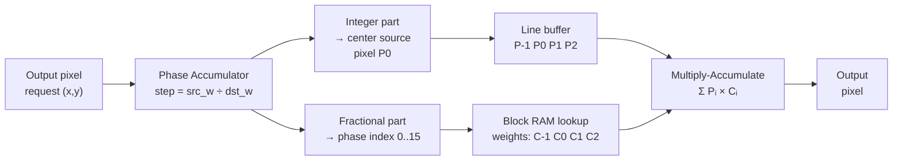
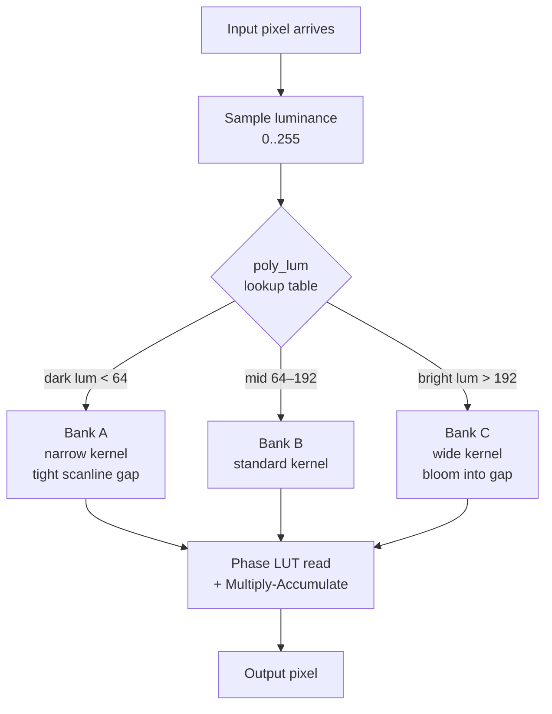
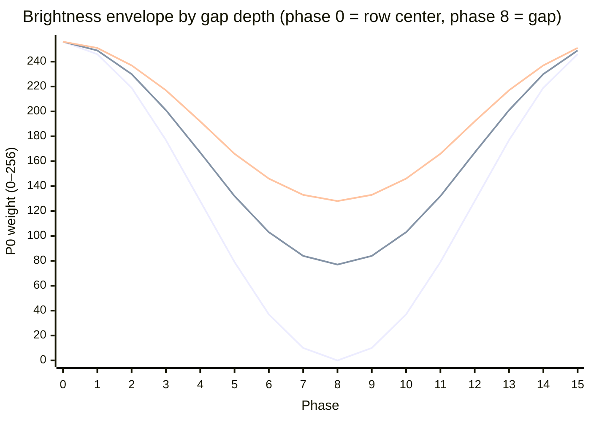

# The Polyphase Scaler Explained (For Everyone)

Video scaling in MiSTer is handled by a chip called `ascal` — a **polyphase scaler**. It sounds intimidating, but the core idea is simple: it applies a small convolution kernel to neighboring pixels to produce each output pixel. Swap the kernel, and the whole "look" of the scaling changes — from sharp to soft, from clean to CRT-scanlined, from neutral to over-bright phosphor glow.

This article explains how that works, starting from scratch.

---

## 1. The Problem: Pixels Don't Line Up

Suppose a game runs at 240p and your monitor runs at 1080p. To fill the screen, every source pixel has to expand to cover roughly 4.5 output pixels. That 0.5 is the trouble — output pixels land *between* source pixels.

```
Source pixels:   S0        S1        S2        S3
                 |         |         |         |
Output pixels:  O0  O1  O2  O3  O4  O5  O6  O7  O8 ...
```

`O2` sits perfectly on `S0`. But `O3` falls between `S0` and `S1`. What color should it be? That's the entire scaling problem.

The simplest answer is **Nearest Neighbor**: snap to whichever source pixel is closest. Result: blocky pixels. The second simplest is **Bilinear**: blend proportionally between the two flanking pixels. Result: smoother but blurry.

The polyphase scaler does something more powerful: it looks at **four** neighboring source pixels at once and applies a customizable convolution kernel. That kernel is called a **coefficient vector** (or just "taps").

---

## 2. The Convolution Kernel Analogy

If you have ever written an image blur, a sharpen filter, or a CSS `filter: drop-shadow()`, you have used a convolution kernel. A kernel is a fixed-size array of weights. You slide it over the input data, multiply each weight by the corresponding pixel value, and sum the results to get one output value.

Polyphase scaling is exactly that — a **1D convolution kernel** applied to four neighboring source pixels:

```
Kernel:   [  P-1   P0    P1    P2  ]
Weights:  [   0    200    56     0  ]   ← the "taps" / coefficients
```

The output pixel is:

```
Output = (P-1 × 0) + (P0 × 200) + (P1 × 56) + (P2 × 0)
       = P0×200 + P1×56
```

Weights must sum to **256** — the hardware's fixed-point representation of 1.0. So this kernel blends 78% of `P0` with 22% of `P1`.

This is also a generalized form of `lerp`. The familiar two-argument `lerp(a, b, t)` is just the special case of a 2-tap kernel with weights `[1-t, t]`. Four taps give you two extra degrees of freedom — enough to add negative weights on the outer taps, which is what produces sharpening.

**The polyphase part:** instead of one fixed kernel, you have a **lookup table of kernels** — typically 16 or 256 entries — one per fractional landing position (called a **phase**). When an output pixel lands exactly on a source pixel, you read the "phase 0" kernel. When it lands halfway between source pixels, you read the "phase 8" kernel. The scaler indexes the table automatically as it sweeps across the image.

That's polyphase scaling: a phase-indexed LUT of 4-tap convolution kernels.

---

## 3. How Phase Is Tracked

The scaler keeps a running counter called a **phase accumulator**:

- **Step size** = `source_width / output_width` (e.g. 240/1080 ≈ 0.222)
- For each output pixel, the accumulator advances by that step size
- The **whole number** part says which source pixel to center on
- The **fractional part** (0.00 → 0.99) selects which kernel entry to use

```
Output pixel:    0     1     2     3     4     5     6
Accumulator:   0.00  0.22  0.44  0.67  0.89  1.11  1.33
                 ↓     ↓     ↓     ↓     ↓     ↓     ↓
Center pixel:   S0    S0    S0    S0    S0    S1    S1
Recipe card:     0     4     7    11    14     2     5
                         (phase index, 0–15 for 4-bit FRAC)
```

The hardware stores the entire kernel table in a small Block RAM. Loading a new filter file replaces that table instantly.

```
What the LUT index actually does — the 4-tap window in space:

Source:  ···  S[n-1]────────S[n]────────S[n+1]────────S[n+2]  ···
                 │               │               │               │
                P-1             P0              P1              P2
                 ←──────────── 4-tap window ──────────────────►

Output pixel O landing at different phases within the S[n]→S[n+1] span:

  phase  0  (  0%): ·O· · · · · · · · · · · · · · ·  on S[n]      LUT[ 0]
  phase  4  ( 25%): · · · ·O· · · · · · · · · · · ·  ¼ across     LUT[ 4]
  phase  8  ( 50%): · · · · · · · ·O· · · · · · · ·  halfway      LUT[ 8]
  phase 12  ( 75%): · · · · · · · · · · · ·O· · · ·  ¾ across     LUT[12]
  phase 15  (≈100%): · · · · · · · · · · · · · · ·O  near S[n+1]  LUT[15]
                     ↑S[n]                         ↑S[n+1]

The same four source pixels are read at every phase. Only the weights from
the LUT entry change — that is the entire mechanism.
```



---

## 4. Dissecting the Kernels: What Taps Actually Do

Here is how different visual effects map directly to coefficient values. All examples use 256 = 100%.

### 4.1 Nearest Neighbor — "Just snap to the closest pixel"

Every kernel entry is identical: take 100% of `P0`, ignore everything else.

```
All phases:   [ 0,  256,   0,   0 ]
```

```
Source:   ████  ████  ░░░░  ████
Output:   ████████  ░░░░░░  ████████   ← hard edges, blocky, no blending
```

**Why it looks blocky:** every output pixel is a perfect copy of one source pixel. No mixing ever happens.

---

### 4.2 Bilinear — "Blend proportionally between neighbors"

Each kernel entry mixes `P0` and `P1` in proportion to how far the output pixel has drifted:

```
Phase 0/16  (0% across):  [  0,  256,    0,   0 ]  ← pure P0
Phase 4/16  (25% across): [  0,  192,   64,   0 ]  ← 75% P0, 25% P1
Phase 8/16  (50% across): [  0,  128,  128,   0 ]  ← 50/50 blend
Phase 12/16 (75% across): [  0,   64,  192,   0 ]  ← 25% P0, 75% P1
Phase 15/16 (≈100%):      [  0,   16,  240,   0 ]  ← nearly pure P1
```

**Why it looks smooth but blurry:** edges get "smeared" because every landing position between pixels produces a blend. Fine detail in the source softens out.

```
P0 tap weight as the output pixel drifts from S[n] toward S[n+1]:

  256 ┤●
      │ ╲
      │  ╲  Bicubic: weight falls slowly at first, then drops sharply
  160 ┤   ╲____
      │        ╲
  128 ┤─●────────╲───────────── Bilinear: straight line
      │            ╲─────●
   64 ┤                   ╲────●
      │                         ╲
    0 ┤                          ╲●
      └────────────────────────────→ phase
      0         4         8        12        15

P-1 and P2 tap weights (bicubic only — bilinear keeps these at 0):

    0 ┤─────────────────────────────────────────
      │     ╲                          ╱
  -16 ┤      ╲______________________╱
      │              negative lobes
      └────────────────────────────→ phase
      0         4         8        12        15

Bicubic's P0 sits above the bilinear line at mid-phases (more weight on the
dominant pixel), while P-1/P2 go negative to keep the sum at 256.
Those negative lobes subtract the far neighbors — that subtraction is what
steepens edges and produces the visual sharpening.
```

---

### 4.3 Bicubic / Lanczos — "Sharp with negative lobes"

Now the outer taps go **negative**. Negative means *subtract* that neighbor's influence.

```
Phase 8/16 (50% across):  [ -32,  160,  160,  -32 ]
                                       ↑sum = 256 ✓
```

What does negative mean visually? On a dark-to-bright edge:

```
Source pixels:  P-1=10   P0=10   P1=200   P2=200
Output at 50%:
  Bilinear:  10×0 + 10×128 + 200×128 + 200×0  =  1280+25600 = 26880 → 105
  Bicubic:   10×-32 + 10×160 + 200×160 + 200×-32
           = -320 + 1600 + 32000 + -6400 = 26880 → 105  (same total)

  ...but at the transition itself (phase 4):
  Bilinear:  10×192 + 200×64 + ...  = gentle ramp
  Bicubic:   10×-20 + 10×200 + 200×68 + 200×8 + ... = steeper ramp ← sharpened edge!
```

The negative outer taps **punch up the contrast at edges** by subtracting a little of the "far" pixel's value. This is why bicubic and Lanczos filters look sharper than bilinear — they actively make edges steeper.

**The trade-off:** if the negative lobe is too strong, bright edges get a dark halo ("ringing"). Filter designers balance sharpness against ringing.

---

### 4.4 Scanlines — "Make alternating rows dark"

This is where polyphase reveals its real power. To simulate CRT scanlines on a 2× vertical scale, you want:
- Even output rows: full brightness
- Odd output rows: black (or very dim)

Because the phase accumulator produces alternating phases for even and odd output rows at 2× scale, you just give those phases different kernel entries:

```
Phase for even output rows:  [  0,  256,   0,   0 ]  ← 100% bright
Phase for odd output rows:   [  0,    0,   0,   0 ]  ← 0% = black gap
```

```
Source row S0:   ████████████████
Output row 0:    ████████████████   ← even phase → full brightness kernel
Output row 1:    ░░░░░░░░░░░░░░░░   ← odd phase  → zero kernel = black
Output row 2:    ████████████████
Output row 3:    ░░░░░░░░░░░░░░░░
```

**Why it works at any output resolution:** the phase accumulator does fractional math. At 3× scale, you get phases 0/3, 1/3, 2/3 cycling. Set the kernel entry for the 2/3 phase to zero, and you get scanlines spaced correctly for 3× too. The filter adapts automatically — no special code needed for each resolution.

---

### 4.5 Soft Scanlines — "CRT glow, not just black gaps"

Real CRTs don't snap to black between lines — they fade. Model that with a curve:

```
Phase for row center:     [  0,  256,   0,   0 ]  ← peak brightness
Phase for row midpoint:   [  0,  180,   0,   0 ]  ← 70% brightness
Phase for row edge:       [  0,   60,   0,   0 ]  ← 23% brightness
Phase for row gap:        [  0,    8,   0,   0 ]  ← 3% brightness, not fully black
```

The gentle falloff makes the scanlines look soft and organic, like a real tube, rather than a hard stripe mask.

```
Brightness across output rows — one source row scaled to 8 output rows:

  Hard gap (2 kernel values: 256 or 0)     Soft glow (8 kernel values, bell curve)

  row 0  ████████████████  100%            row 0  ████████████████  100%
  row 1  ████████████████  100%            row 1  ████████████████  100%
  row 2  ████████████████  100%            row 2  ▓▓▓▓▓▓▓▓▓▓▓▓▓▓▓▓   70%
  row 3  ████████████████  100%  ←bright   row 3  ▒▒▒▒▒▒▒▒▒▒▒▒▒▒▒▒   23%
  row 4  ░░░░░░░░░░░░░░░░    0%            row 4  ░░░░░░░░░░░░░░░░    3%  ←gap
  row 5  ░░░░░░░░░░░░░░░░    0%  ←gap      row 5  ▒▒▒▒▒▒▒▒▒▒▒▒▒▒▒▒   23%
  row 6  ░░░░░░░░░░░░░░░░    0%            row 6  ▓▓▓▓▓▓▓▓▓▓▓▓▓▓▓▓   70%
  row 7  ░░░░░░░░░░░░░░░░    0%            row 7  ████████████████  100%

  The P0 tap weight in the coefficient table directly encodes this
  brightness curve. Swapping the table is all that changes between the
  two looks above — same hardware, same pass.
```

---

### 4.6 Weighted Resize + Scanlines Simultaneously

Here is the key insight: **the same phase step that controls scanlines also controls interpolation shape**. You can combine effects in one coefficient table:

```
Phase 0 (row center, sitting on source pixel):
  [  0,  256,   0,   0 ]  ← pure source pixel, full brightness

Phase 4 (row center, between source pixels):
  [ -24,  152,  152, -24 ]  ← sharp bicubic blend, full brightness

Phase 8 (row gap, sitting on source pixel):
  [  0,   32,   0,   0 ]  ← same source pixel, but at 12.5% brightness → scanline gap

Phase 12 (row gap, between source pixels):
  [ -3,   19,   19,  -3 ]  ← bicubic shape × 12.5% brightness → scanline gap with blur
```

Result: a sharp bicubic resize that simultaneously renders scanline gaps — from a **single pass** of the same hardware, just by loading different numbers into the coefficient table.

---

## 5. The Unifying Principle: Why One Filter Does Everything

The polyphase filter is just a **weighted average machine**. Its output is always:

```
Output = P-1×A + P0×B + P1×C + P2×D
```

Any visual behavior you want is expressible as a choice of A, B, C, D:

| Effect | What you're really doing |
|---|---|
| Nearest neighbor | B=256, everything else 0 — a degenerate kernel |
| Bilinear | Distribute 256 between B and C based on phase — `lerp` |
| Sharpen | Make B+C > 256, compensate with negative A and D — unsharp mask logic |
| Scanline gap | Scale all weights toward 0 at gap phases |
| CRT glow | Smooth weight curve across gap phases instead of hard zero |
| Bloom on bright pixels | Different kernel entry selected by pixel luminance |
| Soft blur | Spread the 256 across all four taps evenly — box filter |

The hardware executes one fixed operation: multiply four pixels by four weights and sum. Every visual effect is just a different parameter set for that same operation.

---

## 6. Adaptive Coefficients: Brightness-Driven Kernel Selection

`ascal` has one more trick: it can pick a **different coefficient set depending on how bright the pixel is**.

This is called `poly_lum` (lum = luminance = brightness). A lookup table maps pixel brightness → which coefficient bank to read from.

**Primary use case — realistic CRT bloom:**

- Dark pixels (shadow areas): use a narrow kernel with weights that drop steeply to zero
- Bright pixels (highlights): use a wider kernel where the weights taper slowly — brightness "bleeds" into the gap

```
Bright pixel at scanline center:   [  0,  256,   0,   0 ]
Bright pixel at scanline gap:      [  0,   80,   0,   0 ]  ← dim but visible (bloom)

Dark pixel at scanline center:     [  0,  180,   0,   0 ]
Dark pixel at scanline gap:        [  0,    4,   0,   0 ]  ← nearly black (tight gap)
```



This makes bright elements on the screen appear to glow, spreading slightly into the scanline shadow, exactly as a high-energy CRT phosphor does.

The VHDL exposes separate controls for horizontal and vertical adaptive mode (`o_h_poly_use_adaptive`, `o_v_poly_use_adaptive`), so you can apply the brightness trick vertically (for scanlines) while using fixed sharp coefficients horizontally (for crisp pixel edges).

---

## 7. Loading Your Own Filter

The coefficient table lives in a small Block RAM inside the FPGA. The MiSTer HPS (the ARM processor on the board) writes to it at runtime through an interface called `poly_mem`.


**User workflow:**

1. Write a plain `.txt` file with rows of numbers (one row per phase, four values per row).
2. The numbers can be floating point (`0.0` to `1.0`) or integers; the firmware converts them to the hardware's 10-bit signed format automatically.
3. Select the filter from the OSD. The HPS writes the values to FPGA RAM. The scaler uses the new kernel table on the very next frame.

**Example filter file (soft scanlines at 2× vertical) — one kernel entry per line, four weights per entry:**

```
# phase 0 — row center
0  256  0  0
# phase 1
0  224  0  0
# phase 2
0  180  0  0
# phase 3
0  120  0  0
# phase 4 — halfway down (gap starts)
0   64  0  0
# phase 5
0   28  0  0
# phase 6
0    8  0  0
# phase 7
0    2  0  0
# phase 8 — row gap center
0    0  0  0
# phases 9–15 mirror 7–1 (symmetric)
0    2  0  0
0    8  0  0
0   28  0  0
0   64  0  0
0  120  0  0
0  180  0  0
0  224  0  0
```

This creates a smooth CRT scanline fade without any programming — just numbers in a text file.

---

## 8. Designing a Filter from Requirements

The sections above show what specific coefficient tables produce. This one works backwards: given a visual target, how do you calculate the right values?

### 8.1 The General Process

1. **Identify which phases are active** at your target output scale
2. **Define the brightness envelope** — what P0 weight at peak (row center) and trough (row gap)?
3. **Choose a curve shape** between peak and trough
4. **Calculate** the weight at each of the 16 phases using the curve formula
5. **Verify** the sum of all four tap weights per phase ≤ 256
6. **Optionally combine** with a horizontal interpolation kernel (see §8.4)

### 8.2 Which Phases Are Active at a Given Scale?

The phase accumulator step is `1 / scale_factor`. At each output row, the fractional part of the accumulator selects the phase index (fractional × 16, rounded):

```
Scale     Step      Phases visited (16-phase LUT)
  2×      0.500     0, 8, 0, 8 …                  ← only 2 phases used
  3×      0.333     0, 5, 10, 0, 5, 10 …           ← only 3 phases used
  4×      0.250     0, 4, 8, 12, 0, 4 …            ← only 4 phases used
4.5×      0.222     0, 3, 7, 11, 14, 1, 5 …        ← all 16 phases cycle through
```

At exactly 2×, only **phase 0** (row center) and **phase 8** (row gap) ever fire.
At non-integer scales every phase matters, so a well-designed filter uses smooth values
across all 16 entries — not a hard step from 256 to 0.

### 8.3 Worked Example: Lifting Gap Intensity

**Goal:** modify a standard hard-gap scanline so the gap rows show 30% brightness instead of 0%.

**Step 1 — Locate the gap phase.**  
At 2× scale: phase 0 = row center (landed on source pixel), phase 8 = gap center (halfway between source rows). Phase 8 is the entry to change.

**Step 2 — Set the target gap weight.**  
30% of 256 = **77**. So `phase 8 → [0, 77, 0, 0]`.

**Step 3 — Compute intermediate phases with a cosine curve.**  
A hard jump from 256 at phase 7 to 77 at phase 8 causes banding at non-2× scales. A cosine envelope distributes the transition smoothly across all phases:

```
weight[p] = min_w + (256 - min_w) × (1 + cos(2π × p / 16)) / 2
```

Where `min_w` is the target gap brightness (77 here). Evaluating all 16 phases:

```
p    angle    weight     bar
 0     0°      256     ████████████████  100%
 1    22°      249     ███████████████▌   97%
 2    45°      230     ██████████████▌    90%
 3    68°      201     ████████████▌      79%
 4    90°      167     ██████████▌        65%
 5   112°      132     ████████▌          52%
 6   135°      103     ██████▌            40%
 7   158°       84     █████▌             33%
 8   180°       77     ████▊              30%  ← gap center
 9   202°       84     █████▌             33%
10   225°      103     ██████▌            40%
11   248°      132     ████████▌          52%
12   270°      167     ██████████▌        65%
13   292°      201     ████████████▌      79%
14   315°      230     ██████████████▌    90%
15   338°      249     ███████████████▌   97%
```

**Step 4 — Write the filter file.**

```
# Scanline filter — 30% gap intensity
# Change only min_w to adjust gap depth; the curve recalculates automatically
# Format: P-1  P0  P1  P2
0  256  0  0   # phase  0  100%
0  249  0  0   # phase  1   97%
0  230  0  0   # phase  2   90%
0  201  0  0   # phase  3   79%
0  167  0  0   # phase  4   65%
0  132  0  0   # phase  5   52%
0  103  0  0   # phase  6   40%
0   84  0  0   # phase  7   33%
0   77  0  0   # phase  8   30%  ← gap center — set this to tune gap depth
0   84  0  0   # phase  9   33%
0  103  0  0   # phase 10   40%
0  132  0  0   # phase 11   52%
0  167  0  0   # phase 12   65%
0  201  0  0   # phase 13   79%
0  230  0  0   # phase 14   90%
0  249  0  0   # phase 15   97%
```

**Gap depth comparison** — swap just the `min_w` value in the formula to get any intensity:

```
min_w     gap center weight   description
    0       [0,   0, 0, 0]   pure black gap (standard hard scanline)
   38       [0,  38, 0, 0]   15% — subtle phosphor glow
   77       [0,  77, 0, 0]   30% — soft CRT (example above)
  128       [0, 128, 0, 0]   50% — mild brightness dip, not a gap
  180       [0, 180, 0, 0]   70% — barely visible scanline effect
```



### 8.4 Combining with Horizontal Interpolation

A pure scanline V-filter (`[0, weight, 0, 0]`) is nearest-neighbor horizontally. To add bicubic horizontal sharpness, **multiply the full bicubic kernel by the vertical brightness factor**:

```
brightness_factor[v_phase] = weight[v_phase] / 256

At gap center (phase 8, 30% brightness):
  factor = 77 / 256 = 0.301

Base bicubic H-kernel at 50% horizontal phase:
  [-32, 160, 160, -32]   sum = 256

Scaled for gap row:
  [-32×0.301, 160×0.301, 160×0.301, -32×0.301]
= [-10, 48, 48, -10]     sum = 76  ≈ 77 ✓
```

The resulting entry combines both effects in one multiply: the bicubic shape steepens edges horizontally, and the brightness factor dims the row to the target gap depth — single hardware pass, no extra logic.

In practice, `ascal` runs H and V as two independent 1D passes, so you can load a V-table (cosine brightness envelope) and a separate H-table (standard bicubic) and get both effects without manually pre-multiplying — the two passes compose automatically. Pre-multiplying into a single combined table is only needed if you want different horizontal blur amounts between bright rows and gap rows (e.g., slightly softer gap rows to simulate scanline phosphor diffusion).

---

## 9. Quick Reference

| Term | Plain meaning |
|---|---|
| **Phase** | Where between two source pixels the output pixel lands (0–100%) |
| **Tap** | One of the four neighboring source pixels used in the mix |
| **Coefficient** | How much weight one tap gets (0 = ignore, 256 = full) |
| **Coefficient vector** | The four weights for one phase — one kernel entry in the LUT |
| **FRAC** | How many phase steps exist between source pixels (16 or 256 typically) |
| **Negative lobe** | A negative coefficient that subtracts a neighbor — creates sharpness |
| **poly_lum** | Adaptive mode: choose coefficient bank based on pixel brightness |
| **Normalization** | The rule that all four weights must sum to 256 for correct brightness |

---

## FAQ

**Q: Why 4 taps? Why not 2 or 8?**  
2 taps is bilinear — no negative lobes possible, no sharpening. 8 taps gives more precision but costs 2× the FPGA multiplier resources. 4 is the sweet spot: sharp bicubic and Lanczos both fit, cost is manageable on the DE10-Nano.

**Q: What happens if my coefficients don't sum to 256?**  
The image brightens or darkens. Sum > 256 → overexposed. Sum < 256 → underexposed. Always normalize unless you intentionally want a brightness shift (some scanline filters intentionally sum to ~200 to simulate overall CRT dimness).

**Q: Can I do horizontal scanlines?**  
Yes — apply the same scanline kernel to the horizontal scaler instead of (or in addition to) the vertical one. You get a dot-matrix or aperture-grille effect.

**Q: Why does the filter look different at 1080p vs 1440p?**  
The phase accumulator step size changes with output resolution, so the same coefficient table maps to different physical row spacings. Scanline filters that were designed for exact 2× or 3× ratios may look irregular at non-integer scales. Well-designed filters use smooth coefficient curves that degrade gracefully at any ratio.

**Q: How does the scaler "know" which phase maps to which output row for scanlines?**  
It doesn't know about scanlines specifically — it just computes the fractional position mechanically. The filter designer arranges the coefficient table so that whatever fractional position corresponds to the "between-rows" landing produces a dark output. At 2×, the half-step phase always lands between source rows, so putting zeroes there gives you scanlines for free.
