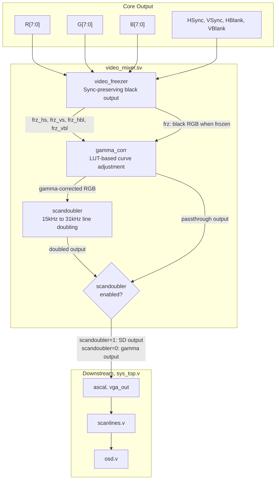
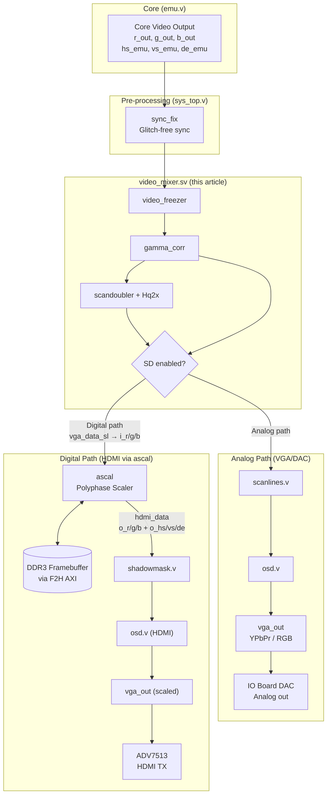

[← Section Index](README.md) · [↑ Knowledge Base](../README.md)

# MiSTer FPGA Video Mixer Subsystem: Deep Dive

A source-grounded analysis of the `video_mixer` pipeline — the first stage of video processing after the emulation core's output. Covers the video freezer, gamma correction, scandoubler, and Hq2x pixel-art scaling, with code traced to `Template_MiSTer/sys/`.

## Table of Contents

1. [Top-Level Architecture](#1-top-level-architecture)
2. [Video Freezer](#2-video-freezer)
3. [Gamma Correction](#3-gamma-correction)
4. [Scandoubler](#4-scandoubler)
5. [Output Selection and Integration](#5-output-selection-and-integration)
6. [Antipatterns and Common Pitfalls](#6-antipatterns-and-common-pitfalls)
7. [Platform Context](#7-platform-context)
8. [Relationship to ascal — The Dual-Path Signal Chain](#8-relationship-to-ascal--the-dual-path-signal-chain)

---

## 1. Top-Level Architecture

Source: [`video_mixer.sv`](https://github.com/MiSTer-devel/Template_MiSTer/blob/master/sys/video_mixer.sv) (220 lines)

The `video_mixer` acts as a multi-stage pipeline between the emulation core's raw video output and the downstream scaler/OSD system. It is typically instantiated inside `arcade_video.v` or the core's top-level wrapper.



### Module Parameters

```verilog
// video_mixer.sv:L19-24
module video_mixer #(
    parameter LINE_LENGTH = 768,
    parameter HALF_DEPTH  = 0,   // 0=8-bit color, 1=4-bit color
    parameter GAMMA       = 0    // 0=no gamma, 1=enable gamma correction
)
```

The `GAMMA` parameter controls whether the `gamma_corr` module is instantiated. When `GAMMA=0`, the gamma path is a passthrough, and the `gamma_bus` is tied low.

---

## 2. Video Freezer

Source: [`video_freezer.sv`](https://github.com/MiSTer-devel/Template_MiSTer/blob/master/sys/video_freezer.sv) (144 lines)

The first stage of the mixer is the `video_freezer`. During core loads, OSD menus, or resolution changes, the `HDMI_FREEZE` signal asserts.

### 2.1 Behavior

When frozen:
- **RGB**: Forced to black (0x00) — the `video_mixer` parent module handles this by gating RGB with the `frz` signal
- **Sync signals**: Continue to output with **correct timing**, maintaining the last-known frame period

The sync preservation is critical — without it, the downstream scaler and display would lose lock, causing a black-screen flash or several seconds of resynchronization delay.

### 2.2 `sync_lock` Implementation

Source: `video_freezer.sv:L80-143`

The freezer uses two instances of `sync_lock` — one for horizontal (WIDTH=21) and one for vertical (WIDTH=33):

```verilog
// video_freezer.sv:L39-59
sync_lock #(33) vs_lock (
    .clk(clk), .sync_in(vs_in), .sync_out(vs_out),
    .de_in(vbl_in), .de_out(vbl_out), .freeze(freeze)
);

sync_lock #(21) hs_lock (
    .clk(clk), .sync_in(hs_in), .sync_out(hs_out),
    .de_in(hbl_in), .de_out(hbl_out), .freeze(freeze),
    .sync_pt(sync_pt)
);
```

The `sync_lock` module measures the incoming sync period while the core is running, then replays the same timing when frozen:

```verilog
// video_freezer.sv:L101-121 — Measurement phase
always @(posedge clk) begin
    reg [WIDTH-1:0] cnti;
    cnti <= cnti + 1'd1;
    if(~old_sync & sync_in) begin
        if(sync_valid) f_len <= cnti;  // measure frame/line period
        f_valid <= 1;
        sync_valid <= f_valid;         // require 2 consecutive frames
        cnti <= 0;
    end
    if(old_sync & ~sync_in & sync_valid) s_len <= cnti;  // sync pulse width
    // ... measure de_start, de_end ...
    if(freeze) {f_valid, sync_valid} <= 0;  // stop measuring when frozen
end
```

```verilog
// video_freezer.sv:L124-136 — Playback phase
always @(posedge clk) begin
    reg [WIDTH-1:0] cnto;
    cnto <= cnto + 1'd1;
    if(cnto == f_len) cnto <= 0;           // wrap at frame period
    if(cnto == f_len) sync_o <= 1;         // assert sync
    if(cnto == s_len) sync_o <= 0;         // deassert sync
    if(cnto == de_start) de_o <= 1;        // assert data enable
    if(cnto == de_end)   de_o <= 0;        // deassert data enable
end

assign sync_out = freeze ? sync_o : sync_in;  // mux: replay or passthrough
assign de_out   = freeze ? de_o   : de_in;
```

### 2.3 VSYNC Synchronization Pulse

Source: `video_freezer.sv:L61-75`

The freezer also generates a `sync` output that toggles once per frame — used by `sys_top.v` to trigger downstream processing:

```verilog
reg sync_o;
always @(posedge clk) begin
    reg old_vs, vs_sync;
    old_vs <= vs_out;
    if(~old_vs & vs_out) vs_sync <= 1;       // set on VSYNC rising
    if(sync_pt & vs_sync) begin               // clear on next HSYNC sync point
        vs_sync <= 0;
        sync_o <= ~sync_o;                    // toggle
    end
end
```

This produces a toggle signal that transitions exactly once per frame, synchronized to the first HSYNC after VSYNC.

---

## 3. Gamma Correction

Source: [`gamma_corr.sv`](https://github.com/MiSTer-devel/Template_MiSTer/blob/master/sys/gamma_corr.sv) (125 lines)

If the core is instantiated with `GAMMA=1`, the mixer routes video through the `gamma_corr` module.

### 3.1 Architecture

`gamma_corr` uses a single 768-byte block RAM as a look-up table (LUT) — shared between all three color channels:

```verilog
// gamma_corr.sv:L22
(* ramstyle="no_rw_check" *) reg [7:0] gamma_curve[768];
```

The 768 bytes are organized as three 256-byte regions:

| Address Range | Channel |
|---|---|
| `0x000–0x0FF` | Red |
| `0x100–0x1FF` | Green |
| `0x200–0x2FF` | Blue |

### 3.2 3-Cycle State Machine

Source: `gamma_corr.sv:L30-57`

To save BRAM, the module looks up R, G, and B sequentially using a single RAM:

```verilog
// gamma_corr.sv:L30-57
always @(posedge clk_vid) begin
    reg [7:0] R_in, G_in, B_in;
    reg [7:0] R_gamma, G_gamma;
    reg [1:0] ctr = 0;
    reg       old_ce;

    old_ce <= ce_pix;
    if(~old_ce & ce_pix) begin  // rising edge of pixel clock enable
        {R_in, G_in, B_in} <= RGB_in;
        // Output uses previous cycle's results
        RGB_out <= gamma_en ? {R_gamma, G_gamma, gamma} : {R_in, G_in, B_in};
        ctr <= 1;
        gamma_index <= {2'b00, RGB_in[23:16]};  // Red lookup
    end

    if (|ctr) ctr <= ctr + 1'd1;

    case(ctr)
        1: begin                   gamma_index <= {2'b01, G_in}; end  // Green lookup
        2: begin R_gamma <= gamma; gamma_index <= {2'b10, B_in}; end  // Blue lookup
        3: begin G_gamma <= gamma; end  // Final: output ready next pixel
    endcase
end
```

The timing diagram for one pixel:

```
Pixel N:    |---ce_pix---|
Cycle:      0    1    2    3
Index:      R[N] G[N] B[N]
Output:     {Rγ[N-1], Gγ[N-1], Bγ[N-1]}  ← 1 pixel latency
```

### 3.3 `gamma_fast` Alternative

Source: `gamma_corr.sv:L62-124`

A `gamma_fast` module exists that uses three separate 256-byte RAMs for single-cycle lookup:

```verilog
// gamma_corr.sv:L84-86
(* ramstyle="no_rw_check" *) reg [7:0] gamma_curve_r[256];
(* ramstyle="no_rw_check" *) reg [7:0] gamma_curve_g[256];
(* ramstyle="no_rw_check" *) reg [7:0] gamma_curve_b[256];
```

However, `video_mixer.sv` defaults to the resource-efficient 3-cycle variant (`gamma_corr`). The `gamma_fast` module is available for cores that need zero-latency gamma correction.

### 3.4 HPS Write Path

The HPS writes gamma curves through the `gamma_bus`:

```verilog
// gamma_corr.sv:L8-9
input [9:0] gamma_wr_addr,  // {2-bit channel, 8-bit index}
input [7:0] gamma_value,
```

The write occurs on `clk_sys` (HPS side), while reads occur on `clk_vid` (video clock). The `no_rw_check` attribute prevents Quartus from flagging the cross-clock RAM access as a timing violation.

---

## 4. Scandoubler

Source: `video_mixer.sv:L139-166`

The scandoubler module (`scandoubler.v`) converts 15 kHz (240p/288p) signals to 31 kHz (480p/576p) VGA standards. It is controlled by the `scandoubler` input from `hps_io`.

### 4.1 Instantiation

```verilog
// video_mixer.sv:L144-166
scandoubler #(.LENGTH(LINE_LENGTH), .HALF_DEPTH(HALF_DEPTH_SD)) sd (
    .clk_vid(CLK_VIDEO),
    .hq2x(hq2x),
    .ce_pix(ce_pix),
    .hs_in(hs_g), .vs_in(vs_g), .hb_in(hb_g), .vb_in(vb_g),
    .r_in(R_gamma), .g_in(G_gamma), .b_in(B_gamma),
    .ce_pix_out(ce_pix_sd),
    .hs_out(hs_sd), .vs_out(vs_sd), .hb_out(hb_sd), .vb_out(vb_sd),
    .r_out(R_sd), .g_out(G_sd), .b_out(B_sd)
);
```

### 4.2 Double-Buffering Line Architecture

The scandoubler operates by caching each incoming scanline in a line buffer, then outputting it twice at twice the horizontal rate. When `hq2x` is active, the Hq2x algorithm replaces simple line doubling with edge-directed interpolation.

### 4.3 Hq2x Pixel-Art Scaling

When the `hq2x` parameter is active, the scandoubler invokes `Hq2x.sv`. The Hq2x algorithm is an edge-directed spatial interpolation algorithm designed for pixel art:

1. **Pattern Detection**: Evaluates the 8 neighboring pixels around the current pixel to detect diagonal edges
2. **LUT Matching**: An MLAB-based ROM (`hqTable[256]`) translates an 8-bit neighbor-difference pattern into a 6-bit blending rule
3. **Blending Engine**: Executes fixed-point arithmetic (`(A × 12 + B × 4) >> 4`, etc.) using shift-and-add logic — no DSP multipliers required

---

## 5. Output Selection and Integration

Source: `video_mixer.sv:L168-217`

The mixer's final stage selects between the raw/gamma output and the scandoubler output:

### 5.1 Color Mux

```verilog
// video_mixer.sv:L168-170
wire [DWIDTH_SD:0] rt = (scandoubler ? R_sd : R_gamma);
wire [DWIDTH_SD:0] gt = (scandoubler ? G_sd : G_gamma);
wire [DWIDTH_SD:0] bt = (scandoubler ? B_sd : B_gamma);
```

### 5.2 Pixel Clock Enable Selection

```verilog
// video_mixer.sv:L188
CE_PIXEL <= scandoubler ? ce_pix_sd : fs_osc ? (~old_ce & ce_pix) : ce_pix;
```

When the scandoubler is active, `CE_PIXEL` follows the scandoubler's doubled output rate. When inactive, it uses the original `ce_pix`, with a special oscillator detection mode (`fs_osc`) that handles cores with irregular pixel clock enables.

### 5.3 HALF_DEPTH Expansion

```verilog
// video_mixer.sv:L190-199
if(!GAMMA && HALF_DEPTH) begin
    r <= {rt, rt};  // duplicate 4-bit to 8-bit
    g <= {gt, gt};
    b <= {bt, bt};
end else begin
    r <= rt;
    g <= gt;
    b <= bt;
end
```

When the core outputs 4-bit color (`HALF_DEPTH=1`) and gamma correction is disabled, each 4-bit value is duplicated to fill 8 bits. This preserves the original retro aesthetic without artificially smoothing the limited palette.

### 5.4 Data Enable Generation

```verilog
// video_mixer.sv:L214-216
if(CE_PIXEL) begin
    old_hde <= hde;
    if(old_hde ^ hde) VGA_DE <= vde & hde;
end
```

The `VGA_DE` (Data Enable) signal transitions only on the boundary between active and blank video, preventing glitches from spurious transitions within blank regions.

---

## 6. Antipatterns and Common Pitfalls

### 6.1 Gamma Latency

The 3-cycle gamma correction adds one pixel of latency. For most applications this is invisible, but for cores that rely on sub-pixel timing (e.g., light gun games), this latency must be accounted for in the input processing chain.

### 6.2 HALF_DEPTH with Gamma

When both `HALF_DEPTH=1` and `GAMMA=1` are set, the gamma module expects 8-bit input. The `video_mixer` handles this by expanding 4-bit to 8-bit before the gamma module (via the `R_in = {R, R}` expansion in the generate block at L91-100).

### 6.3 Scandoubler with Non-Standard Sync

The scandoubler expects consistent HSYNC/VSYNC timing. Cores that produce irregular sync (e.g., the C64's variable-length lines) may cause the scandoubler to produce artifacts. In such cases, the scandoubler should be disabled and the core should output 31 kHz directly.

### 6.4 Freezer and Resolution Changes

When a core changes resolution mid-stream, the `sync_lock` module's measured timing becomes invalid. The freezer requires at least 2 consecutive frames with valid sync before it can reliably replay timing. During the transition, the output may briefly lose sync.

---

## 7. Platform Context

| Aspect | MiSTer | Analogue Pocket | Software Emulation |
|---|---|---|---|
| Gamma correction | LUT-based, HPS-programmable | Fixed or none | Shader-based |
| Scandoubler | Hardware line buffer + Hq2x | Not needed (all digital) | Shader-based |
| Video freezer | Sync-lock replay | Framebuffer hold | N/A |
| Color depth | 4-bit or 8-bit per channel | 8-bit per channel | 8-bit or 10-bit |
| Latency | 1 pixel (gamma) + variable (scandoubler) | Framebuffer dependent | 1+ frames |

---

## 8. Relationship to ascal — The Dual-Path Signal Chain

Source: [`sys_top.v`](https://github.com/MiSTer-devel/Template_MiSTer/blob/master/sys/sys_top.v) (2149 lines)

The `video_mixer` does not exist in isolation — it is the **first stage** in a dual-path video pipeline that diverges at the mixer's output. Understanding how `video_mixer` feeds into `ascal` (the polyphase scaler) is essential for reasoning about latency, image quality, and the analog-vs-digital output decision.

### 8.1 Full Signal Chain in `sys_top.v`

After the emulation core produces raw video (`r_out/g_out/b_out` + `hs_emu/vs_emu/de_emu`), the signal flows through the following stages — with the video_mixer (§1–§5) handling the first half, and ascal handling the HDMI scaling half:



### 8.2 How video_mixer Feeds ascal

The `video_mixer` output reaches ascal through an important intermediate stage. In `sys_top.v`, the signal routing is:

```
emu core → sync_fix → scanlines.v → vga_data_sl
                                              ↓
                                     ascal.i_r/g/b, i_hs/vs, i_de
```

The `scanlines.v` module sits between the video_mixer output and the ascal input. It applies the scanline effect to the `de_emu`-gated RGB before the signal reaches the scaler. The key signal assignments in `sys_top.v:L1739-1746`:

```verilog
// sys_top.v:L1739-1746 — Ascal input is fed from scanlines output
assign clk_ihdmi = clk_vid;
assign ce_hpix   = vga_ce_sl;       // scanlines output clock enable
assign hr_out    = vga_data_sl[23:16]; // scanlines output R
assign hg_out    = vga_data_sl[15:8];  // scanlines output G
assign hb_out    = vga_data_sl[7:0];   // scanlines output B
assign hhs_fix   = vga_hs_sl;         // scanlines output HSYNC
assign hvs_fix   = vga_vs_sl;         // scanlines output VSYNC
assign hde_emu   = vga_de_sl;         // scanlines output DE
```

These `hr_out/hg_out/hb_out` signals connect directly to ascal's `i_r/i_g/i_b` ports (`sys_top.v:L779-785`).

### 8.3 What ascal Does with the video_mixer Output

The ascal scaler receives the video_mixer's processed output and performs a fundamentally different operation:

| Aspect | video_mixer | ascal |
|--------|-------------|-------|
| **Purpose** | Signal conditioning (freeze, gamma, line-double) | Resolution scaling to fixed output |
| **Latency** | 0–1 pixel (gamma), 1 line (scandoubler) | 1+ frames (framebuffer + triple buffer) |
| **Memory** | Line buffer (M10K BRAM) | Full framebuffer (DDR3 via F2H AXI) |
| **Clock domain** | `clk_vid` (core pixel clock) | `i_clk` = `clk_vid`, `o_clk` = `clk_hdmi` |
| **Output** | Same resolution as input (or 2× vertically) | Scaled to 720p/1080p/1440p/4K |
| **Sync handling** | Passes through or freezes | Regenerates entirely from `o_clk` domain |

When the video_mixer's scandoubler is active, ascal receives 31 kHz doubled video — which means fewer lines to scale vertically. When the scandoubler is off, ascal receives the native 15 kHz signal and must handle both the scaling and the interlace detection internally.

### 8.4 The Dual-Path Mux at the Physical Output

At the VGA connector, `sys_top.v` selects between the analog path (direct from video_mixer → scanlines → OSD → `vga_out`) and the scaled path (ascal output → shadowmask → OSD → `vga_out`):

```verilog
// sys_top.v:L1544 — VGA output mux
wire vgas_en = vga_fb | vga_scaler;

// sys_top.v:L1549-1553 — Physical pin assignment
assign VGA_R = vgas_en ? vgas_o[23:18]    : vga_o[23:18];  // scaled or native
assign VGA_HS = vgas_en ? ~vgas_hs        : ~vga_hs;       // scaled or native sync
```

When `vga_scaler=1` (user sets `vga_scaler=1` in MiSTer.ini), the VGA port carries the ascal-scaled output instead of the native-rate signal. This allows using the IO Board's DAC with a modern monitor that only accepts standard resolutions.

### 8.5 Key Interactions

- **Freeze → ascal**: When `HDMI_FREEZE` asserts (during core load, OSD, resolution change), the video_mixer's `video_freezer` maintains sync timing. The ascal sees continuous sync and does not lose its phase-locked output — critical for preventing HDMI black-screen flashes.
- **Scandoubler → ascal**: If the scandoubler is enabled, ascal receives 31 kHz progressive input. If disabled, ascal receives 15 kHz and must detect interlacing via `i_fl` (field flag) and apply bob deinterlacing when `bob_deint=1`.
- **Gamma → ascal**: Gamma correction applies *before* ascal. The scaler receives gamma-corrected pixels, which means the scaling interpolation operates on perceptually-linear values — the mathematically correct order for high-quality scaling.
- **Shadow mask**: After ascaling, the `shadowmask.v` module applies CRT shadow-mask effects in the output clock domain (`clk_hdmi`). This is separate from the video_mixer's gamma/scandoubler processing.

---

### Cross-References

- [ASCAL Deep Dive](ascal_deep_dive.md) — Complete architectural analysis of the polyphase scaler: clock domains, CDC, data flow, interpolation algorithms, triple buffering, and all 17 functional blocks
- [ASCAL Architecture](ascal_architecture.md) — Overview of the VHDL and SystemVerilog scaler implementations
- [Polyphase Scaling Theory](polyphase_scaling_theory.md) — Mathematical foundations of video scaling, FIR filters, and coefficient vectors
- [Video/Audio Pipelines](../06_fpga_subsystem/video_audio_pipelines.md) — System-level view of the dual-path analog/digital video pipeline
- [Analog & Direct Video](analog_direct_video_architecture.md) — Direct Video mode, RGB→YPbPr, NTSC/PAL composite, IO board DAC

---

Source: `Template_MiSTer/sys/video_mixer.sv` (220 lines), `Template_MiSTer/sys/video_freezer.sv` (144 lines), `Template_MiSTer/sys/gamma_corr.sv` (125 lines), `Template_MiSTer/sys/sys_top.v` (2149 lines)