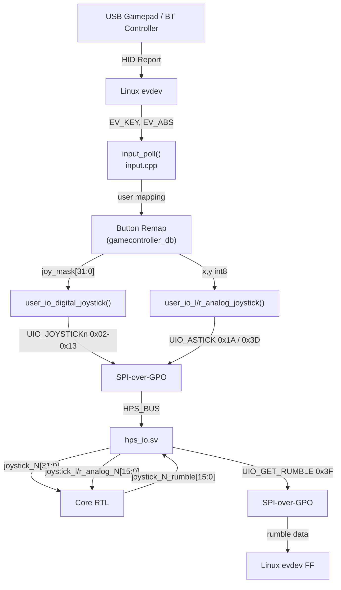

[← Input Devices](README.md) · [↑ Knowledge Base](../README.md)

# Joystick and Gamepad Path

MiSTer translates USB/BT gamepad events into a 32-bit digital button word
plus optional 16-bit analog stick values delivered to the FPGA.

Sources: `Main_MiSTer/input.cpp`, `input.h`, `user_io.cpp`, `user_io.h`, `hps_io.sv`

---

## Architecture



---

## Digital Joystick Mapping

### Standard 32-bit Button Word

The lower 16 bits follow the original Atari/Amiga joystick layout extended
for modern pads:

| Bit | Constant | Gamepad button |
|---|---|---|
| 0 | `JOY_RIGHT` | D-pad right |
| 1 | `JOY_LEFT` | D-pad left |
| 2 | `JOY_DOWN` | D-pad down |
| 3 | `JOY_UP` | D-pad up |
| 4 | `JOY_BTN1` / `JOY_A` | A / Fire 1 |
| 5 | `JOY_BTN2` / `JOY_B` | B / Fire 2 |
| 6 | `JOY_BTN3` / `JOY_SELECT` | Select |
| 7 | `JOY_BTN4` / `JOY_START` | Start |
| 8 | `JOY_X` | X |
| 9 | `JOY_Y` | Y |
| 10 | `JOY_L` | L1 |
| 11 | `JOY_R` | R1 |
| 12 | `JOY_L2` | L2 |
| 13 | `JOY_R2` | R2 |
| 14 | `JOY_L3` | L3 (stick click) |
| 15 | `JOY_R3` | R3 (stick click) |
| `[31:16]` | core-specific | Extended buttons (core-defined) |

### UIO Command — Digital Joystick

```c
// user_io.cpp
void user_io_digital_joystick(unsigned char idx, uint32_t map, int autofire)
{
    // opcodes: 0x02=joy0, 0x03=joy1, 0x10=joy2..0x13=joy5
    static const uint8_t cmd[] = {
        UIO_JOYSTICK0, UIO_JOYSTICK1,
        UIO_JOYSTICK2, UIO_JOYSTICK3,
        UIO_JOYSTICK4, UIO_JOYSTICK5
    };
    spi_uio_cmd_cont(cmd[idx]);
    spi_w((uint16_t)(map & 0xFFFF));      // lower 16 bits first
    spi_w((uint16_t)(map >> 16));         // upper 16 bits
    DisableIO();
}
```

### FPGA Reception

```verilog
// hps_io.sv
'h02: if(byte_cnt==1) joystick_0[15:0] <= io_din;
      else            joystick_0[31:16] <= io_din;
'h03: if(byte_cnt==1) joystick_1[15:0] <= io_din;
      else            joystick_1[31:16] <= io_din;
// ... 0x10-0x13 same pattern for joy 2-5
```

---

## Analog Stick Mapping

### Left Analog Stick (Opcode `0x1A`)

```c
void user_io_l_analog_joystick(unsigned char idx, char x, char y)
{
    // idx[3:0] = joystick index (0-5), idx[7:4] = paddle/spinner index
    spi_uio_cmd_cont(UIO_ASTICK);   // 0x1A
    spi_w(idx);                      // byte 0: index
    spi_w(((uint8_t)y << 8) | (uint8_t)x); // byte 1: Y[15:8], X[7:0]
    DisableIO();
}
```

Format: `joystick_l_analog_N[15:0]` = `{Y[7:0], X[7:0]}`, signed -127..+127.

### Right Analog Stick (Opcode `0x3D`)

```verilog
// hps_io.sv
'h3d: if(!byte_cnt[MAX_W:2]) begin
    case(byte_cnt[1:0])
        1: stick_idx <= io_din[3:0];
        2: case(stick_idx)
            0: joystick_r_analog_0 <= io_din;
            // ...
        endcase
    endcase
end
```

### Paddles and Spinners (via `0x1A` with `idx[7:4]`)

When `idx[3:0] == 15` (special), `idx[7:4]` selects paddle/spinner:

| `idx[7:4]` | Output register |
|---|---|
| 0–5 | `paddle_N[7:0]` (0..255) |
| 8–13 | `spinner_N[8:0]` (signed delta + toggle bit 8) |

---

## Rumble / Force Feedback

Cores can request rumble via `joystick_N_rumble[15:0]`:

| Bits | Meaning |
|---|---|
| `[15:8]` | Large motor magnitude (0=off, 255=max) |
| `[7:0]` | Small motor magnitude |

MiSTer polls `UIO_GET_RUMBLE` (0x3F):
```verilog
// hps_io.sv — response to 0x3F
'h003F: io_dout <= joystick_0_rumble;
'h013F: io_dout <= joystick_1_rumble;
// ... (upper byte of command = joystick index)
```

---

## Button Remapping

`input.cpp` supports per-device gamepad database (`gamecontroller_db.cpp`)
and per-core OSD remapping.  The remap is applied in software before calling
`user_io_digital_joystick()`.

Player swap (`user_io_set_joyswap()`) exchanges joystick 0 ↔ 1 transparently.

---

## Joystick Swap

```c
// user_io.cpp
static int joyswap = 0;

void user_io_set_joyswap(int swap) { joyswap = swap; }

void user_io_digital_joystick(unsigned char idx, uint32_t map, int autofire)
{
    if (joyswap && idx < 2) idx ^= 1;  // swap player 1 ↔ 2
    // ... send to FPGA
}
```

---

## Cross-References

| Topic | Article |
|---|---|
| Keyboard input path | [Keyboard](keyboard.md) |
| Mouse input path | [Mouse](mouse.md) |
| SNAC direct wiring | [SNAC & LLAPI](snac_llapi.md) |
| UIO joystick opcodes | [UIO Command Reference](../17_references/uio_command_reference.md) |
| hps_io joystick decoder | [hps_io Module](../06_fpga_subsystem/hps_io_module.md) |
| Input latency analysis | [Input Latency & SNAC](../06_fpga_subsystem/input_latency_and_snac.md) |
