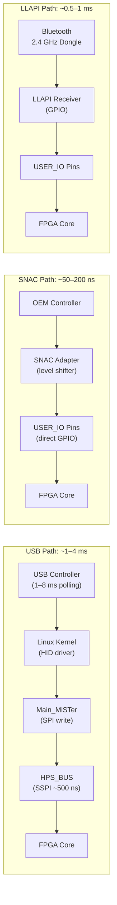
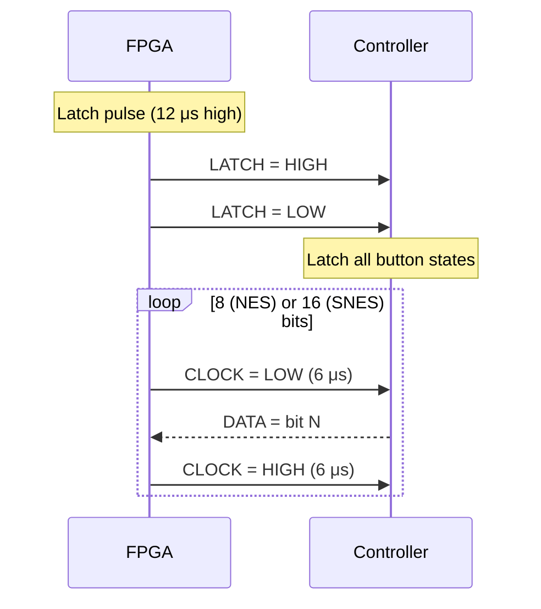

[← Input Devices](README.md) · [↑ Knowledge Base](../README.md)

# SNAC & LLAPI: Direct Controller Wiring to FPGA Fabric

Standard USB controllers on MiSTer have ~1–4 ms of latency from USB polling, Linux kernel processing, and SSPI handoff. For competitive play, speedrunning, and arcade cabinet use, even this small delay can be perceptible. **SNAC (Serial Native Accessory Converter)** and **LLAPI (Low-Latency API)** are two complementary approaches that bypass the HPS entirely, connecting original controllers directly to the FPGA fabric for sub-microsecond input response.

This article provides a Deep analysis of both systems: the SNAC hardware interface, the per-core protocol implementations, the LLAPI wireless alternative, and the critical safety considerations when wiring 5V controllers to a 3.3V FPGA.

Sources:
* [`Template_MiSTer/sys/sys.tcl`](https://github.com/MiSTer-devel/Template_MiSTer/blob/master/sys/sys.tcl) — USER_IO pin assignments
* [`Main_MiSTer/support/n64/n64.cpp`](https://github.com/MiSTer-devel/Main_MiSTer/blob/master/support/n64/n64.cpp) — N64 SNAC implementation
* [Input Latency & SNAC](../06_fpga_subsystem/input_latency_and_snac.md) — High-level overview (this article goes deeper)

---

## 1. The Latency Problem



| Path | Latency | Bypasses HPS? | Supports OEM Protocols? |
|---|---|---|---|
| USB (standard) | 1–4 ms | No | No (generic HID only) |
| SNAC (wired) | 50–200 ns | **Yes** | **Yes** (native protocols) |
| LLAPI (wireless) | 0.5–1 ms | **Yes** | Partial (custom protocol) |

---

## 2. SNAC Hardware Interface

### 2.1 The USER_IO Port

The MiSTer I/O Board provides a USER port using a USB 3.0 Type-A connector. This connector is **not** wired as USB — its pins are connected directly to the Cyclone V FPGA's GPIO pins through level shifters.

| USER_IO Pin | FPGA Pin | Function |
|---|---|---|
| USER_IO[0] | PIN_AH9 | General-purpose I/O |
| USER_IO[1] | PIN_AH12 | General-purpose I/O |
| USER_IO[2] | PIN_AH11 | General-purpose I/O |
| USER_IO[3] | PIN_AG16 | General-purpose I/O |
| USER_IO[4] | PIN_AF15 | General-purpose I/O |
| USER_IO[5] | PIN_AF17 | General-purpose I/O |
| USER_IO[6] | PIN_AG11 | General-purpose I/O |

Source: [`sys.tcl:L31-40`](https://github.com/MiSTer-devel/Template_MiSTer/blob/master/sys/sys.tcl#L31)

The pin assignments in the QSF/TCL:

```tcl
# sys.tcl:L31-40 — USER_IO pin assignments
set_location_assignment PIN_AF17 -to USER_IO[6]
set_location_assignment PIN_AF15 -to USER_IO[5]
set_location_assignment PIN_AG16 -to USER_IO[4]
set_location_assignment PIN_AH11 -to USER_IO[3]
set_location_assignment PIN_AH12 -to USER_IO[2]
set_location_assignment PIN_AH9  -to USER_IO[1]
set_location_assignment PIN_AG11 -to USER_IO[0]
set_instance_assignment -name IO_STANDARD "3.3-V LVTTL" -to USER_IO[*]
set_instance_assignment -name WEAK_PULL_UP_RESISTOR ON -to USER_IO[*]
set_instance_assignment -name CURRENT_STRENGTH_NEW "MAXIMUM CURRENT" -to USER_IO[*]
```

Key properties:
- **3.3V LVTTL** I/O standard (NOT 5V-tolerant without external level shifting)
- **Weak pull-up resistors** enabled (default high state — important for open-drain controllers)
- **Maximum current drive** — ensures clean signal edges at high speed

### 2.2 Level Shifting: The 74LVC245

> [!CAUTION]
> Connecting a 5V controller (NES, SNES, Genesis, etc.) directly to the USER_IO port **without a level shifter will permanently damage the FPGA**. The Cyclone V's I/O pins are NOT 5V-tolerant.

The standard SNAC adapter uses a **74LVC245** or **74LVX245** octal bus transceiver:

```
            SNAC Adapter
        ┌───────────────────┐
 5V     │    ┌──────────┐   │
Controller──►│ 74LVC245 │──►│──► USER_IO (3.3V FPGA)
        │    │          │   │
        │    │ DIR ←────│───  FPGA direction control
        │    │ OE  ←────│───  FPGA output enable
        │    └──────────┘   │
        │    VCC = 3.3V     │
        └───────────────────┘
```

The 74LVC245 is ideal because:
- **5V-tolerant inputs** when powered at 3.3V (no clamping diodes conduct)
- **Bidirectional**: DIR pin controls data flow direction
- **Low propagation delay**: ~3–5 ns
- **High drive strength**: 24 mA output current

### 2.3 Direction Control

Some controllers are read-only (NES, SNES) while others require bidirectional communication (PlayStation DualShock, N64). The DIR and OE pins on the 74LVC245 are controlled by the FPGA core:

- **Read mode**: DIR = A→B (controller to FPGA), OE = low (enabled)
- **Write mode**: DIR = B→A (FPGA to controller), OE = low (enabled)
- **High-impedance**: OE = high (disabled, both sides floating)

---

## 3. Per-Core SNAC Protocol Implementations

Each console's controller uses a different protocol. The FPGA core must implement the exact same protocol to communicate with OEM controllers via SNAC.

### 3.1 NES/SNES Controller Protocol

The NES and SNES controllers use a simple synchronous serial protocol:

| Signal | NES Pin | SNES Pin | FPGA Direction |
|---|---|---|---|
| +5V | 1 | 1 | Output (power) |
| Clock | 2 | 2 | Output (FPGA→controller) |
| Latch | 3 | 3 | Output (FPGA→controller) |
| Data | 4 | 4 | Input (controller→FPGA) |
| GND | 7 | 7 | Ground |

**Protocol sequence:**



The FPGA core must generate the latch and clock signals at exactly the right timing. The NES reads 8 bits (A, B, Select, Start, Up, Down, Left, Right), while the SNES reads 16 bits (adds X, Y, L, R and additional buttons).

### 3.2 Genesis/Mega Drive Controller Protocol

The Genesis controller uses a multiplexed data bus with a select line:

| Signal | DB9 Pin | Function |
|---|---|---|
| D0–D3 | 1–4 | Data bus (4-bit) |
| Select | 7 | Multiplex control |
| +5V | 5 | Power |
| GND | 8 | Ground |

When Select is LOW: D0–D3 = Up, Down, A, B
When Select is HIGH: D0–D3 = Up, Down, A, B (3-button) or additional buttons (6-button)

The 6-button controller requires a specific timing pattern with three Select toggles per read cycle.

### 3.3 PlayStation Controller Protocol (SPI)

The PlayStation controller uses a synchronous SPI-like protocol:

| Signal | Pin | Direction |
|---|---|---|
| ATT | 1 | Output (FPGA→controller, active low) |
| CMD | 2 | Output (FPGA→controller, MOSI) |
| DATA | 3 | Input (controller→FPGA, MISO) |
| CLK | 4 | Output (FPGA→controller, ~250 kHz) |
| ACK | 6 | Input (controller→FPGA) |
| +7.5V | 5 | Power (for vibration motors) |

The PlayStation protocol is significantly more complex than NES/SNES — it involves:
1. ATT assertion (select controller)
2. Command byte transmission (0x01 = read controller type, 0x42 = read data)
3. Multiple data bytes returned (2 bytes header + 2–6 bytes button data)
4. ACK pulse after each byte

DualShock controllers require the 7.5V supply on pin 5 for vibration motors. The SNAC adapter must provide this from an external power supply (not from the FPGA's 3.3V rail).

### 3.4 N64 Controller Protocol

The N64 controller uses a proprietary single-wire bidirectional protocol:

| Signal | Pin | Function |
|---|---|---|
| Data | 3 | Bidirectional (open-drain) |
| GND | 2 | Ground |
| +3.3V | 1 | Power |

The protocol is bit-banged over a single wire:
- **1 bit**: 4 μs low (start) + data-dependent high time
- **Logic 0**: 3 μs low, 1 μs high
- **Logic 1**: 1 μs low, 3 μs high
- **Stop bit**: 1 μs low

Commands: 0x00 = identify controller, 0x01 = read controller state (4 bytes: joystick X/Y, buttons), 0x03 = read EEPROM, 0x02 = write EEPROM

The N64 SNAC implementation in `Main_MiSTer` ([`n64.cpp:L101`](https://github.com/MiSTer-devel/Main_MiSTer/blob/master/support/n64/n64.cpp#L101)) handles the HPS-side controller enumeration, while the FPGA core implements the actual bit-banging protocol on the USER_IO pin.

---

## 4. LLAPI: Low-Latency API (Wireless)

LLAPI provides a wireless alternative to SNAC using 2.4 GHz Bluetooth dongles connected to the USER_IO port. While not as low-latency as wired SNAC, it still bypasses the HPS:

| Feature | SNAC (wired) | LLAPI (wireless) |
|---|---|---|
| Latency | 50–200 ns | 0.5–1 ms |
| Protocol | OEM native | Custom LLAPI |
| Controller | OEM original only | 2.4 GHz dongle compatible |
| Multiplayer | Per-controller adapter | Single receiver supports multiple |
| Vibration | Depends on adapter | Not supported |

LLAPI receivers connect to the USER_IO port and present a simple parallel interface to the FPGA core. The core reads button state from dedicated USER_IO pins without SSPI involvement.

---

## 5. SNAC in the Core's Verilog

### 5.1 USER_IO Signal Mapping

The core receives the USER_IO signals from `sys_top.v`:

```verilog
// In the emu module (e.g., SNES core)
input  [6:0] USER_IO,   // Direct from USER_IO port

// Example: NES/SNES controller via SNAC
wire snac_latch = USER_IO[0];  // Controller reads latch from elsewhere
wire snac_clock = USER_IO[1];  // Controller reads clock from elsewhere  
wire snac_data  = USER_IO[2];  // Controller data input
```

The exact pin mapping is core-specific — each core defines which USER_IO pins correspond to which controller signals.

### 5.2 SNAC vs USB Input Muxing

Cores typically support both USB and SNAC inputs simultaneously. The core must mux between them:

```verilog
// Simplified SNAC/USB mux logic
wire [11:0] joystick_snac;
wire [31:0] joystick_usb = joystick_0;  // From hps_io.sv

// SNAC decoding (NES protocol example)
reg [7:0] nes_shift;
always @(posedge snac_clock) begin
    if (snac_latch) nes_shift <= 8'hFF;  // All buttons released
    else nes_shift <= {nes_shift[6:0], snac_data};
end

assign joystick_snac = {nes_shift, 4'b0};  // Map to standard joystick format

// Mux: use SNAC if adapter detected, otherwise USB
wire use_snac = |snac_detect;  // Detection logic varies per core
assign joystick_final = use_snac ? joystick_snac : joystick_usb[11:0];
```

### 5.3 SNAC Detection

The `hps_io.sv` module can detect SNAC adapter presence through the status word. When a SNAC adapter is plugged in, `Main_MiSTer` sets a flag in the configuration that the core reads:

```verilog
// In hps_io.sv, the core can read the SNAC status
// via the joystick status bits or OSD configuration
```

Some cores use the OSD menu to explicitly enable/disable SNAC mode, since the hardware detection is not always reliable.

---

## 6. Safety and Electrical Considerations

### 6.1 Voltage Compatibility Matrix

| Controller | Voltage | Level Shifter Required? | Risk Without Shifter |
|---|---|---|---|
| NES/SNES | 5V | **Yes** | Permanent FPGA damage |
| Genesis | 5V | **Yes** | Permanent FPGA damage |
| PC Engine | 5V | **Yes** | Permanent FPGA damage |
| Saturn | 5V | **Yes** | Permanent FPGA damage |
| PlayStation | 3.3V/5V | **Yes** (5V on data lines) | Permanent FPGA damage |
| N64 | 3.3V | **No** (native 3.3V) | Safe |
| Atari/Commodore | 5V | **Yes** | Permanent FPGA damage |

### 6.2 Current Limits

The Cyclone V's GPIO pins can source/sink a maximum of **24 mA** per pin. Some controllers (especially those with LEDs or vibration motors) can draw more current than this. The SNAC adapter should include current-limiting resistors or buffer ICs to protect the FPGA.

### 6.3 Hot-Plugging

> [!WARNING]
> Do not hot-plug SNAC adapters while the core is running. The transient voltage spikes from hot-plugging can damage the level shifters and potentially the FPGA. Always power off before connecting or disconnecting SNAC adapters.

---

## 7. SNAC Adapter Buying Guide

| Adapter | Systems | Vibration | Notes |
|---|---|---|---|
| **dnotq SNAC** | NES, SNES, Genesis, PCE | No | Original open-source design |
| **SNX** | PlayStation | Yes (7.5V external) | Supports DualShock vibration |
| **N64 SNAC** | N64 | Yes (Rumble Pak) | Direct 3.3V connection |
| **DB9 SNAC** | Atari, Commodore, SMS | No | Simple digital joystick |
| **Multi-System SNAC** | Multiple | Varies | Switchable via DIP switches |

The [MiSTer Hardware Repository](https://github.com/MiSTer-devel/Hardware_MiSTer) contains open-source PCB designs for all official SNAC adapters.

---

## Read Also

* [Input Latency & SNAC](../06_fpga_subsystem/input_latency_and_snac.md) — High-level overview of input latency analysis
* [Joystick Handling](joystick.md) — USB joystick input path through hps_io.sv
* [Keyboard](keyboard.md) — PS/2 keyboard emulation via USB HID
* [Mouse](mouse.md) — PS/2 mouse emulation via USB HID
* [hps_io.sv Deep Dive](../06_fpga_subsystem/hps_io_module.md) — How joystick data reaches the FPGA via SSPI
