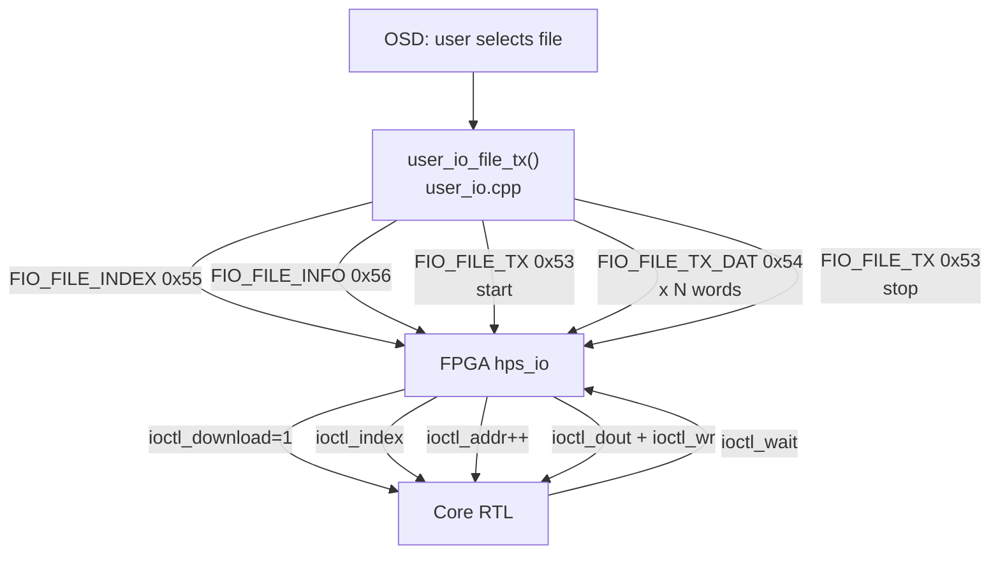

[← Storage](../README.md)

# ROM / File Download Stream (`ioctl_*`)

MiSTer streams ROM files and other binary data to FPGA cores using the
**file I/O** (`ioctl`) subsystem.  This is the primary mechanism for
loading game ROMs, firmware images, and other bulk binary content.

Sources: `Main_MiSTer/user_io.cpp`, `user_io.h`, `hps_io.sv`

---

## Overview



---

## HPS-Side API (`user_io.cpp`)

### Step 1: Set File Index

The **file index** tells the core which slot/ROM type is being loaded
(e.g. 0 = main ROM, 1 = extension ROM, 2 = save state, etc.):

```c
void user_io_set_index(unsigned char index)
{
    spi_uio_cmd_cont(FIO_FILE_INDEX);  // 0x55
    spi_w(index);
    DisableIO();
}
```

### Step 2: Send File Info

```c
void user_io_file_info(const char *ext)
{
    uint32_t ext_word = 0;
    // Pack 4-char extension into 32-bit word
    for (int i = 0; i < 4 && ext[i]; i++)
        ext_word |= (toupper(ext[i]) << (i * 8));

    spi_uio_cmd_cont(FIO_FILE_INFO);   // 0x56
    spi_w((uint16_t)(ext_word >> 16));
    spi_w((uint16_t)(ext_word));
    DisableIO();
}
```

### Step 3: Start Download

```c
void user_io_set_download(unsigned char enable, int addr)
{
    spi_uio_cmd_cont(FIO_FILE_TX);    // 0x53
    if (enable) {
        spi_w(1);                      // byte 0: 1 = start download
        spi_w((uint16_t)addr);         // byte 1: start address low
        spi_w((uint16_t)(addr >> 16)); // byte 2: start address high
    } else {
        spi_w(0);                      // byte 0: 0 = stop download
    }
    DisableIO();
}
```

### Step 4: Stream Data

```c
void user_io_file_tx_data(const uint8_t *addr, uint32_t len)
{
    // Chunk data into SPI transfers
    spi_uio_cmd_cont(FIO_FILE_TX_DAT);  // 0x54
    spi_write(addr, len, fio_size);      // block write (8 or 16-bit)
    DisableIO();
}
```

### Full Transfer

```c
int user_io_file_tx(const char *name, unsigned char index, ...)
{
    fileTYPE f;
    if (!FileOpenEx(&f, name, ...)) return 0;

    user_io_set_index(index);
    user_io_file_info(get_ext(name));
    user_io_set_download(1, 0);         // start at address 0

    uint8_t buf[4096];
    while (FileReadEx(&f, buf, sizeof(buf))) {
        user_io_file_tx_data(buf, bytes_read);
    }

    user_io_set_download(0);            // stop
    return 1;
}
```

---

## FPGA-Side — `hps_io.sv` (file port block)

The file port uses **`fp_enable`** (HPS_BUS bit 35) as its chip select,
separate from the UIO channel:

```verilog
// hps_io.sv — fio_block always block

localparam FIO_FILE_TX      = 8'h53;
localparam FIO_FILE_TX_DAT  = 8'h54;
localparam FIO_FILE_INDEX   = 8'h55;
localparam FIO_FILE_INFO    = 8'h56;

FIO_FILE_INDEX:
    ioctl_index <= io_din[15:0];

FIO_FILE_INFO:
    if(~cnt[1]) begin
        case(cnt)
            0: ioctl_file_ext[31:16] <= io_din;
            1: ioctl_file_ext[15:00] <= io_din;
        endcase
    end

FIO_FILE_TX:
    case(cnt)
        0: if(io_din[7:0]) begin
               ioctl_addr <= 0;
               req_io <= (io_din[7:0] == 8'hAA) ? 2'b10 : 2'b01;
               // 0x01 = download, 0xAA = upload
           end else begin
               // stop: final address update
               if(ioctl_download) ioctl_addr <= ioctl_addr + 1;
               ioctl_download <= 0;
               ioctl_upload   <= 0;
           end
        1: ioctl_addr[15:0]  <= io_din;
        2: ioctl_addr[26:16] <= io_din[10:0];
    endcase

FIO_FILE_TX_DAT:
    if(!skip_add) ioctl_addr <= ioctl_addr + (WIDE ? 2'd2 : 2'd1);
    if(ioctl_download) begin
        ioctl_dout <= io_din[DW:0];
        wr <= 1;    // generates ioctl_wr pulse next cycle
    end else begin
        fp_dout <= ioctl_din;  // upload: read from core
        ioctl_rd <= 1;
    end
```

---

## Core-Facing `ioctl_*` Signals

| Signal | Direction | Width | Description |
|---|---|---|---|
| `ioctl_download` | hps→core | 1-bit | 1 while download is active |
| `ioctl_upload` | hps→core | 1-bit | 1 while upload is active |
| `ioctl_index` | hps→core | 16-bit | File slot / type index |
| `ioctl_file_ext` | hps→core | 32-bit | 4-char file extension |
| `ioctl_addr` | hps→core | 27-bit | Current write address (auto-increments) |
| `ioctl_dout` | hps→core | 8 or 16-bit | Data byte/word |
| `ioctl_wr` | hps→core | 1-bit | Write strobe (1 cycle) |
| `ioctl_din` | core→hps | 8 or 16-bit | Upload data from core |
| `ioctl_rd` | hps→core | 1-bit | Read strobe for upload |
| `ioctl_wait` | core→hps | 1-bit | Back-pressure: HPS must pause |

### Back-Pressure

If the core cannot accept data fast enough (e.g. SDRAM is busy), it asserts
`ioctl_wait`.  `hps_io` feeds this back to the HPS via HPS_BUS[37]:

```verilog
assign HPS_BUS[37] = ioctl_wait;
```

The HPS busy-waits in `fpga_spi()` until the FPGA de-asserts ACK.

---

## Address Modes

| Mode | `WIDE` | Increment | Notes |
|---|---|---|---|
| 8-bit | 0 | +1 per word | `ioctl_dout[7:0]` used |
| 16-bit | 1 | +2 per word | `ioctl_dout[15:0]` used |

Initial address is set by `FIO_FILE_TX` start sequence (usually 0).
Some cores set a non-zero start address for patching or ROM banking.

---

## Upload (Core → HPS)

The reverse direction (`ioctl_upload = 1`) allows cores to export save states
or screenshots:

1. Core asserts `ioctl_upload_req` with `ioctl_upload_index`.
2. `hps_io` signals HPS via `UIO_CHK_UPLOAD` (0x3C).
3. HPS starts an upload transfer (`FIO_FILE_TX` with `0xAA`).
4. On each `FIO_FILE_TX_DAT`, the FPGA reads `ioctl_din` and asserts `ioctl_rd`.
5. Core increments internal pointer; HPS writes received data to file.
