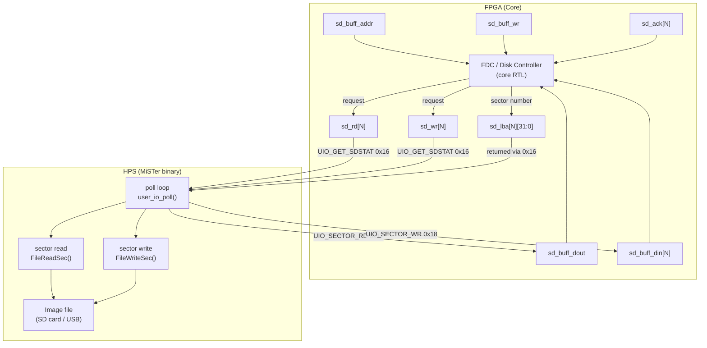

[← Storage](README.md) · [↑ Knowledge Base](../README.md)

# Floppy Disk Emulation (FDD)

MiSTer emulates floppy disk drives by serving block requests from the FPGA
against image files on the SD card or USB storage.  The mechanism is a
**shared buffer** model: the FPGA signals a read/write request, the HPS
services it, and the data is exchanged via the SPI bus.

Sources: `Main_MiSTer/user_io.cpp`, `user_io.h`, `hps_io.sv`

---

## Architecture



---

## SD Card Slot Model

The `hps_io` module supports **1 to 10 virtual disk drives** (set by `VDNUM`
parameter).  Each virtual drive has:

| Signal | Width | Description |
|---|---|---|
| `sd_lba[N]` | 32-bit | LBA sector number requested by core |
| `sd_blk_cnt[N]` | 6-bit | Number of blocks − 1 |
| `sd_rd[N]` | 1-bit | Core requests read from slot N |
| `sd_wr[N]` | 1-bit | Core requests write to slot N |
| `sd_ack[N]` | 1-bit | HPS acknowledges the request |
| `sd_buff_addr` | 13 or 12-bit | Byte address within 512-byte buffer |
| `sd_buff_dout` | 8 or 16-bit | Data word from HPS to core (read path) |
| `sd_buff_din[N]` | 8 or 16-bit | Data word from core to HPS (write path) |
| `sd_buff_wr` | 1-bit | Write strobe for `sd_buff_dout` |
| `img_mounted[N]` | 1-bit | Image mounted event (pulse) |
| `img_readonly` | 1-bit | Mounted image is read-only |
| `img_size` | 64-bit | Image size in bytes |

`WIDE=1` mode uses 16-bit `sd_buff_dout/din` (halving transfer count).

---

## Poll Cycle — HPS Side

`user_io_poll()` is called from the main loop ~every millisecond:

```c
// user_io.cpp (simplified)
void user_io_poll()
{
    // 1. Ask FPGA for pending SD request
    EnableIO();
    spi_w(UIO_GET_SDSTAT);  // 0x16
    // FPGA returns: {1, sd_blk_cnt, BLKSZ, slot_num, wr, rd}
    uint16_t stat = spi_w(0);
    // ...next word returns LBA low, next word LBA high
    DisableIO();

    int slot = (stat >> 4) & 0xF;
    int do_read  = stat & 1;
    int do_write = stat & 2;
    int blkcnt   = (stat >> 10) & 0x3F;

    if (do_read || do_write) {
        // Acknowledge the request
        spi_uio_cmd16(do_read ? UIO_SECTOR_RD : UIO_SECTOR_WR,
                       (slot << 8) | ...);

        // Transfer data
        if (do_read) {
            FileReadSec(&sd_image[slot], buf);
            // Stream buf to FPGA via UIO_SECTOR_RD (0x17)
            spi_uio_cmd_cont(UIO_SECTOR_RD | (slot << 8));
            spi_write(buf, 512, fio_size);
            DisableIO();
        } else {
            // Read from FPGA via UIO_SECTOR_WR (0x18)
            spi_uio_cmd_cont(UIO_SECTOR_WR | (slot << 8));
            spi_read(buf, 512, fio_size);
            DisableIO();
            FileWriteSec(&sd_image[slot], buf);
        }
    }
}
```

---

## FPGA Side — `hps_io.sv`

### SD Status Query (`0x16`)

```verilog
// First word response (at byte_cnt=0):
'h16: io_dout <= {1'b1, sd_blk_cnt[sdn], BLKSZ[2:0], sdn, sd_wr[sdn], sd_rd[sdn]};
// Subsequent words:
'h16: case(byte_cnt[1:0])
    1: sd_rrb <= (sd_rrb == VD) ? 4'd0 : (sd_rrb + 1'd1);
    2: io_dout <= sd_lba[sdn_r][15:0];
    3: io_dout <= sd_lba[sdn_r][31:16];
endcase
```

### Sector Read (`0x17` — data HPS → FPGA)

```verilog
'h0X17: begin
    sd_buff_dout <= io_din[DW:0];  // write to internal buffer
    b_wr <= 1;                      // assert write strobe (with 2-cycle delay)
end
// b_wr pipeline: sd_buff_wr is pipelined 2 cycles for timing
sd_buff_wr <= b_wr[0];
if(b_wr[2] && (~&sd_buff_addr)) sd_buff_addr <= sd_buff_addr + 1'b1;
b_wr <= (b_wr<<1);
```

### Sector Write (`0x18` — data FPGA → HPS)

```verilog
'h0X18: begin
    if(~&sd_buff_addr) sd_buff_addr <= sd_buff_addr + 1'b1;
    io_dout <= sd_buff_din[sdn_ack];  // read from core's output buffer
end
```

---

## Image Mount Notification

When a user selects an image file via OSD:

```c
// user_io.cpp
int user_io_file_mount(const char *name, unsigned char index, ...)
{
    // Open file, update sd_image[index]
    // Signal FPGA:
    spi_uio_cmd_cont(UIO_SET_SDSTAT);   // 0x1C
    spi_w(index | (readonly ? 0x80 : 0)); // slot + flags
    DisableIO();

    spi_uio_cmd_cont(UIO_SET_SDINFO);   // 0x1D
    uint64_t size = sd_image[index].size;
    spi_w((uint16_t)(size));            // 4 words for 64-bit size
    spi_w((uint16_t)(size >> 16));
    spi_w((uint16_t)(size >> 32));
    spi_w((uint16_t)(size >> 48));
    DisableIO();
}
```

FPGA receives these and pulses `img_mounted[N]` for one clock cycle:

```verilog
'h1c: begin
    img_mounted  <= io_din[VD:0] ? io_din[VD:0] : 1'b1;
    img_readonly <= io_din[7];
end
'h1d: if(byte_cnt<5) img_size[{byte_cnt-1'b1, 4'b0000} +:16] <= io_din;
// img_mounted is cleared at end of each io_enable active period:
if(~io_enable) img_mounted <= 0;
```

---

## Block Size Configuration

The `BLKSZ` parameter controls the transfer granularity:

| `BLKSZ` | Block size |
|---|---|
| 0 | 128 bytes |
| 1 | 256 bytes |
| 2 | 512 bytes (default) |
| 3 | 1 KB |
| … | … |
| 7 | 16 KB |

Total transfer per request = `(sd_blk_cnt + 1) × (1 << (BLKSZ + 7))` bytes,
maximum 16384 bytes per burst.

---

## Minimig Floppy (ADF format)

The Minimig core uses standard `sd_*` signals with `VDNUM=4` for its four
floppy drives (DF0–DF3).  The ADF (Amiga Disk Format) image is a flat
sector-addressed file of 901120 bytes (880 KB).

The core's custom Amiga FDC logic converts the MFM track request into an
LBA address and asserts `sd_rd`.  The sector data returned is re-serialised
into MFM by the FPGA.

---

## Cross-References

| Topic | Article |
|---|---|
| HDD/IDE emulation | [HDD/IDE Emulation](hdd_ide_emulation.md) |
| ROM/file download stream | [File Transfer](file_transfer.md) |
| UIO SD card opcodes | [UIO Command Reference](../17_references/uio_command_reference.md) |
| hps_io SD block | [hps_io Module](../06_fpga_subsystem/hps_io_module.md) |
