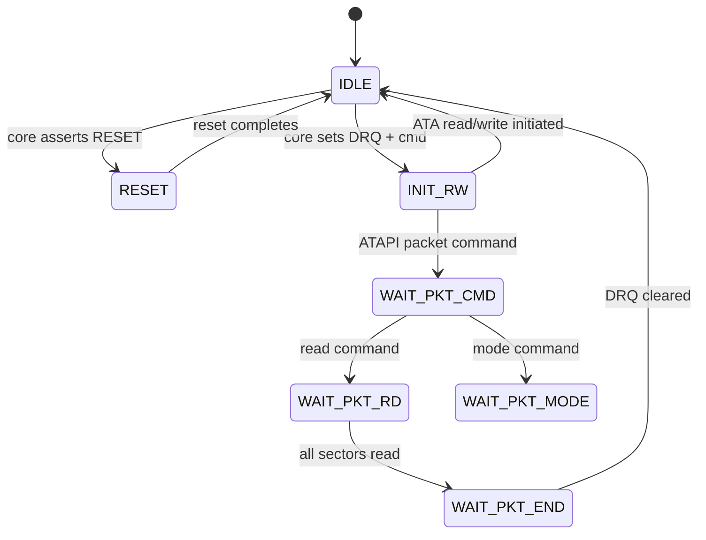

[← Storage](../README.md)

# Hard Disk / ATA Emulation (HDD / IDE)

For cores that emulate an x86 PC, Amiga, or other system with an IDE hard disk
controller, MiSTer implements a full ATA/ATAPI state machine in software on
the HPS, communicating with the FPGA via a dedicated register-mapped protocol.

Sources: `Main_MiSTer/ide.cpp`, `ide.h`, `ide_cdrom.cpp`, `user_io.cpp`,
`cores/Minimig-AGA_MiSTer/hps_ext.v`

---

## Two IDE Channels

MiSTer supports two independent IDE channels, each with a master and slave
drive (4 drives total):

```c
// ide.h
struct ide_config {
    uint32_t base;      // LW-AXI base address offset for this channel
    uint32_t bitoff;    // bit offset within status register
    uint32_t state;     // current IDE state machine state
    regs_t   regs;      // ATA register file
    drive_t  drive[2];  // master (0) and slave (1)
};

extern ide_config ide_inst[2];  // two channels
```

---

## Register Protocol — Two Paths

### Path A: Minimig (`hps_ext.v`) — SPI-over-GPO

The Minimig core uses the `EXT_BUS` extension to expose ATA registers directly
over the SSPI bus.  The `hps_ext.v` module decodes IDE address/data:

```verilog
// hps_ext.v
// Command 0x61: DMA_WRITE (HPS → FPGA)
// Command 0x62: DMA_READ  (FPGA → HPS)
// Command 0x63: SDIO poll (read IDE/CD request flags)

// On 0x63 (first word response):
io_dout <= {4'hE, 2'b00, 1'b0, cdda_req, 2'b00, ide_req};
//                                                 ^^^^^^^
//                        6-bit field: {drq, pio_in, pio_out,
//                                       irq, cmd_pending, reset}

// On 0x61 (write): route data to IDE register
if(byte_cnt >= 3) ide_wr <= ide_cs;

// On 0x62 (read): latch IDE register value
if(byte_cnt >= 3 && ide_cs) begin
    io_dout <= ide_din;
    ide_rd  <= 1;
end

// IDE address decode (second word):
ide_addr <= {io_din[8], io_din[3:0]};  // A4..A0
ide_cs   <= (io_din[15:9] == 7'b1111000); // chip select decode
```

### Path B: ao486 / x86 — LW-AXI Window

The x86 core exposes IDE registers as memory-mapped registers in the
LW-AXI slave window (`0xFF200000`).  HPS uses `fpga_core_read/write()`:

```c
// ide.cpp
void ide_get_regs(ide_config *ide)
{
    uint32_t base = ide->base;
    // Read ATA register file from FPGA
    uint32_t r = fpga_core_read(base);
    ide->regs.features      = (r >> 8)  & 0xFF;
    ide->regs.sector_count  = (r >> 16) & 0xFF;
    ide->regs.sector        = (r >> 24) & 0xFF;
    r = fpga_core_read(base + 4);
    ide->regs.cylinder      = r & 0xFFFF;
    ide->regs.head          = (r >> 16) & 0x0F;
    ide->regs.lba           = (r >> 20) & 1;
    ide->regs.drv           = (r >> 20) & 2;
    ide->regs.cmd           = (r >> 24) & 0xFF;
    // ... status, DRQ, etc.
}

void ide_set_regs(ide_config *ide)
{
    // Write status/error back to FPGA
    fpga_core_write(ide->base + 8, (ide->regs.status << 8) | ide->regs.error);
}
```

---

## IDE State Machine



State constants:
```c
#define IDE_STATE_IDLE         0
#define IDE_STATE_RESET        1
#define IDE_STATE_INIT_RW      2
#define IDE_STATE_WAIT_PKT_CMD 3  // ATAPI: waiting for 12-byte command packet
#define IDE_STATE_WAIT_PKT_RD  4  // ATAPI: sending read data
#define IDE_STATE_WAIT_PKT_END 5  // ATAPI: finalizing
#define IDE_STATE_WAIT_PKT_MODE 6 // ATAPI: mode sense / inquiry
```

---

## ATA Register File

```c
// ide.h
struct regs_t {
    uint8_t  io_done;          // transfer complete flag
    uint8_t  io_fast;          // fast (DMA) mode
    uint8_t  features;         // ATA features register
    uint8_t  sector_count;     // sector count
    uint8_t  sector;           // sector number (CHS mode)
    uint16_t cylinder;         // cylinder (CHS mode)
    uint8_t  head;             // head (CHS mode)
    uint8_t  drv;              // drive select
    uint8_t  lba;              // LBA mode flag
    uint8_t  cmd;              // ATA command byte
    // ATAPI specific:
    uint16_t pkt_size_limit;   // transfer size limit
    uint16_t pkt_io_size;      // actual packet size
    uint32_t pkt_lba;          // ATAPI LBA
    uint32_t pkt_cnt;          // remaining sector count
    // Status:
    uint8_t  io_size;          // DRQ transfer unit size
    uint8_t  error;            // ATA error register
    uint8_t  status;           // ATA status register
};
```

Status register bits:
| Bit | Constant | Meaning |
|---|---|---|
| 7 | `ATA_STATUS_BSY` | Device busy |
| 6 | `ATA_STATUS_RDY` | Device ready |
| 5 | `ATA_STATUS_RDP` | Performance read |
| 4 | `ATA_STATUS_DSC` | Seek complete / service |
| 3 | `ATA_STATUS_DRQ` | Data request |
| 2 | `ATA_STATUS_IRQ` | Raise IRQ |
| 1 | `ATA_STATUS_END` | Last read |
| 0 | `ATA_STATUS_ERR` | Error / ATAPI check |

---

## Data Transfer — `ide_sendbuf` / `ide_recvbuf`

### Read (FPGA requests data from HPS)

```c
// ide.cpp
void ide_sendbuf(ide_config *ide, uint16_t reg, uint32_t length, uint16_t *data)
{
    // Set up DMA transfer in FPGA registers
    ide_reg_set(ide, reg, length);

    // Stream data via SPI
    EnableFpga();                        // assert io_ss0
    spi_w(UIO_DMA_WRITE);               // 0x61
    spi_w(ide->base | ...);             // address
    spi_w(length);
    fpga_spi_fast_block_write(data, length);
    DisableFpga();
}
```

### Write (HPS reads data the FPGA has buffered)

```c
void ide_recvbuf(ide_config *ide, uint16_t reg, uint32_t length, uint16_t *data)
{
    ide_reg_set(ide, reg, length);

    EnableFpga();
    spi_w(UIO_DMA_READ);                // 0x62
    spi_w(ide->base | ...);
    spi_w(length);
    fpga_spi_fast_block_read(data, length);
    DisableFpga();
}
```

---

## ATAPI / CD-ROM

`ide_cdrom.cpp` implements the full SCSI-2 / ATAPI command set layered on
top of the ATA state machine:

- **READ(10)** — reads 2048-byte CD-ROM sectors from `.iso` / `.bin` / `.chd`
- **READ TOC** — returns disc table of contents
- **INQUIRY** — SCSI device identification
- **MODE SENSE** — drive capability information
- **START/STOP UNIT** — tray open/close simulation

CD audio (CDDA) data is streamed separately via the Minimig's `cdda_dout`
path in `hps_ext.v`, fed directly into the core's audio mixer.

### CHD Support

`.chd` (MAME Compressed Hunks of Data) files are supported via an embedded
`support/chd/` library.  The `drive_t` structure tracks:

```c
chd_file *chd_f;
int      chd_hunknum;
uint8_t *chd_hunkbuf;
uint32_t chd_total_size;
uint32_t chd_last_partial_lba;
```

Hunks are decompressed on-demand into `chd_hunkbuf` and cached by hunk number.

---

## Drive Geometry

```c
// ide.h
struct drive_t {
    fileTYPE *f;          // open image file
    uint16_t  cylinders;  // C
    uint16_t  heads;      // H
    uint16_t  spt;        // sectors per track
    uint32_t  total_sectors;
    uint32_t  spb;        // sectors per block
    uint32_t  offset;     // LBA offset within image
    uint8_t   cd;         // 1 = ATAPI CD-ROM
    track_t   track[50];  // CUE/TOC track list (for CD images)
};
```

HDD images use standard CHS-to-LBA translation internally; cores only
see LBA addressing.
