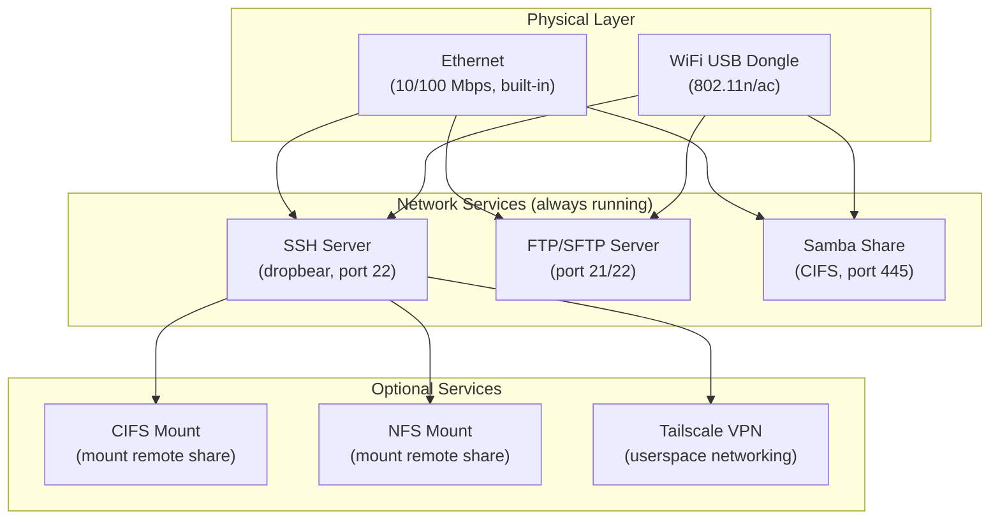

[← Networking](README.md) · [↑ Knowledge Base](../README.md)

# WiFi, SSH, FTP & Network Access

## Overview

The DE10-Nano has no built-in WiFi or Bluetooth — only a 10/100 Ethernet port. Network connectivity is optional for MiSTer, but extremely useful for:

- Transferring ROMs, core files, and BIOS images without removing the SD card
- Remote SSH administration and script execution
- Network-mounted storage (CIFS/NFS) for large game libraries
- Web-based remote control (MiSTer Remote)
- Tailscale VPN for remote access over the internet

This article covers the full networking stack: WiFi adapter selection, connection setup, SSH/FTP/SFTP access, Samba sharing, network mount scripts, and advanced configurations like Tailscale.



> [!NOTE]
> **Default credentials**: User `root`, password `1`. Change this immediately if your MiSTer is exposed to the internet (e.g., via Tailscale or port forwarding).

---

## WiFi Setup

### Compatible WiFi Adapters

Not all USB WiFi adapters work — the MiSTer Linux kernel includes a limited set of drivers. The following adapters have been confirmed working:

| Adapter | Chipset | Speed | Notes |
|---------|---------|-------|-------|
| ASUS USB-AC53 Nano (rev A1) | MediaTek | AC1300 | Compact, well-supported |
| TP-Link Archer T3U | Realtek | AC1300 | Widely available |
| TP-Link Archer T2U Nano | Realtek | AC600 | Very small form factor |
| Edimax EW-7811UN | Realtek | N150 | Cheap, ubiquitous |
| Edimax EW-7612UAn v2 | Realtek | N300 | External antenna |
| Edimax EW-7822ULC | Realtek | AC1200 | Compact |
| CanaKit Raspberry Pi WiFi | Ralink | N150 | Designed for Pi, works on MiSTer |
| Netgear A6100 / A6150 | Realtek | AC | |
| D-Link DWA-181 | Realtek | AC1300 | |

> [!WARNING]
> Hardware revisions matter. A v2 adapter may use a completely different chipset than v1 of the same product. If a dongle doesn't appear in `lsusb` output, it likely needs a driver not included in the MiSTer kernel.

### Method 1: WiFi Script (Recommended)

The Mr. Fusion SD image includes `wifi.sh` in `/media/fat/Scripts/`:

1. Connect a USB keyboard to the DE10-Nano
2. Boot into the Main Menu core
3. Press F12 (or the OSD button) to open the menu
4. Navigate to **Scripts** → **wifi**
5. Select your WiFi network's SSID from the scan list
6. Enter your WiFi password
7. Wait for connection confirmation

A WiFi icon appears at the top of the OSD when connected. The credentials are saved and will auto-connect on subsequent boots (with the adapter plugged in).

### Method 2: Manual Configuration

If the script doesn't work (non-standard network, hidden SSID, enterprise auth):

1. Edit `/media/fat/linux/_wpa_supplicant.conf` with a Unix-line-ending editor:

```ini
# /media/fat/linux/wpa_supplicant.conf
ctrl_interface=/var/run/wpa_supplicant
update_config=1

network={
    ssid="YourNetworkName"
    psk="YourPassword"
    # For hidden networks, add:
    # scan_ssid=1
}
```

2. Rename the file: `_wpa_supplicant.conf` → `wpa_supplicant.conf`
3. Reboot the MiSTer

> [!NOTE]
> The first WiFi connection after boot can take 30–60 seconds. The ARM Cortex-A9 is handling both Linux networking and HPS binary duties — be patient.

### Verifying Connection

From the OSD Main Menu, look for the WiFi icon (top-right corner). For detailed diagnostics, SSH in and run:

```bash
# Check if interface is up
ip addr show wlan0

# Check signal strength
iwconfig wlan0

# Ping test
ping -c 3 8.8.8.8
```

---

## Ethernet Setup

The DE10-Nano's onboard Ethernet is 10/100 Mbps (Fast Ethernet). No configuration is needed for DHCP — it works out of the box.

### Finding Your IP Address

From the OSD Main Menu: the IP address is displayed at the top of the screen. Alternatively, check your router's DHCP client list.

### Static IP (Optional)

MiSTer uses `dhcpcd` for network configuration. To set a static IP, edit `/media/fat/linux/user-startup.sh`:

```bash
# Static IP example: 192.168.1.100/24, gateway 192.168.1.1
ip addr add 192.168.1.100/24 dev eth0
ip route add default via 192.168.1.1
```

### Hostname

To set a hostname (avoid typing IP addresses), add to `/media/fat/linux/user-startup.sh`:

```bash
hostname mister
echo mister > /etc/hostname
```

Then access via `ssh root@mister.local` (mDNS) or add a DNS entry to your router.

---

## SSH Access

SSH (Secure Shell) provides remote terminal access to the MiSTer's Linux environment. The `dropbear` SSH server runs by default on port 22.

### Connecting

| OS | Command / Tool |
|----|---------------|
| **Linux / macOS** | `ssh root@192.168.1.100` (password: `1`) |
| **Windows 10+** | `ssh root@192.168.1.100` (built-in OpenSSH) |
| **Windows (older)** | [PuTTY](https://www.putty.org/) — host: `192.168.1.100`, port 22 |

### Common SSH Tasks

```bash
# Check disk usage
df -h /media/fat

# List cores
ls /media/fat/_Amiga    # Amiga Minimig core files
ls /media/fat/_Console  # Console cores
ls /media/fat/_Arcade   # Arcade cores (MRA + ROM)

# View running processes
ps aux | grep MiSTer

# Check MiSTer.ini
cat /media/fat/MiSTer.ini

# Edit MiSTer.ini
mcedit /media/fat/MiSTer.ini   # or: vi /media/fat/MiSTer.ini

# Reboot
reboot

# Power off safely
poweroff
```

> [!WARNING]
> The root filesystem is a ramdisk rebuilt on every boot. Only `/media/fat/` (SD card FAT32 partition) persists across reboots. Do not modify files outside `/media/fat/` unless you understand the boot process.

---

## FTP / SFTP File Transfer

### FTP vs SFTP

| Protocol | Port | Encryption | Speed | Recommendation |
|----------|------|-----------|-------|---------------|
| FTP | 21 | None | Faster | Local network only |
| SFTP | 22 | SSH | Slightly slower | **Recommended** (secure, same port as SSH) |

### Connecting with FileZilla (Cross-Platform)

1. Download [FileZilla](https://filezilla-project.org/)
2. Open **File → Site Manager → New Site**
3. Set:
   - **Protocol**: `SFTP - SSH File Transfer Protocol`
   - **Host**: your MiSTer's IP address
   - **Port**: `22`
   - **Logon Type**: `Ask for password`
   - **User**: `root`
4. Set **Default Remote Directory** to `/media/fat`
5. Connect — password is `1`

> [!CAUTION]
> Always transfer files in **binary mode**, never ASCII. ASCII-mode transfers will corrupt ROMs, RBF files, and save states. FileZilla defaults to binary for SFTP — this is correct.

### Connecting with WinSCP (Windows)

1. Download [WinSCP](https://winscp.net/)
2. Set **File protocol**: `SFTP`
3. **Host name**: MiSTer IP
4. **User name**: `root`, **Password**: `1`
5. **Advanced → Directories → Remote directory**: `/media/fat`

### Quick Command-Line Transfer

```bash
# Copy a file TO MiSTer
scp game.adf root@192.168.1.100:/media/fat/games/

# Copy a file FROM MiSTer
scp root@192.168.1.100:/media/fat/saves/save.srm ./

# Sync an entire directory
rsync -avP roms/ root@192.168.1.100:/media/fat/games/Ao486/
```

---

## Samba (SMB/CIFS) Share

MiSTer runs a Samba server that shares `/media/fat/` over the network. This lets you browse MiSTer files from Windows Explorer, macOS Finder, or Linux file managers.

### Connecting

| OS | Path |
|----|------|
| **Windows** | `\\192.168.1.100\fat` (or `\\mister\fat`) |
| **macOS** | `smb://root@192.168.1.100/fat` |
| **Linux** | `smb://192.168.1.100/fat` |

Credentials: user `root`, password `1` (or blank depending on Samba config).

### Samba Performance Notes

- The DE10-Nano's 10/100 Ethernet limits practical transfer speeds to ~10-12 MB/s
- WiFi transfers are significantly slower (typically 2-5 MB/s depending on signal)
- For large library transfers (hundreds of GB), use Ethernet + SFTP or mount the SD card directly

> [!WARNING]
> Some cores (notably ao486 and NeoGeo) have known issues loading games from CIFS shares due to Samba Kernel Oplock bugs. If a core fails to start from a network share, copy the game to the SD card temporarily, or disable Kernel Oplocks on the CIFS server.

---

## Network Mount Scripts (CIFS / NFS)

MiSTer can mount remote shares and use them transparently. The file system overlay gives priority to network-mounted files over local SD card files.

### CIFS (Windows/Samba) Mount

Download `cifs_mount.sh` to `/media/fat/Scripts/` and configure:

```bash
# Inside cifs_mount.sh — edit these variables
SERVER="192.168.1.50"        # Your NAS/PC IP
SHARE="Games"                # Share name
MOUNT_POINT="/media/fat/cifs"
USER="your_username"
PASS="your_password"
```

Mount point `/media/fat/cifs/` overlays onto `/media/fat/` — cores will see files from both locations.

### NFS (Linux/Unix) Mount

Download `nfs_mount.sh` to `/media/fat/Scripts/`:

```bash
# Inside nfs_mount.sh
SERVER="192.168.1.50"
SHARE="/export/games"
MOUNT_POINT="/media/fat/nfs"
```

### RetroNAS

For users wanting a dedicated retro gaming NAS, [RetroNAS](https://github.com/danmons/retronas) provides a Raspberry Pi-based solution pre-configured for MiSTer compatibility. Supports CIFS, NFS, FTP, and HTTP serving.

---

## Tailscale VPN (Advanced)

Adding MiSTer to a [Tailscale](https://tailscale.com/) tailnet enables:

- Remote access from anywhere (no port forwarding)
- Secure file transfer over the internet
- Remote SSH administration of friends' MiSTer units
- Travel with MiSTer while retaining NAS access

### Installation

1. Download the ARMv7 binary from the [Tailscale packages](https://pkgs.tailscale.com/stable/#static) page
2. SFTP the files (`tailscaled`, `tailscale`) to `/media/fat/linux/tailscale/`
3. SSH in and start the daemon:

```bash
/media/fat/linux/tailscale/tailscaled \
    --tun=userspace-networking \
    --statedir=/media/fat/linux/tailscale/.state/
```

> [!NOTE]
> `--tun=userspace-networking` is required because the MiSTer kernel lacks TUN/TAP support. `--statedir` prevents state loss on cold boot (root filesystem is a ramdisk).

4. Join the tailnet:

```bash
/media/fat/linux/tailscale/tailscale up --accept-routes
```

5. Open the displayed URL in a browser to authenticate the device.

### Auto-Start on Boot

Create `/media/fat/linux/tailscale/tailstart.sh`:

```bash
#!/bin/sh
/media/fat/linux/tailscale/tailscaled --tun=userspace-networking \
    --statedir=/media/fat/linux/tailscale/.state/ > /dev/null 2>&1 &
/media/fat/linux/tailscale/tailscale up --accept-routes > /dev/null 2>&1 &
```

Add to `/media/fat/linux/user-startup.sh`:

```bash
/media/fat/linux/tailscale/tailstart.sh
```

---

## MiSTer File System Paths

Understanding the path structure is essential for network file management:

| Path | Content | Persistence |
|------|---------|-------------|
| `/media/fat/` | SD card FAT32 partition — all user content | Persists across reboots |
| `/media/fat/games/` | Game ROMs organized by core | Persists |
| `/media/fat/saves/` | Save states and SRAM | Persists |
| `/media/fat/scripts/` | User scripts (update_all, wifi.sh) | Persists |
| `/media/fat/linux/` | Linux config files (user-startup.sh, wpa) | Persists |
| `/media/fat/_Arcade/` | Arcade MRA files | Persists |
| `/media/fat/_Console/` | Console core RBF files | Persists |
| `/media/fat/cifs/` | CIFS network mount point | Overlay |
| `/` | Root filesystem (ramdisk) | **Lost on reboot** |

See [File Transfer](../11_storage/file_transfer.md) for more on the file hierarchy.

---

## Troubleshooting

### WiFi won't connect

1. Verify the adapter appears: `lsusb` — look for Realtek/MediaTek entries
2. Check `dmesg | grep -i wifi` for driver loading errors
3. Ensure `wpa_supplicant.conf` has correct SSID (case-sensitive) and password
4. Try the manual method instead of the script
5. Some routers require WPA2 (not WPA3) for older adapters

### SSH connection refused

1. Verify MiSTer is on the network: `ping 192.168.1.100`
2. Check that dropbear is running: `ps | grep dropbear`
3. Try specifying the interface: `ssh -o PreferredAuthentications=password root@192.168.1.100`

### Slow file transfers

1. Use Ethernet instead of WiFi
2. Use SFTP instead of Samba (less protocol overhead)
3. Check for SD card speed issues: `hdparm -tT /dev/mmcblk0p1`
4. Disable Samba Kernel Oplocks if cores fail to load from network shares

### IP address changes after reboot

DHCP assigns a new IP each time. Solutions:
1. Set a static IP (see above)
2. Configure your router to assign a fixed DHCP lease by MAC address
3. Use mDNS: `ssh root@mister.local`

---

## References

- [MiSTer Advanced Networking Wiki](https://mister-devel.github.io/MkDocs_MiSTer/advanced/network/)
- [MiSTer WiFi Setup](https://mister-devel.github.io/MkDocs_MiSTer/basics/wifi/)
- [MiSTer File Transfer](../11_storage/file_transfer.md)
- [HPS Binary Overview](../04_hps_binary/build/overview.md)
- [MiSTer.ini Configuration](../05_configuration/mister_ini_guide.md)
