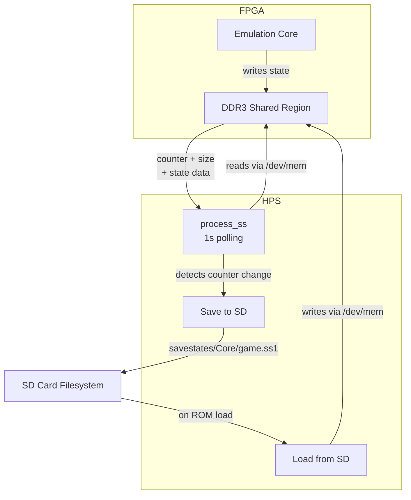

[← Section Index](README.md) · [↑ Knowledge Base](../README.md)

# Save State Architecture

How MiSTer captures, stores, and restores the complete internal state of an FPGA core — from the CONF_STR declaration to the DDR3 shared-memory protocol and the per-core save file layout.

## Table of Contents

1. [Overview](#1-overview)
2. [CONF_STR Declaration: `SS` Tag](#2-conf_str-declaration-ss-tag)
3. [Architecture: DDR3 Shared-Memory Approach](#3-architecture-ddr3-shared-memory-approach)
4. [HPS Side: `process_ss()` Polling Loop](#4-hps-side-process_ss-polling-loop)
5. [FPGA Side: Core Responsibility](#5-fpga-side-core-responsibility)
6. [Save State File Format and Storage](#6-save-state-file-format-and-storage)
7. [Alternative Save Mechanism: Sector I/O](#7-alternative-save-mechanism-sector-io)
8. [Per-Core Save State Implementations](#8-per-core-save-state-implementations)
9. [OSD Integration](#9-osd-integration)
10. [Antipatterns and Common Pitfalls](#10-antipatterns-and-common-pitfalls)
11. [Platform Context](#11-platform-context)

---

## 1. Overview

MiSTer's save state system allows an FPGA core to snapshot its entire internal state — CPU registers, RAM contents, peripheral state, and any other data required to resume execution from exactly the same point. The system operates on a fundamentally different principle than software emulators: the FPGA core itself decides *what* to save and *when*, while the ARM HPS handles storage and file I/O.



There are **two distinct save state mechanisms** in MiSTer:

| Mechanism | Transport | Used By | Section |
|---|---|---|---|
| **DDR3 shared memory** (SS tag) | `/dev/mem` mmap polling | Arcade cores, GBA, PSX, etc. | [§3](#3-architecture-ddr3-shared-memory-approach) |
| **Sector I/O** (UIO_SECTOR_RD/WR) | SPI block read/write | N64, C64, Apple II | [§7](#7-alternative-save-mechanism-sector-io) |

The DDR3 mechanism is the primary one used by most cores. The sector I/O mechanism evolved from floppy/disk image handling and is used by cores that manage their own persistent storage (N64 controller paks, C64 disk images, etc.).

---

## 2. CONF_STR Declaration: `SS` Tag

A core advertises its save state capability through the `SS` directive in its CONF_STR index 1 string:

```
SS<base>:<size>
```

| Parameter | Format | Description |
|---|---|---|
| `base` | Hex address | DDR3 physical address where save state data begins |
| `size` | Hex size | Maximum size of each save state slot in bytes |

### 2.1 Parsing

Source: `Main_MiSTer/user_io.cpp:L691-715`

```c
if (!strncasecmp(p, "SS", 2))
{
    char *end = 0;
    ss_base = strtoul(p+2, &end, 16);
    p = end;
    if (p && *p == ':')
    {
        p++;
        ss_size = strtoul(p, &end, 16);
    }
}
```

### 2.2 Validation

The HPS validates both parameters strictly:

| Check | Rule | Rationale |
|---|---|---|
| Size must be nonzero | `ss_size > 0` | Zero-size states are meaningless |
| Size must be ≤ 128 MB | `ss_size ≤ 128 * 1024 * 1024` | Prevents runaway memory mapping |
| Base must be ≥ 0x20000000 | `ss_base ≥ 0x20000000` | Must fall within the FPGA-accessible DDR3 window |
| Base must be < 0x40000000 | `ss_base < 0x40000000` | Must not exceed the 1 GB DDR3 range |
| End must be < 0x40000000 | `ss_base + ss_size < 0x40000000` | Entire region must be addressable |

If any check fails, both `ss_base` and `ss_size` are zeroed, effectively disabling save states for the core.

Source: `Main_MiSTer/user_io.cpp:L704-715`

### 2.3 Legacy GBA Fallback

For the GBA core, which predates the `SS` tag convention, a hardcoded fallback exists:

```c
// user_io.cpp:L1038-1043
if (is_gba() && !ss_base)
{
    ss_base = 0x3E000000;
    ss_size = 0x100000;  // 1 MB
}
```

This places the GBA save state at the top of the DDR3 address space (near the 1 GB boundary).

---

## 3. Architecture: DDR3 Shared-Memory Approach

The primary save state mechanism uses a **shared DDR3 memory region** that both the FPGA core and the ARM HPS can access directly. This avoids any SPI bandwidth bottleneck — the FPGA writes state data at DDR3 speeds, and the HPS reads it via memory-mapped I/O.

### 3.1 Memory Layout

The DDR3 save state region is divided into **4 equal-sized slots**:

```
DDR3 Physical Address Space
┌──────────────────────────────────────────┐ 0x40000000
│                                          │
│  (upper DDR3 — available for core use)   │
│                                          │
├──────────────────────────────────────────┤ ss_base + 4×ss_size
│  Slot 4  (ss_base + 3×ss_size)          │
├──────────────────────────────────────────┤ ss_base + 3×ss_size
│  Slot 3  (ss_base + 2×ss_size)          │
├──────────────────────────────────────────┤ ss_base + 2×ss_size
│  Slot 2  (ss_base + 1×ss_size)          │
├──────────────────────────────────────────┤ ss_base + 1×ss_size
│  Slot 1  (ss_base + 0×ss_size)          │
├──────────────────────────────────────────┤ ss_base
│                                          │
│  (lower DDR3 — core RAM, video buffers)  │
│                                          │
└──────────────────────────────────────────┘ 0x20000000
```

Each slot's **first 8 bytes** are reserved for metadata:

| Offset | Size | Field | Description |
|---|---|---|---|
| 0x00 | 4 bytes | `counter` | Monotonically increasing counter — incremented by the core when a new state is saved |
| 0x04 | 4 bytes | `size` | Size of the actual state data in 32-bit words (not bytes) |
| 0x08 | ... | state data | The serialized core state |

### 3.2 The `shmem_map` Bridge

Source: `Main_MiSTer/shmem.cpp:L18-37`

The HPS accesses the DDR3 save state region through Linux's `/dev/mem` device, using `mmap()` to map physical addresses into userspace:

```c
void *shmem_map(uint32_t address, uint32_t size)
{
    if (memfd < 0)
    {
        memfd = open("/dev/mem", O_RDWR | O_SYNC | O_CLOEXEC);
    }
    void *res = mmap(0, size, PROT_READ | PROT_WRITE, MAP_SHARED, memfd, address);
    return res;
}
```

The `fpga_mem()` macro translates between FPGA-visible and physical addresses:

```c
// shmem.h:L12
#define fpga_mem(x) (0x20000000 | ((x) & 0x1FFFFFFF))
```

This ensures that addresses in the `0x20000000–0x3FFFFFFF` range (the FPGA DDR3 window) are correctly mapped.

### 3.3 Advantages of the DDR3 Approach

| Aspect | DDR3 Shared Memory | SPI FIO Upload |
|---|---|---|
| Bandwidth | ~1.6 GB/s (DDR3-800) | ~25 MB/s (SPI clk) |
| Latency | ~100 ns (DDR3 CAS) | ~40 µs per transaction |
| Core overhead | Simple DDR3 writes | Must drive SPI protocol |
| Bidirectional | Yes (read + write) | Primarily upload |
| Concurrent access | Polling (1 s interval) | Immediate |

The DDR3 approach allows cores with large state (e.g., PSX with 2 MB RAM + GPU + GTE + MDEC) to save quickly without stalling the emulation for an extended SPI transfer.

---

## 4. HPS Side: `process_ss()` Polling Loop

Source: `Main_MiSTer/user_io.cpp:L1886-1992`

The HPS-side save state handler is `process_ss()`, which operates in two phases: **initialization** and **polling**.

### 4.1 Initialization Phase

When a ROM is loaded, `process_ss()` is called with the ROM filename:

```c
int process_ss(const char *rom_name, int enable)
```

Initialization steps:
1. **Map 4 DDR3 slots** — Each slot at `ss_base + (i * ss_size)` is mapped via `shmem_map()`
2. **Clear each slot** — `memset(base[i], 0, len)` zeroes the region
3. **Mark counter as "no save yet"** — `ss_cnt[i] = 0xFFFFFFFF`
4. **Load existing save state files** — If a `.ss1`–`.ss4` file exists on the SD card, it is read into the mapped DDR3 region
5. **Set the counter sentinel** — `*(uint32_t*)(base[i]) = 0xFFFFFFFF` marks the slot as "not yet written by core"

This means when a core starts, it can immediately find its previously saved state in DDR3 at the expected address.

### 4.2 Polling Phase

After initialization, `process_ss()` is called repeatedly with `rom_name = NULL`. It polls every **1 second**:

```c
static unsigned long ss_timer = 0;
if (ss_timer && !CheckTimer(ss_timer)) return 0;
ss_timer = GetTimer(1000);  // 1-second interval
```

For each of the 4 slots:
1. Read `counter` at `base[i][0]` and `size` at `base[i][1]`
2. If `counter` has changed since last check (`curcnt != ss_cnt[i]`):
   - Compute actual byte size: `size = (size + 2) * 4` (the `size` field stores 32-bit word count minus 2 for the header)
   - Validate: `0 < size ≤ ss_size`
   - Display "Saving the state" OSD message
   - Write the entire slot to the corresponding `.ss{1-4}` file using `O_CREAT | O_TRUNC | O_RDWR | O_SYNC`

Source: `Main_MiSTer/user_io.cpp:L1958-1989`

### 4.3 Size Field Encoding

The `size` field at offset 0x04 encodes the number of 32-bit words *excluding* the 8-byte header, minus 2:

```c
if (size) size = (size + 2) * 4;
```

This means:
- `size = 0` → no valid state data (header only)
- `size = 1` → 12 bytes total (8 header + 4 data)
- `size = N` → `(N + 2) * 4` bytes total

> [!WARNING]
> The size encoding is counter-intuitive. The FPGA core stores the count of 32-bit words after the header minus 2. The HPS then reverses this with `(size + 2) * 4` to get the total byte count including the header. Core developers must follow this exact convention.

---

## 5. FPGA Side: Core Responsibility

The FPGA core is entirely responsible for **what** gets saved. The `sys/` framework provides no automatic state serialization — each core must implement its own save/load logic.

### 5.1 What a Core Must Do

To support save states, a core must:

1. **Reserve DDR3 space**: Declare `SS<base>:<size>` in CONF_STR
2. **Implement a save trigger**: Detect the OSD save-state request (typically via a status bit)
3. **Serialize state**: Write CPU registers, RAM contents, peripheral state, and any timing-critical data to the DDR3 region at `ss_base`
4. **Write the header**: Set `counter` (incrementing) and `size` fields
5. **Implement a load trigger**: Detect the OSD load-state request
6. **Deserialize state**: Read from DDR3 and restore all saved components

### 5.2 Save State Contents by Core Type

| Component | Arcade (Jotego, etc.) | PSX | GBA |
|---|---|---|---|
| CPU registers | ✓ | ✓ R3000A | ✓ ARM7TDMI |
| Main RAM | ✓ (via DDR3) | ✓ 2 MB | ✓ 256 KB |
| Video RAM | ✓ | ✓ 1 MB | ✓ 96 KB |
| Audio state | ✓ | ✓ SPU | ✓ |
| Input state | ✓ | ✓ | ✓ |
| Timer state | ✓ | ✓ | ✓ |
| DMA state | ✓ | ✓ | ✓ |
| GPU command buffer | — | ✓ | — |
| Palette RAM | ✓ | ✓ | ✓ |
| Peripheral state | ✓ (core-specific) | ✓ CD-ROM, MDEC | ✓ |

### 5.3 The `ioctl_upload_req` Signal

Source: `Template_MiSTer/sys/hps_io.sv:L152`

The `hps_io` module provides an `ioctl_upload_req` input signal that a core can assert to request the HPS to read back data via the SPI FIO channel:

```verilog
// hps_io.sv:L151-153
output reg        ioctl_upload = 0,   // signal indicating an active upload
input             ioctl_upload_req,   // request to save (must be supported on HPS side)
input       [7:0] ioctl_upload_index,
```

When the core asserts `ioctl_upload_req`, the `hps_io` module sets a latch:

```verilog
// hps_io.sv:L289-290
old_upload_req <= ioctl_upload_req;
if(~old_upload_req & ioctl_upload_req) upload_req <= 1;
```

The HPS detects this via the `UIO_CHK_UPLOAD` (0x3C) command and begins a SPI read transfer.

> [!NOTE]
> The `ioctl_upload_req` mechanism is a **secondary** save path used by some cores. The primary DDR3 shared-memory mechanism does not use SPI at all — the core writes directly to DDR3, and the HPS reads via `/dev/mem`.

---

## 6. Save State File Format and Storage

### 6.1 Directory Structure

Source: `Main_MiSTer/file_io.cpp:L920-944`

Save state files are stored under `/media/fat/savestates/`:

```
/media/fat/savestates/
├── Arcade/
│   ├── game_name.ss1
│   ├── game_name.ss2
│   ├── game_name.ss3
│   └── game_name.ss4
├── SNES/
│   └── ...
└── PSX/
    └── ...
```

The subdirectory name is determined by the core type:
- Arcade cores use `Arcade/`
- Console/computer cores use the core's directory name (e.g., `SNES/`, `PSX/`)

### 6.2 File Naming

Source: `Main_MiSTer/file_io.cpp:L920-944`

```c
void FileGenerateSavestatePath(const char *name, char* out_name, int sufx)
{
    const char *subdir = is_arcade() ? "Arcade" : CoreName2;
    create_path(SAVESTATE_DIR, subdir);
    sprintf(out_name, "%s/%s/", SAVESTATE_DIR, subdir);
    // Strip extension from ROM name, append .ssN
}
```

The `sufx` parameter (1–4) determines which slot the file corresponds to:
- `sufx = 1` → `.ss1` (auto-save slot, also the default search target)
- `sufx = 2` → `.ss2`
- `sufx = 3` → `.ss3`
- `sufx = 4` → `.ss4`

### 6.3 File Content

A save state file is a **binary blob** — a raw copy of the DDR3 region for that slot. There is no file header, compression, or checksum beyond what the core itself stores in the first 8 bytes.

| Offset | Size | Content |
|---|---|---|
| 0x00 | 4 | `counter` — monotonically increasing, changes trigger a save |
| 0x04 | 4 | `size` — state data size in 32-bit words minus 2 |
| 0x08 | variable | Core-specific serialized state data |

### 6.4 Auto-Save Behavior

The HPS automatically saves state changes to slot 1 (`.ss1`). On core startup, if `.ss1` does not exist but `.ss0` does, the loader falls back to `.ss0`:

```c
// user_io.cpp:L1919-1921
FileGenerateSavestatePath(rom_name, ss_name, 1);
if (!FileExists(ss_name)) FileGenerateSavestatePath(rom_name, ss_name, 0);
```

> [!NOTE]
> Slot 0 (`.ss0`) appears to be a legacy convention. Current cores typically use slots 1–4.

---

## 7. Alternative Save Mechanism: Sector I/O

Some cores — notably N64, C64, and Apple II — use a **sector-based I/O** mechanism instead of (or alongside) the DDR3 shared-memory approach. This mechanism evolved from the floppy and hard disk image handling infrastructure.

### 7.1 Protocol

The sector I/O mechanism uses two UIO commands:

| Command | Opcode | Direction | Description |
|---|---|---|---|
| `UIO_SECTOR_RD` | 0x17 | HPS → FPGA | Send a 512-byte sector to the FPGA |
| `UIO_SECTOR_WR` | 0x18 | FPGA → HPS | Receive a 512-byte sector from the FPGA |

Source: `Main_MiSTer/user_io.h:L33-34`

### 7.2 N64 Save State System

Source: `Main_MiSTer/support/n64/n64.cpp:L1290-1305`

The N64 core handles all save types by concatenating them into a single data stream:

```
(EEPROM/SRAM/FLASH) + (TPAK) + (CPAK 1) + (CPAK 2) + (CPAK 3) + (CPAK 4)
```

The `n64_process_save()` function:
1. Determines the save type and file layout from the loaded ROM
2. For writes (`op == 2`): fetches sector data from the FPGA via `UIO_SECTOR_WR`, then writes to the correct save file (EEPROM, SRAM, FlashRAM, or Controller Pak)
3. For reads (`op == 1`): reads from the save file and sends sector data to the FPGA via `UIO_SECTOR_RD`

The N64 core uses a sophisticated multi-file save system with byte-order normalization and chunked read/write:

```c
bool n64_process_save(const bool use_save, const int op,
    const uint64_t sector_index, const uint32_t sector_size,
    const int ack_flags, uint64_t& confirmed_sector,
    uint8_t* buffer, const uint32_t buffer_capacity, uint32_t chunk_size);
```

### 7.3 C64 and Apple II

The C64 and Apple II cores use the sector I/O mechanism for disk image persistence (G64, D64, NIB formats). The C64 core has specialized handlers for GCR-encoded data:

```c
// user_io.cpp:L3232-3236
if ((blks == G64_BLOCK_COUNT_1541+1 || blks == G64_BLOCK_COUNT_1571+1)
    && sd_type[disk]==SD_TYPE_C64)
{
    if (op == 2) c64_writeGCR(disk, lba, blks-1);
    else if (op & 1) c64_readGCR(disk, lba, blks-1);
}
```

---

## 8. Per-Core Save State Implementations

### 8.1 Arcade Cores

Most arcade cores use the DDR3 shared-memory mechanism. The Jotego framework provides a standardized save state infrastructure:

- `SS` tag in CONF_STR declares the DDR3 region
- The core's main module serializes CPU state, sprite/palette RAM, and input state
- Save/load is triggered through OSD menu selections that set status bits

### 8.2 PSX Core

Source: `Main_MiSTer/support/psx/psx.cpp:L785`

The PSX core calls `process_ss()` during ROM loading:

```c
process_ss(filename, name_len != 0);
```

PSX save states are typically large (2+ MB) due to the R3000A CPU state, 2 MB main RAM, 1 MB VRAM, SPU audio RAM, GPU command buffer, timers, and DMA channels. The DDR3 approach is essential here — an SPI transfer of 2 MB would take ~80 ms at 25 MB/s, causing a noticeable emulation stall.

### 8.3 GBA Core

The GBA core uses a hardcoded DDR3 save state region at `0x3E000000` (1 MB). This was defined before the `SS` tag convention existed, so it relies on the legacy fallback in `user_io.cpp`.

### 8.4 ao486

The ao486 core uses the sector I/O mechanism for its hard disk and CD-ROM images, but does not currently support traditional save states (snapshot/restore of CPU state). Instead, it relies on the guest OS's native save functionality (e.g., Windows hibernation) and persistent disk images.

### 8.5 Minimig (Amiga)

The Minimig core does not use the DDR3 save state mechanism. Amiga save games are handled through the native Amiga OS file system, which runs inside the emulated environment and writes to the mounted HDF (hard disk image) or floppy image.

---

## 9. OSD Integration

### 9.1 Save State Menu

The save/load state options appear in the core's OSD menu. When the user selects "Save State" or "Load State":

1. The HPS sets a status bit in the FPGA's status register
2. The core detects this bit in its main loop
3. For **save**: the core serializes its state to DDR3, increments the counter, and writes the size field
4. For **load**: the core reads the serialized state from DDR3 and restores all components

### 9.2 Save Wait State

Source: `Main_MiSTer/menu.cpp:L2172-2185`

The OSD enters a `MENU_GENERIC_SAVE_WAIT` state while waiting for the save to complete:

```c
case MENU_GENERIC_SAVE_WAIT:
    menumask = 0;
    parentstate = menustate;
    if (menu)
    {
        menu_save_timer = 0;
        menustate = MENU_NONE1;
    }
    else if (menu_save_timer && CheckTimer(menu_save_timer))
    {
        menu_save_timer = 0;
        menustate = MENU_GENERIC_MAIN1;
    }
    break;
```

The `menu_process_save()` function is called by the sector I/O handler when a write is detected:

```c
// menu.cpp:L7925-7928
void menu_process_save()
{
    menu_save_timer = GetTimer(500);  // 500 ms grace period
}
```

### 9.3 Visual Feedback

During a save operation, the OSD displays "Saving..." and the disk activity LED is activated via `diskled_on()`. The save timer ensures the "Saving..." message is visible for at least 500 ms before the OSD returns to the main menu.

---

## 10. Antipatterns and Common Pitfalls

### 10.1 Incorrect `SS` Tag Address Range

> [!CAUTION]
> The `ss_base` must be in the range `0x20000000–0x3FFFFFFF`. Addresses below `0x20000000` fall in the SDRAM or register space; addresses at or above `0x40000000` are outside the DDR3 physical range. The HPS will silently disable save states if the range check fails.

### 10.2 Forgetting to Increment the Counter

The HPS only detects a save when the counter changes. If the core writes state data but does not increment the counter at offset 0, the HPS will never persist the save to the SD card.

### 10.3 Incomplete State Serialization

A common bug in core development is to save CPU registers and RAM but forget peripheral state (timer counts, DMA position, audio FIFO state, etc.). This results in a "loaded" state that appears to work but has subtle glitches — audio pops, stuck timers, or incorrect DMA transfers.

### 10.4 Writing State Non-Atomically

If the core writes the state data incrementally and the HPS happens to poll mid-write, it may capture a partially-updated state. The counter should be written **last**, after all state data is committed to DDR3.

### 10.5 Size Field Overflow

The `size` field is only 32 bits wide, encoding the word count. For very large states (> 4 GB ÷ 4 = 1 GB), the size would overflow. In practice, no MiSTer core approaches this limit — the DDR3 is only 1 GB total.

### 10.6 Race Condition on Load

When loading a state, the core must be paused or in a known-safe state. If the core is actively running while state data is being written to DDR3, it may read partially-updated data, causing a crash. Most cores handle this by pausing emulation during the load sequence.

---

## 11. Platform Context

| Aspect | MiSTer | Software Emulation (RetroArch) | Analogue Pocket |
|---|---|---|---|
| State storage | DDR3 shared memory | Host RAM | Not supported (no save states) |
| Persistence | SD card (.ss1–.ss4 files) | Host filesystem (.state files) | N/A |
| Bandwidth | ~1.6 GB/s DDR3 | RAM speed | N/A |
| Core responsibility | Core must serialize | Emulator serializes | N/A |
| Rewind support | Not supported | Supported (ring buffer) | N/A |
| Compression | None (raw DDR3 copy) | Often compressed | N/A |

> [!NOTE]
> MiSTer does not currently support **rewind** functionality (continuously recording state to allow stepping backward in time). This would require a ring buffer of DDR3 snapshots, which would consume significant memory and bandwidth. The 1-second polling interval of `process_ss()` is also too coarse for frame-level rewind.

---

Source: `Main_MiSTer/user_io.cpp`, `Main_MiSTer/file_io.cpp`, `Main_MiSTer/shmem.cpp`, `Main_MiSTer/menu.cpp`, `Main_MiSTer/support/n64/n64.cpp`, `Template_MiSTer/sys/hps_io.sv`
