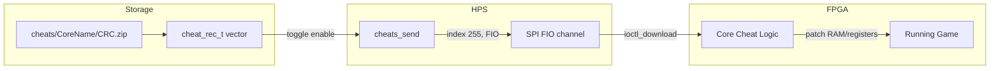

[← Section Index](README.md) · [↑ Knowledge Base](../README.md)

# Cheat Engine Architecture

How MiSTer loads, manages, and applies cheat codes across arcade and console cores — from the ZIP-based cheat file format to the SPI delivery protocol and per-core cheat execution.

---

## 1. Overview

MiSTer's cheat system allows players to apply game-altering codes (infinite lives, level select, debug modes, etc.) at runtime. The system supports two primary code formats — **Game Genie** and **Action Replay/PAR** — and delivers them to the FPGA core via the same SPI FIO channel used for ROM data.



---

## 2. Cheat File Discovery

Source: `Main_MiSTer/cheats.cpp:L92-326`

The cheat engine searches for cheat files using a multi-stage lookup strategy.

### 2.1 Search Order

| Priority | Path Pattern | Core Types |
|---|---|---|
| 1 | `<rom_path_without_ext>.zip` | All (same-directory) |
| 2 | `cheats/<CoreName>/CD<rom_name_without_ext> [].zip` | MegaCD, PCE-CD |
| 3 | `cheats/<CoreName><rom_name_without_ext>.zip` | PSX |
| 4 | `cheats/<CoreName>/<game_id>.zip` | PSX (by game ID) |
| 5 | `cheats/<CoreName>/[CRC32].zip` | All (by CRC) |

### 2.2 CRC-Based Lookup

Source: `Main_MiSTer/cheats.cpp:L92-129`

For ROMs without a same-directory cheat file, the engine scans the `cheats/<CoreName>/` directory for files matching the pattern `[XXXXXXXX].zip`, where `XXXXXXXX` is the uppercase hex CRC32 of the ROM:

```c
if (len >= 14 && de->d_name[len - 14] == '['
    && !strcasecmp(de->d_name + len - 5, "].zip"))
{
    uint32_t crc = 0;
    if (sscanf(de->d_name + len - 14, "[%X].zip", &crc) == 1)
    {
        if (crc == romcrc) { /* found */ }
    }
}
```

### 2.3 PSX Game ID Lookup

Source: `Main_MiSTer/cheats.cpp:L165-192`

PSX games use a different identification scheme based on the disc game ID (e.g., `SCUS94425`). The `cheat_init_psx()` function tries:
1. Same filename pattern: `cheats/PSX/<gamename>.zip`
2. Game ID pattern: `cheats/PSX/<game_id>.zip`

---

## 3. Cheat Data Structure

Source: `Main_MiSTer/cheats.cpp:L21-59`

Each cheat is stored in a `cheat_rec_t` structure:

```c
struct cheat_rec_t
{
    bool enabled;
    char name[256];
    int cheatSize;
    char *cheatData;  // lazy-loaded binary cheat data
};
```

Cheats are stored in a sorted `std::vector<cheat_rec_t>` and sorted alphabetically by name.

### 3.1 Unit Size and Capacity

| Parameter | Default | Arcade Override | Description |
|---|---|---|---|
| `cheat_unit_size` | 16 bytes | Variable (set by MRA) | Size of one cheat code unit |
| `cheat_max_active` | 128 codes | Variable (set by MRA) | Maximum active cheat code units |
| `CHEAT_SIZE` | 128×16 = 2048 bytes | — | Maximum cheat buffer size |

---

## 4. Arcade Cheat Codes (MRA-Embedded)

Source: `Main_MiSTer/cheats.cpp:L194-229`

Arcade cores receive cheat definitions through the MRA XML file, not from external ZIP files. The MRA loader provides three functions:

```c
void cheats_init_arcade(int unit_size, int max_active);
void cheats_add_arcade(const char *name, const char *cheatData, int cheatSize);
void cheats_finalize_arcade();
```

The `unit_size` and `max_active` parameters are specified in the MRA's `<cheat>` element attributes, allowing arcade cores to define their own cheat code format.

When adding an arcade cheat, the engine validates that `cheatSize` is a multiple of `cheat_unit_size`:

```c
if ((cheatSize % cheat_unit_size) != 0)
{
    printf("Arcade cheat '%s' has incorrect length %d -> skipping.\n", name, cheatSize);
    return;
}
```

---

## 5. Cheat Code Delivery to FPGA

Source: `Main_MiSTer/cheats.cpp:L477-514`

When a cheat is toggled on or off, the `cheats_send()` function transmits all enabled cheats to the FPGA:

```c
static void cheats_send()
{
    static uint8_t buff[CHEAT_SIZE];
    int pos = 0;

    for (int i = 0; i < cheats_available(); i++)
    {
        if (cheats[i].enabled)
        {
            memcpy(&buff[pos], cheats[i].cheatData, cheats[i].cheatSize);
            pos += cheats[i].cheatSize;
        }
    }

    loaded = pos / cheat_unit_size;

    if (is_n64())
    {
        n64_cheats_send(buff, loaded);
    }
    else
    {
        user_io_set_index(255);           // cheat index
        user_io_set_download(1);          // begin download
        user_io_file_tx_data(buff, pos ? pos : 2);  // send data
        user_io_set_download(0);          // end download
    }
}
```

### 5.1 FIO Index 255

Cheat data is sent to the FPGA using **FIO index 255**. This is a reserved index that cores recognize as the cheat data channel. The SPI sequence is:

1. `FIO_FILE_INDEX` → 255 (set the cheat index)
2. `FIO_FILE_TX` → 0xFF (enable download mode)
3. `FIO_FILE_TX_DAT` → cheat buffer (stream data)
4. `FIO_FILE_TX` → 0x00 (end download)

If no cheats are enabled (`pos == 0`), a 2-byte zero buffer is sent to signal "clear all cheats."

### 5.2 N64 Special Case

The N64 core has its own cheat delivery mechanism (`n64_cheats_send()`) because it implements cheat execution entirely in the FPGA fabric. N64 cheats use a custom structure:

```c
// n64.cpp:L122-150
struct cheat_code_flags { ... };
struct cheat_code {
    struct cheat_code_flags flags;
    uint32_t address;
    int32_t compare;     // -1 if no compare
    int32_t replace;     // replacement value
};
```

The N64 cheat engine supports:
- **Compare-type cheats**: Only patch memory if the current value matches
- **Replace-type cheats**: Unconditionally write a value to memory
- **Automatic execution**: A timer-based handler in the FPGA applies cheats every frame

---

## 6. Cheat Toggle and Lazy Loading

Source: `Main_MiSTer/cheats.cpp:L516-589`

Cheats use **lazy loading** — the binary cheat data is not loaded from the ZIP file until the user toggles the cheat on:

```c
void cheats_toggle()
{
    if (cheats[iSelectedEntry].enabled == true)
    {
        cheats[iSelectedEntry].enabled = false;
        changedCheats = true;
    }
    else
    {
        /* lazy load cheat data */
        if (cheats[iSelectedEntry].cheatData == NULL)
        {
            // Open ZIP, read file, allocate memory
            snprintf(filename, sizeof(filename), "%s/%s",
                     cheat_zip, cheats[iSelectedEntry].name);
            if (FileOpen(&f, filename)) { /* read data */ }
        }

        if (cheats[iSelectedEntry].cheatData)
        {
            cheats[iSelectedEntry].enabled = true;
            changedCheats = true;
        }
    }

    if (changedCheats) cheats_send();
}
```

This design saves memory — only enabled cheats have their data allocated and loaded.

### 6.1 Capacity Check

Before loading a new cheat, the engine checks if there is room for it:

```c
if (((len / cheat_unit_size) + cheats_loaded()) <= cheat_max_active)
{
    // Load the cheat
}
else
{
    printf("No more room in current selection for cheat file %s.\n", filename);
}
```

---

## 7. OSD Display

Source: `Main_MiSTer/cheats.cpp:L431-474`

The cheat menu displays all available cheats with an enable/disable indicator:

- Character `0x1A` (▶) indicates an **enabled** cheat
- Character `0x1B` (◁) indicates a **disabled** cheat

The menu supports scrolling, paging, and name scrolling for long cheat names (truncated to 28 characters with `…` indicator).

---

## 8. Cheat Code Formats

### 8.1 Game Genie

Game Genie codes are 6–8 character alphanumeric strings (e.g., `SXROMW`). They encode:
- A memory address to patch
- A replacement value
- An optional compare value (8-character codes)

The HPS decodes the Game Genie cipher and converts it to an address+value pair before sending to the FPGA.

### 8.2 Action Replay / PAR

Action Replay codes are in the format `XXXXXXXX YYYYYYYY`, encoding:
- A 32-bit address
- A 32-bit value to write

These codes are simpler to process as they directly specify the memory address.

### 8.3 Arcade Native Format

Arcade cores define their own cheat code format in the MRA XML. The format is opaque to the HPS — the MRA loader simply passes the binary blob through. Common encodings include:
- Address + byte value pairs (16-bit units)
- Address + word value pairs (32-bit units)
- Multi-step cheats with conditional activation

---

## 9. Reset and Clear

When a new ROM is loaded, the cheat engine resets:

```c
// cheats.cpp:L232-247
void cheats_init(const char *rom_path, uint32_t romcrc)
{
    cheats.clear();
    loaded = 0;
    cheat_unit_size = 16;
    cheat_max_active = 128;

    // Clear cheats in FPGA (except N64 which has its own reset)
    if (!is_n64())
    {
        user_io_set_index(255);
        user_io_set_download(1);
        user_io_file_tx_data((const uint8_t*)&loaded, 2);  // 2 zero bytes
        user_io_set_download(0);
    }

    // ... search for cheat files ...
}
```

The 2-byte zero send at index 255 tells the core to clear all active cheats.

---

Source: `Main_MiSTer/cheats.cpp`, `Main_MiSTer/cheats.h`, `Main_MiSTer/support/n64/n64.cpp`, `Main_MiSTer/support/arcade/mra_loader.cpp`
