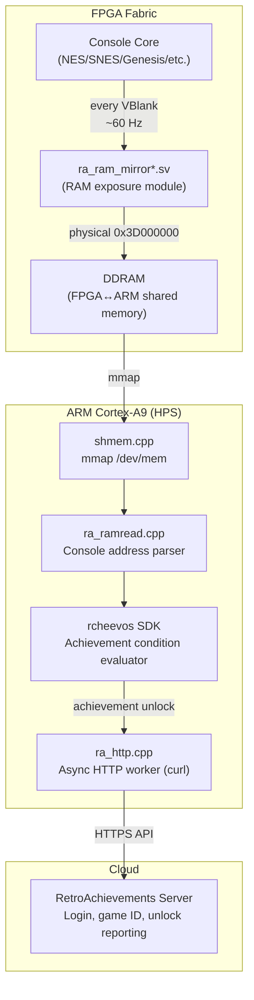
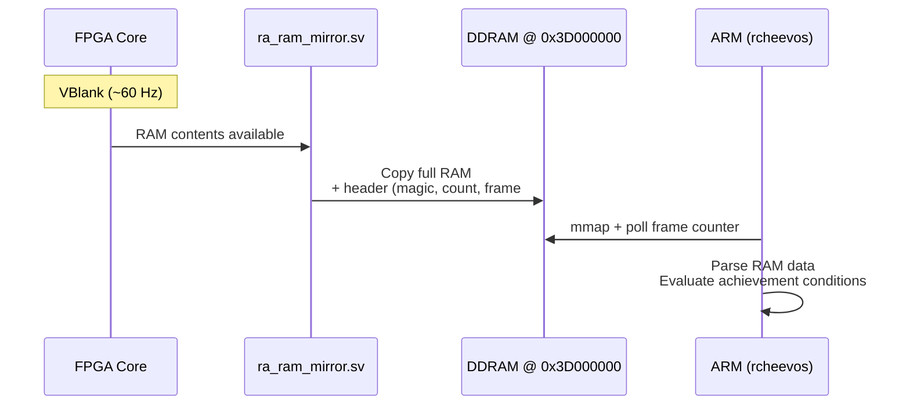
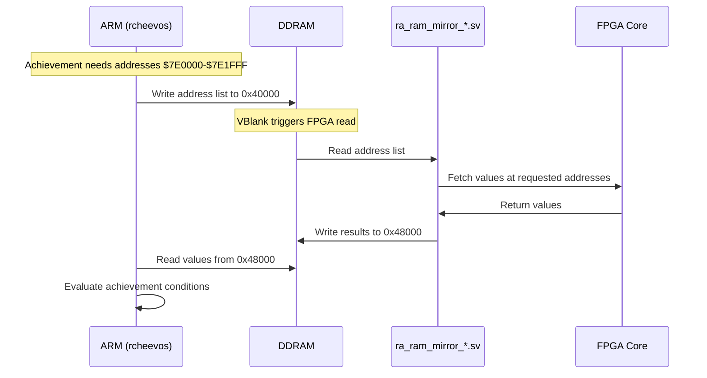

[← Extensions](README.md) · [↑ Knowledge Base](../README.md)

# RetroAchievements on MiSTer — Architecture & Setup

## Overview

[RetroAchievements](https://retroachievements.org/) is a platform that adds achievement systems to classic games — similar to Xbox Achievements or PlayStation Trophies, but for retro consoles. A fork of the MiSTer Main binary by [odelot](https://github.com/odelot) integrates RetroAchievements directly into the MiSTer FPGA platform.

This is not software emulation — the achievements run against **real FPGA-emulated hardware** with RAM state read directly from the FPGA fabric via DDRAM shared memory.



---

## Supported Cores

| Console | RA Console ID | Core Repository | RAM Protocol |
|---------|--------------|-----------------|--------------|
| NES / Famicom Disk System | 7 / 91 | [odelot/NES_MiSTer](https://github.com/odelot/NES_MiSTer) | Full Mirror |
| SNES | 3 | [odelot/SNES_MiSTer](https://github.com/odelot/SNES_MiSTer) | Selective Address |
| Genesis / Mega Drive | 1 | [odelot/MegaDrive_MiSTer](https://github.com/odelot/MegaDrive_MiSTer) | Selective Address |
| Master System / Game Gear | 11 | [odelot/SMS_MiSTer](https://github.com/odelot/SMS_MiSTer) | Full Mirror |
| Game Boy / Game Boy Color | 4 | [odelot/Gameboy_MiSTer](https://github.com/odelot/Gameboy_MiSTer) | Full Mirror |
| Game Boy Advance | 5 | [odelot/GBA_MiSTer](https://github.com/odelot/GBA_MiSTer) | Selective Address |
| N64 | 2 | [odelot/N64_MiSTer](https://github.com/odelot/N64_MiSTer) | Direct RDRAM + VBlank |
| PlayStation | 12 | [odelot/PSX_MiSTer](https://github.com/odelot/PSX_MiSTer) | Selective Address |
| Mega CD / Sega CD | 9 | [odelot/MegaCD_MiSTer](https://github.com/odelot/MegaCD_MiSTer) | Selective Address |
| NeoGeo (MVS/AES/CD) | 27 | [odelot/NeoGeo_MiSTer](https://github.com/odelot/NeoGeo_MiSTer) | Selective Address |
| TurboGrafx-16 / PC Engine | 8 | [odelot/TurboGrafx16_MiSTer](https://github.com/odelot/TurboGrafx16_MiSTer) | Selective Address |
| Atari 2600 (via 7800 core) | 25 | [odelot/Atari7800_MiSTer](https://github.com/odelot/Atari7800_MiSTer) | Full Mirror |
| Sega 32X | 10 | [odelot/S32X_MiSTer](https://github.com/odelot/S32X_MiSTer) | Selective Address |

---

## Setup Guide

### Prerequisites

1. A [RetroAchievements account](https://retroachievements.org/) (free)
2. MiSTer connected to the internet (Ethernet or WiFi — see [WiFi Setup](../12_networking/wifi_setup.md))
3. A supported console ROM

### Installation

1. Download the latest release from [odelot/Main_MiSTer releases](https://github.com/odelot/Main_MiSTer/releases)
2. Extract all files
3. Edit `retroachievements.cfg`:

```ini
# retroachievements.cfg
username = your_ra_username
password = your_ra_password
hardcore = 0
leaderboards = 1
debug = 0
```

4. Copy all files to `/media/fat/` on your MiSTer SD card (this replaces the Main binary)
5. Download the modified core for your console from the table above
6. Copy the modified `.rbf` to the appropriate directory (e.g., `/media/fat/_Console/`)

> [!NOTE]
> The RA fork replaces the standard `MiSTer` binary. To switch back to the official binary, simply copy the official `MiSTer` binary back to `/media/fat/MiSTer`. Your saves and settings are not affected.

### Running

1. Boot MiSTer with a supported core
2. Load a ROM that has achievements on RetroAchievements.org
3. The OSD will show a login confirmation and game identification
4. Play — achievements trigger automatically
5. Press **F6** during OSD to view the achievement list for the current game

---

## Architecture Deep Dive

### RAM Exposure Protocols

The core challenge: the RetroAchievements rcheevos library needs to read the emulated console's RAM state. On MiSTer, the RAM lives inside the FPGA fabric — the ARM processor can't access it directly. Two protocols solve this:

#### Full Mirror (Small RAM)

For consoles with small address spaces (NES: 10 KB, SMS: 8 KB, GB: 8 KB):



The FPGA writes a structured block at ARM physical address `0x3D000000`:

| Offset | Content |
|--------|---------|
| `0x00000` | Header: magic `"RACH"`, region count, busy flag, frame counter |
| `0x00100+` | RAM data (layout varies per core) |
| `0x40000` | Address request list (Selective Address protocol) |
| `0x48000` | Value response cache (Selective Address protocol) |

#### Selective Address (Large RAM)

For consoles with larger address spaces (SNES: 128 KB, Genesis: 64 KB, PSX: 2 MB):



This is more efficient because only the addresses needed by active achievements are transferred, not the entire RAM space.

### Per-Core Details

#### NES / Famicom Disk System

- **Protocol**: Full Mirror
- **RAM exposed**: CPU RAM ($0000–$07FF, 2 KB) + Cart SRAM ($6000–$7FFF, 8 KB)
- **FDS detection**: When a `.fds` file is loaded, the console ID switches from 7 (NES) to 91 (Famicom Disk System)
- **Hashing**: FDS files skip the 16-byte fwNES header before MD5 computation

#### SNES

- **Protocol**: Selective Address
- **RAM exposed**: WRAM ($7E0000–$7FFFFF, 128 KB), SRAM, hardware registers
- The ARM sends address requests; the FPGA responds with values

#### N64

- **Protocol**: Direct RDRAM read + VBlank heartbeat
- N64 has 4–8 MB of RDRAM — too large for either Full Mirror or Selective Address
- Instead, the ARM reads RDRAM directly through the DDRAM bridge
- A VBlank heartbeat signal synchronizes the reads

### Integration Hooks

The RA fork modifies these files in the Main binary:

| File | Change |
|------|--------|
| `scheduler.cpp` | Calls `achievements_poll()` every frame |
| `menu.cpp` | Calls `achievements_load_game()` when ROM is selected |
| `main.cpp` | Calls `achievements_init()` / `achievements_deinit()` at startup/shutdown |
| `user_io.cpp` | Notifies RA layer on core reset |
| `Makefile` | Conditionally compiles rcheevos sources |

> [!NOTE]
> Loading a standard community core (without the RA mirror module) silently suppresses all RA activity — no spurious login attempts or network calls.

---

## Hardcore Mode

RetroAchievements has two modes:

| Mode | Features | Restrictions |
|------|----------|-------------|
| **Softcore** (default) | Achievements, leaderboards | None — save states and cheats allowed |
| **Hardcore** | Achievements, leaderboards, **double points** | No save states, no cheats, no slow-motion |

Enable in `retroachievements.cfg`:

```ini
hardcore = 1
```

> [!WARNING]
> Hardcore enforcement is currently implemented only for NES/FDS. Other cores automatically fall back to softcore. Check the [odelot repo](https://github.com/odelot/Main_MiSTer) for current enforcement status.

---

## Achievement List Navigation

While OSD is open and a game with achievements is loaded, press **F6**:

| Key | Action |
|-----|--------|
| ↑ / ↓ | Move one entry |
| Page Up / ← | Previous page |
| Page Down / → | Next page |
| Home | Jump to first entry |
| End | Jump to last entry |
| Menu button | Close and return to normal OSD |

Unlocked entries are marked with ►, locked entries with ◄. The title shows total count: `Achievements (42)`.

---

## CD Game Support

Disc-based consoles (PSX, Mega CD, PC Engine CD, NeoGeo CD) use a unified CD reader:

| Format | Handler |
|--------|---------|
| `.chd` | MiSTer's built-in `libchdr` |
| `.cue` / `.gdi` | rcheevos default handler |

The bridge module `ra_cdreader_chd.cpp` registers at startup, enabling CHD support for all disc-based cores without additional configuration.

---

## Troubleshooting

### "Login failed" or no achievement popups

1. Verify internet: `ping -c 3 retroachievements.org`
2. Check credentials in `retroachievements.cfg` (case-sensitive)
3. Ensure the ROM matches the RA database (correct version/region)

### Achievements work in software emulator but not MiSTer

1. Ensure you're using the **modified core** from odelot's repo (not the community core)
2. Verify the core RBF matches the RA fork version
3. Some achievements rely on specific RAM addresses — report mismatches to odelot

### Performance impact

The RA poll runs every frame (~60 Hz). In practice, the overhead is negligible because:
- DDRAM reads via mmap are fast (direct memory access, no SPI)
- rcheevos evaluation is optimized (hash-based condition lookup)
- HTTP calls are async and non-blocking

---

## References

- [odelot/Main_MiSTer — RetroAchievements Fork](https://github.com/odelot/Main_MiSTer)
- [RetroAchievements.org](https://retroachievements.org/)
- [rcheevos Library](https://github.com/RetroAchievements/rcheevos)
- [DDRAM Architecture](../06_fpga_subsystem/ddr3_architecture.md)
- [WiFi & Network Setup](../12_networking/wifi_setup.md)
- [Cheat Engine](cheats.md)
