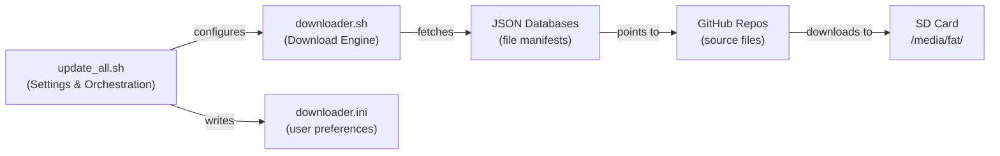
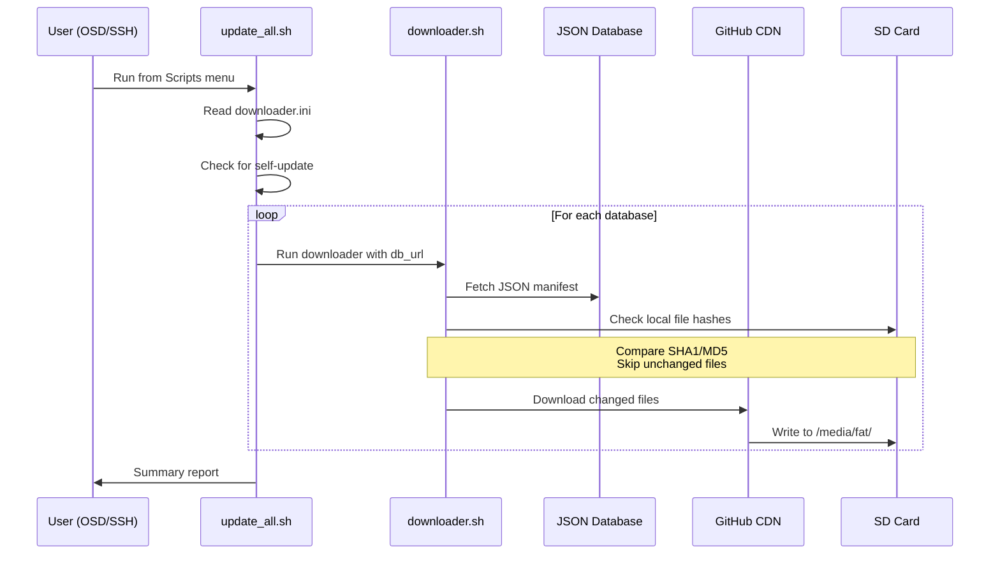

[← Ecosystem](README.md) · [↑ Knowledge Base](../README.md)

# Update Scripts — Update All, Downloader & Package Management

## Overview

MiSTer's core and firmware ecosystem moves fast — new cores, bug fixes, BIOS files, and MRA updates ship weekly. The update tooling automates keeping everything current without manual SD card management.

The update pipeline is:



Two tools form the backbone:

| Tool | Author | Role |
|------|--------|------|
| **[Update All](https://github.com/theypsilon/Update_All_MiSTer)** | theypsilon | Settings UI, database selection, orchestration |
| **[Downloader](https://github.com/MiSTer-devel/Downloader_MiSTer)** | MiSTer-devel | File download engine, hash verification, incremental updates |

> [!NOTE]
> **Update All runs Downloader under the hood.** Update All is the user-facing tool; Downloader is the engine. You can use Downloader directly if you prefer manual configuration.

---

## Update All

### Installation

1. Download `update_all.sh` from the [GitHub releases](https://github.com/theypsilon/Update_All_MiSTer)
2. Copy to `/media/fat/Scripts/update_all.sh` on the SD card
3. Boot MiSTer → Scripts menu → select `update_all`

The script self-updates on subsequent runs, so installation is one-time.

> **Alternative**: Add to `downloader.ini` and run the built-in Downloader:
> ```ini
> [update_all_mister]
> db_url = https://raw.githubusercontent.com/theypsilon/Update_All_MiSTer/db/update_all_db.json
> ```

### Settings Screen

Press **UP** on your controller/keyboard during the initial countdown to access settings. Key categories:

#### Main Distribution

| Option | Description | Default |
|--------|-------------|---------|
| **Official MiSTer Distribution** | MiSTer-devel cores, firmware, Linux | Yes |
| **DB9 Fork** | Extended native controller compatibility (Genesis/NeoGeo via SNAC8) | No |
| **Aitor Gómez Fork** | Official + custom firmware | No |

#### Core Databases

| Database | Content | Default |
|----------|---------|---------|
| **JTCORES** | Jotego team arcade cores (CPS1/2, SNK, Sega System 16, etc.) | Enabled |
| **Coin-Op Collection** | Community arcade cores | Enabled |
| **Arcade Offset** | Patched arcade games (Toya) | Disabled |
| **LLAPI Forks** | BlisSTer/LLAMA-compatible cores | Disabled |
| **Patreon Cores** | Jotego early-access cores (requires Patreon) | Disabled |

#### Tools & Scripts

| Tool | Content | Default |
|------|---------|---------|
| **Arcade Organizer** | Creates `_Arcade/_Organized/` folder structure for MRA browsing | Disabled |
| **Names TXT** | Human-readable core names in OSD (Threepwood curated) | Disabled |

#### Extra Content

Wallpapers, BIOS files, and other supplementary downloads.

### PC Launcher (Offline Updates)

If your MiSTer has no internet access, use the **Downloader PC Launcher** to fetch files on your computer:

1. Copy `downloader.ini` from your MiSTer's SD card root
2. Run the Downloader PC Launcher on Windows/macOS/Linux
3. It reads the same `.ini` configuration and downloads the same files
4. Copy the updated files back to the SD card

This is especially useful for first-time setup with large game libraries.

---

## Downloader

### Configuration

Downloader reads `/media/fat/downloader.ini` (created automatically by Update All, or manual):

```ini
# downloader.ini — MiSTer package manifest

[distribution_mister]
db_url = https://raw.githubusercontent.com/MiSTer-devel/Distribution_MiSTer/main/db.json

[jtcores_mister]
db_url = https://raw.githubusercontent.com/jotego/jtcores_mister/main/jtcores_mister_db.json

[coin_op_collection]
db_url = https://raw.githubusercontent.com/Coin-OpCollection/COCKTAIL_xyz/main/cocktail_db.json
```

Each `[section]` defines a database source. The `db_url` points to a JSON manifest listing files, hashes, and GitHub download URLs.

### Database JSON Format

Each database is a JSON file with an array of file entries:

```json
{
  "files": [
    {
      "path": "_Arcade/cores/jtgng_MiSTer.rbf",
      "url": "https://github.com/jotego/jtcores/releases/download/v2024.01/jtgng_MiSTer.rbf",
      "hash": "a1b2c3d4e5f6...",
      "size": 1234567
    }
  ]
}
```

Downloader compares local file hashes against the manifest and only downloads changed files — making subsequent runs fast (typically 1-3 minutes).

### Running Downloader Directly

From SSH or the Scripts menu:

```bash
# Run all configured databases
/media/fat/Scripts/downloader.sh

# Run with verbose output
/media/fat/Scripts/downloader.sh -v

# Dry run (show what would be downloaded)
/media/fat/Scripts/downloader.sh -d
```

### Adding Custom Databases

To add a third-party database, edit `downloader.ini`:

```ini
[custom_core]
db_url = https://example.com/mister/custom_db.json
```

> [!WARNING]
> **Security**: MiSTer scripts run as root with full internet access. Only add databases from sources you trust. A malicious database could overwrite any file on the SD card, including core RBFs and scripts.

---

## File Download Flow



---

## What Gets Updated

| Component | Path | Source |
|-----------|------|--------|
| **MiSTer binary** | `/media/fat/MiSTer` | Main distribution |
| **Menu core** | `/media/fat/menu.rbf` | Main distribution |
| **Linux kernel** | `/media/fat/linux/` | Main distribution |
| **Core RBF files** | `/media/fat/_Console/`, `_Arcade/cores/` | Distribution + JTCORES |
| **MRA files** | `/media/fat/_Arcade/` | Distribution + arcade DBs |
| **BIOS/firmware** | Various (`boot.rom`, etc.) | Distribution + extra content |
| **Scripts** | `/media/fat/Scripts/` | Distribution + tools DBs |
| **Wallpapers** | `/media/fat/wallpapers/` | Extra content |

> [!NOTE]
> **Game ROMs are NOT included** in any distribution database due to copyright. You must source ROMs separately and place them in the appropriate directories.

---

## Best Practices

### Before Updating

1. **Back up your saves**: Copy `/media/fat/saves/` to your computer periodically
2. **Note your settings**: Screenshot your Update All settings screen
3. **Stable internet**: Use Ethernet for large updates (first run is ~2 GB)

### After Updating

1. **Check the log**: Update All prints a summary of errors/warnings
2. **Verify cores load**: Run a quick test of your most-used cores
3. **Check save compatibility**: Core updates can occasionally change save state formats

### Scheduling

Update All doesn't auto-schedule — it runs on demand. For automatic updates, add to `/media/fat/linux/user-startup.sh`:

```bash
# Run update_all silently on boot (use with caution)
# /media/fat/Scripts/update_all.sh -a
```

The `-a` flag runs Update All in automatic mode with saved settings (no user interaction).

> [!CAUTION]
> Auto-updating can break save state compatibility if a core update changes the save format. Use this only if you accept that risk.

---

## Troubleshooting

### Update All fails with "download error"

1. Check internet connectivity: `ping -c 3 github.com`
2. DNS issues: try `echo "nameserver 8.8.8.8" > /etc/resolv.conf`
3. GitHub rate limiting: wait an hour and retry
4. WiFi instability: switch to Ethernet for the update

### "Not enough space on SD card"

1. Check space: `df -h /media/fat`
2. Remove unused cores in `_Arcade/cores/` and `_Console/`
3. Clean up old files: `find /media/fat/ -name "*.bak" -delete`
4. Consider using a larger SD card (32 GB minimum recommended, 128 GB preferred)

### Downloader hash mismatch

This means a file was corrupted during download. Delete the file and re-run:

```bash
rm /media/fat/_Arcade/cores/suspicious_file.rbf
/media/fat/Scripts/downloader.sh
```

---

## Community Tools

| Tool | Author | Description |
|------|--------|-------------|
| **[update_all](https://github.com/theypsilon/Update_All_MiSTer)** | theypsilon | All-in-one updater with settings UI |
| **[Downloader](https://github.com/MiSTer-devel/Downloader_MiSTer)** | MiSTer-devel | Core download engine |
| **[mrext](https://github.com/wizzomafizzo/mrext)** | wizzomafizzo | Extensions: NFC launcher, remote control, overclocking |
| **[Arcade Organizer](https://github.com/MiSTer-devel/ArcadeOrganizer)** | MiSTer-devel | Sorts MRA files into category folders |
| **[RetroNAS](https://github.com/danmons/retronas)** | danmons | Pi-based NAS pre-configured for retro devices |

---

## References

- [Update All GitHub](https://github.com/theypsilon/Update_All_MiSTer)
- [Downloader GitHub](https://github.com/MiSTer-devel/Downloader_MiSTer)
- [MiSTer Distribution](https://github.com/MiSTer-devel/Distribution_MiSTer)
- [WiFi & Network Setup](../12_networking/wifi_setup.md)
- [MiSTer.ini Configuration](../05_configuration/mister_ini_guide.md)
- [File Transfer](../11_storage/file_transfer.md)
