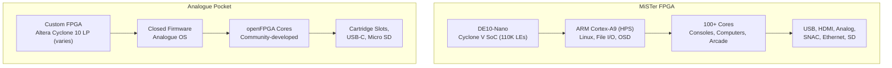
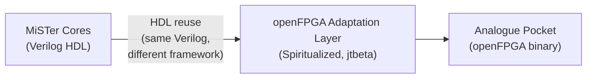

[← Advanced Topics](README.md) · [↑ Knowledge Base](../README.md)

# Analogue Pocket vs MiSTer — Platform Comparison

## Overview

The [Analogue Pocket](https://www.analogue.co/pocket) and MiSTer FPGA are the two most prominent FPGA-based retro gaming platforms. Both use FPGA hardware to emulate classic consoles at the gate level — but they serve fundamentally different audiences and use cases.

This comparison is engineering-focused, not marketing. The goal is to help developers and enthusiasts understand the architectural differences and make informed decisions.

---

## Architecture Comparison

| Aspect | MiSTer FPGA | Analogue Pocket |
|--------|-------------|-----------------|
| **FPGA** | Intel Cyclone V SoC (110K LEs) | Altera Cyclone 10 LP (size varies by core) |
| **Processor** | Hard ARM Cortex-A9 (800 MHz) | Soft-core or none (core-dependent) |
| **Operating System** | Linux (Debian-based) | Analogue OS (closed-source) |
| **Core Framework** | MiSTer `sys/` (open-source) | openFPGA SDK (open-source cores, closed platform) |
| **Development Model** | Fully open-source | openFPGA is open; Analogue OS is closed |
| **Input** | USB controllers, SNAC (OEM controllers), keyboard, mouse | Built-in controls, dock USB, Bluetooth (dock) |
| **Video Output** | HDMI + analog (VGA/component via I/O board) | Built-in LCD (3.5" 1600×1440), HDMI via dock |
| **Audio** | HDMI, analog (3.5mm), MT-32 Pi | Built-in speaker, 3.5mm, HDMI via dock |
| **Storage** | MicroSD + USB + network (CIFS/NFS) | MicroSD + original cartridges |
| **Networking** | Ethernet, WiFi (USB dongle), SSH, FTP | None (offline device) |
| **Cartridge Support** | No (ROM-based) | Yes (original Game Boy, GBC, GBA, Game Gear, etc.) |

---

## Core Ecosystem

### MiSTer Cores

| Category | Examples | Count | Source |
|----------|----------|-------|--------|
| **8-bit consoles** | NES, SNES, SMS, Genesis, TG16 | ~20 | MiSTer-devel + community |
| **16/32-bit** | PSX, N64 (WIP), GBA, Saturn (WIP) | ~10 | Community |
| **Arcade** | CPS1/2, NeoGeo, MVS, Sega, Konami | 100+ | Jotego + many others |
| **Computers** | Amiga, C64, ZX Spectrum, MSX, Atari ST | ~20 | Community |
| **Handhelds** | Game Boy, GBC, GBA, Game Gear, Lynx | ~10 | Community |

### Analogue Pocket openFPGA Cores

| Category | Examples | Count | Notes |
|----------|----------|-------|-------|
| **Cartridge-based** | GB, GBC, GBA, GG, NGPC, Lynx | ~10 | Native cartridge support |
| **Additional cores** | NES, SNES, Genesis, TG16, various arcade | ~50+ | Community-developed via openFPGA |
| **Arcade** | Various (Spiritualized, jotego ports) | Growing | Subset of MiSTer ports |

### Core Porting Relationship

Many Analogue Pocket cores are **ported from MiSTer HDL**. The relationship:

Key porting efforts:
- **[Spiritualized](https://github.com/spiritualized1997)**: Major openFPGA core porter (NES, SNES, Genesis, GBA, many more)
- **[jotego/jtcores](https://github.com/jotego/jtcores)**: Arcade cores with MiSTer + Pocket targets
- **[agg23](https://github.com/agg23)**: Game Boy, Game Boy Color, Analogue Pocket-specific cores

The Verilog HDL is often shared, but the framework layer (`sys/` for MiSTer, openFPGA API for Pocket) is entirely different.

---

## Developer Experience

| Aspect | MiSTer | Analogue Pocket |
|--------|--------|-----------------|
| **SDK** | Template_MiSTer (Verilog + C++) | openFPGA SDK (Verilog + C) |
| **Build tools** | Quartus (free Web edition) | Quartus (free) + Analogue tools |
| **Documentation** | Extensive (this KB, wiki, source code) | Analogue developer docs + community |
| **Debug access** | Full: SSH, SignalTap, UART, status word | Limited: USB debugging only |
| **Core distribution** | GitHub + Downloader script | Analogue Pocket store + GitHub |
| **Community size** | Large, developer-focused | Large, enthusiast-focused |
| **Entry barrier** | Medium (FPGA knowledge + Linux comfort) | Low (copy RBF to SD card) |

---

## Input Latency

Both platforms offer excellent input latency due to FPGA-based cycle-accurate emulation. Approximate measurements:

| Path | MiSTer | Analogue Pocket |
|------|--------|-----------------|
| **Built-in controls** | USB HID (~4 ms) | Direct GPIO (<1 ms) |
| **OEM controllers (SNAC)** | <1 ms | N/A (no cartridge slot for most) |
| **Bluetooth** | ~8-12 ms | ~8-12 ms (dock) |
| **USB controller** | ~4 ms | ~4 ms (dock) |

The Pocket has a slight advantage with built-in controls (direct FPGA GPIO), but MiSTer's SNAC adapter achieves comparable latency with original controllers.

---

## Video Quality

| Feature | MiSTer | Analogue Pocket |
|---------|--------|-----------------|
| **Internal scaler** | ascal (polyphase, 10-tap, programmable) | Analogue's custom scaler |
| **Scanline simulation** | Yes (multiple methods) | Yes (built-in) |
| **CRT phosphor simulation** | Yes (via MiSTer.ini) | No |
| **Output resolution** | Up to 1080p HDMI + analog | 1600×1440 LCD + 1080p HDMI (dock) |
| **Analog output** | VGA/component via I/O board, Direct Video | No |
| **Frame interpolation** | No (optional) | No |
| **Custom scaling** | Full control via ascal registers | Limited to Analogue OS options |

---

## Use Case Matrix

| Use Case | MiSTer | Analogue Pocket | Winner |
|----------|--------|-----------------|--------|
| **Play original cartridges** | No | Yes (GB/GBC/GBA/GG/etc.) | Pocket |
| **Arcade games** | Excellent (100+ cores) | Growing (subset) | MiSTer |
| **Home computers (Amiga, C64)** | Excellent | Not available | MiSTer |
| **Portable gaming** | No (requires TV/monitor) | Yes (handheld) | Pocket |
| **CRT output** | Yes (analog video) | No | MiSTer |
| **Network play / file transfer** | Yes (Ethernet/WiFi) | No (offline) | MiSTer |
| **Living room setup** | Excellent (HDMI, scaler) | Dock + HDMI (limited) | MiSTer |
| **Collect / display shelf** | No aesthetic design | Premium product design | Pocket |
| **Core development** | Full debug access | Limited debug access | MiSTer |
| **Price (complete setup)** | $130–200 | $220+ (console + dock) | MiSTer |

---

## When to Choose Which

### Choose MiSTer if you want:

- The largest core library (100+ platforms)
- Arcade game support (CPS, NeoGeo, MAME-era)
- Home computer emulation (Amiga, C64, Spectrum)
- Network features (file transfer, remote control, RetroAchievements)
- CRT output via analog video
- Full developer access (SSH, debug tools)
- A living-room console replacement

### Choose Analogue Pocket if you want:

- A portable handheld device
- Original cartridge support (GB/GBC/GBA/GG)
- Premium build quality and aesthetics
- Simple setup (no Linux, no configuration)
- A curated, polished user experience
- To collect and display on a shelf

### Own both if you want:

- Portable gaming (Pocket) + TV gaming (MiSTer)
- Cartridge authenticity (Pocket) + ROM convenience (MiSTer)
- The Pocket as a companion to a MiSTer-based setup

---

## References

- [Analogue Pocket Official Site](https://www.analogue.co/pocket)
- [openFPGA Developer Documentation](https://www.analogue.co/developers)
- [Spiritualized openFPGA Cores](https://github.com/spiritualized1997)
- [MiSTer Platform Architecture](../01_system_architecture/platform_architecture.md)
- [MiSTer HDMI Scaler (ascal)](../09_video_audio/hdmi_scaler.md)
- [MiSTer Input Latency & SNAC](../06_fpga_subsystem/input_latency_and_snac.md)
- [Ecosystem Overview](../15_ecosystem/README.md)
