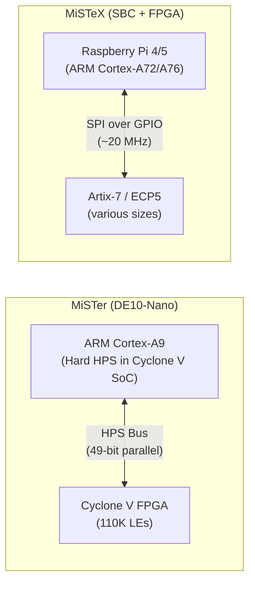
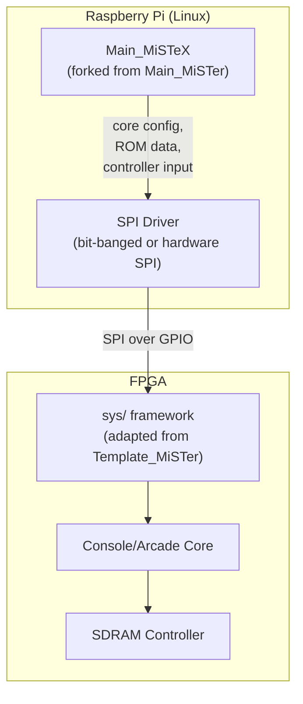

[← Advanced Topics](README.md) · [↑ Knowledge Base](../README.md)

# MiSTeX — SBC + FPGA Alternative Platform

## Overview

[MiSTeX](https://github.com/MiSTeX-devel) is an alternative FPGA platform that ports the MiSTer `sys/` framework to non-DE10-Nano hardware. Instead of the Cyclone V SoC's hard ARM processor (HPS), MiSTeX uses a **separate single-board computer (SBC)** — typically a Raspberry Pi — connected to an FPGA board via SPI over GPIO.

The goal: decouple MiSTer's excellent core library from the aging DE10-Nano hardware, enabling it to run on modern, cheaper, and more capable FPGA boards.

> [!NOTE]
> MiSTeX is a work in progress. Not all MiSTer cores are ported, and some cores may not fit on smaller FPGA boards. Check the [MiSTeX-ports](https://github.com/MiSTeX-devel/MiSTeX-ports) repository for current compatibility.

---

## Architecture Comparison

| Aspect | MiSTer (DE10-Nano) | MiSTeX |
|--------|-------------------|--------|
| **FPGA** | Intel Cyclone V (110K LEs) | Xilinx Artix-7 / Lattice ECP5 (varies) |
| **Processor** | Hard ARM Cortex-A9 (HPS) | External SBC (Raspberry Pi) |
| **FPGA↔CPU Link** | HPS bus (49-bit parallel, ~100 MHz) | SPI over GPIO (~20 MHz) |
| **Memory** | DDR3 (shared FPGA+HPS) | Board-dependent (SRAM or DDR3) |
| **Video Output** | HDMI (hard IP in Cyclone V) | HDMI via FPGA or SBC |
| **OS** | Custom Linux (Debian-based) | Raspberry Pi OS / Debian |
| **Cost** | ~$130–200 (DE10-Nano + addons) | ~$50–150 (SBC + FPGA board) |

### Key Architectural Difference: The Communication Bus

The most significant difference is the FPGA↔CPU communication:

- **MiSTer**: The HPS bus is a 49-bit parallel bus running at FPGA clock speed (~50 MHz). This provides high bandwidth for SD card access, controller input, and video scaler configuration with minimal latency.

- **MiSTeX**: SPI over GPIO runs at ~20 MHz with serial framing overhead. This is slower but sufficient for most use cases (controller input, core configuration, SD card data). The bandwidth bottleneck primarily affects large file transfers and the initial core loading.

---

## Supported Hardware

### FPGA Boards

| Board | FPGA | LEs | Memory | Status |
|-------|------|-----|--------|--------|
| **QMTech XC7A35T** | Artix-7 35T | 33K | 32 MB SDRAM | Primary target |
| **QMTech XC7A75T** | Artix-7 75T | 75K | 32 MB SDRAM | Supported |
| **QMTech XC7A100T** | Artix-7 100T | 101K | 32 MB SDRAM | Best core compatibility |
| **Colorlight i5** | ECP5 45F | 45K | Onboard SDRAM | Community port |
| **ECP5 Versa** | ECP5 45F | 45K | DDR3 | Experimental |

### SBC Options

| SBC | Processor | RAM | Notes |
|-----|-----------|-----|-------|
| **Raspberry Pi 4** | Cortex-A72 | 2–8 GB | Most tested |
| **Raspberry Pi 5** | Cortex-A76 | 4–8 GB | Faster, but GPIO changes |
| **Other Pi-compatible** | Various | Various | May work if GPIO pinout matches |

---

## Core Compatibility

MiSTeX ports cores from the MiSTer ecosystem. Compatibility depends on FPGA size and memory:

| Category | Examples | XC7A35T (33K) | XC7A100T (101K) |
|----------|----------|---------------|-----------------|
| **8-bit consoles** | NES, SMS, GG, ColecoVision | Likely fits | Fits |
| **16-bit consoles** | SNES, Genesis | May not fit | Fits |
| **Arcade (simple)** | Pac-Man, Galaga, Donkey Kong | Fits | Fits |
| **Arcade (complex)** | CPS1, NeoGeo | Does not fit | May fit |
| **Computers** | Amiga (OCS), C64, ZX Spectrum | Likely fits | Fits |
| **32-bit+** | PSX, N64, GBA | Does not fit | Does not fit |

> [!WARNING]
> Core compatibility changes frequently. Check the [MiSTeX-ports](https://github.com/MiSTeX-devel/MiSTeX-ports) repository for the latest port status.

---

## Software Architecture

MiSTeX reuses MiSTer's `sys/` framework with adaptations:

### Modified Components

| Component | MiSTer | MiSTeX Adaptation |
|-----------|--------|-------------------|
| `Main_MiSTer` | C++ binary using HPS bus | `Main_MiSTeX` — SPI backend instead of HPS |
| `hps_io.sv` | 49-bit parallel bus | Replaced with SPI deserializer |
| `sdram`/`ddram` | DDR3 via HPS F2SDRAM bridge | SDRAM controller (board-specific) |
| Video output | HDMI hard IP (Cyclone V) | FPGA-generated HDMI or VGA |
| `Template_MiSTer` | Core template | `Template_MiSTeX` — adapted framework |

---

## Setup Guide

### Prerequisites

- QMTech Artix-7 board (or compatible)
- Raspberry Pi 4 or 5
- SPI wiring between Pi GPIO and FPGA header
- MicroSD cards for both Pi and FPGA configuration

### Installation

1. **Flash the Pi**: Install Raspberry Pi OS Lite (64-bit recommended)
2. **Build Main_MiSTeX**: Clone [Main_MiSTeX](https://github.com/MiSTeX-devel/Main_MiSTeX) and compile
3. **Generate bitstream**: Use Vivado to build the FPGA bitstream for your board + core
4. **Load bitstream**: Use `xc3sprog` or OpenOCD via JTAG, or the Pi's SPI0 for passive programming
5. **Connect SPI wires**: Wire Pi GPIO to the FPGA's SPI pins per the [MiSTeX-hardware](https://github.com/MiSTeX-devel/MiSTeX-hardware) pinout
6. **Run Main_MiSTeX**: Launch the binary on the Pi — it communicates with the FPGA via SPI

> [!NOTE]
> Setup is significantly more involved than MiSTer (which is essentially "flash SD, boot, done"). MiSTeX is aimed at FPGA enthusiasts comfortable with Vivado, JTAG, and Linux administration.

---

## Comparison with MiSTer

| Factor | MiSTer | MiSTeX |
|--------|--------|--------|
| **Ease of setup** | Plug-and-play (Mr. Fusion SD image) | Manual (build, wire, configure) |
| **Core library** | 100+ cores, mature | Subset of MiSTer cores, growing |
| **Video quality** | Excellent (ascal scaler, HDMI, analog) | Board-dependent |
| **Input latency** | Very low (HPS bus, SNAC) | Slightly higher (SPI latency) |
| **Community support** | Large, active | Small, developer-focused |
| **Future hardware** | DE10-Nano discontinued (2024) | Uses current-gen FPGA boards |
| **Cost** | $130–200 complete | $50–150 complete |
| **Expandability** | Fixed FPGA (110K LEs) | Multiple FPGA sizes available |

### When to Choose MiSTeX over MiSTer

- The DE10-Nano is unavailable or too expensive
- You need a specific FPGA size (larger or smaller than Cyclone V)
- You're a developer wanting to experiment with MiSTer cores on open hardware
- You want a portable form factor (Pi + small FPGA board)

### When to Stick with MiSTer

- You want plug-and-play simplicity
- You need full core compatibility
- You value community support and documentation
- You use SNAC, analog video, or other MiSTer-specific peripherals

---

## References

- [MiSTeX-devel GitHub Organization](https://github.com/MiSTeX-devel)
- [MiSTeX Hardware Repository](https://github.com/MiSTeX-devel/MiSTeX-hardware)
- [MiSTeX Ports (Core Compatibility)](https://github.com/MiSTeX-devel/MiSTeX-ports)
- [Main_MiSTeX Binary](https://github.com/MiSTeX-devel/Main_MiSTeX)
- [MiSTer Platform Architecture](../01_system_architecture/platform_architecture.md)
- [Ecosystem Overview](../15_ecosystem/README.md)
